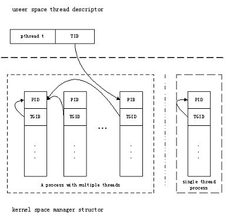

文章出处：https://blog.csdn.net/ixidof/article/details/24579879

文章出处：http://blog.csdn.net/guosha/article/details/2976429

NPTL: Native POSIX Thread Library

 

    Linux从内核2.0到内核2.4期间多线程编程使用的是LinuxThread，但使用这种方式写出的多线程程序在诸多特性上并不是跟POSIX标准兼容的（通过网址：http://www.kernel.org/doc/man-pages/online/pages/man7/pthreads.7.html可以了解诸多的不兼容特性）。这显然跟Linux号称的跟POSIX标准兼容不相符，所以从内核2.6开始有了新的线程实现方式NPTL。NPTL号称解决了LinuxThread中绝大多数跟POSIX标准不兼容的特性，并提供了更好的性能，可扩展性及可维护性等等。那么NPTL跟LinuxThread的实现到底有什么不同呢？百度半天，结果都是些IBM开发网上一篇有关LinuxThread缺点的转载。看上去大家都只喜欢坐享结果，而不问为什么，或者自己知道原因而不愿或不诮跟他人分享。

 

LinuxThread

 

    在实现LinuxThread之前，系统内核并没有提供任何对线程的支持，实现LinuxThread时也并没有针对其做任何的改动，所以LinuxThread只能使用现有的系统调用来创建一些用户接口来尽量模仿POSIX定义的API的语义，这也就是导致了pthread之外的系统调用接口表现出来的行为跟POSIX的线程标准不一致，如最简单的在同一个进程里的不同线程里调用getpid()的结果不一致，具体原因后面详细说明。

 

创建线程

    LinuxThread使用的是1 * 1模型，即每一个用户态线程都有一个内核的管理实体跟其对应，这个内核对应的管理实体就是进程，又称LWP（轻量级进程）。这里先说一下，系统调用clone()，大家熟知的fork()函数就是调用clone()来实现父进程拷贝的从而创建一个新进程的。系统调用clone()里有一个flag参数，这个参数有很多的标志位指定了克隆时需要拷贝的东西，其中标志位CLONE_VM就是定义拷贝时是否使用相同的内存空间。fork()调用clone()时没有设置CLONE_VM，所以在内核看来就是产生了两个拥有不同内存空间的进程。而pthread_create()里调用clone()时设置了CLONE_VM，所以在内核看来就产生了两个拥有相同内存空间的进程。所以用户态创建一个新线程，内核态就对应生成一个新进程。

    从上面就可以得到问题的答案了，为什么在同一个进程里面不同线程getpid()得到的结果不一样。其他很多在http://www.kernel.org/doc/man-pages/online/pages/man7/pthreads.7.html里提到的不兼容特性都可以根据这一段的论述得到答案。

 

同步互斥

    内核没有提供任何对线程的支持，当然也就没有可供线程同步互斥使用的系统原语，但POSIX的线程标准里要求了诸多的互斥同步接口，怎么办呢？LinuxThread使用信号来模拟同步互斥，比如互斥锁，大致过程我猜如下：新建互斥锁的时候，在内核里把所有的进程mask掉一个特定信号，然后再kill()发出一个信号，等某个线程执行锁定时，就用sigwait()查看是否有发出的信号，如果没有就等待，有则返回，相当于锁定。解锁时就再kill()发出这个信号。那么LinuxThread使用的是哪几个信号来模拟这个同步互斥的呢？有的文档说是SIGUSR1和SIGUSR2，也有的说是某几个实时信号，具体可以看对应线程库的开发手册。必须知道你所使用的线程库内部使用哪几个信号，因为如果你的多线程程序里也使用了这几个信号的话，就会导致线程API工作混乱。

    从行分析就可以得出，LinuxThrea的同步互斥是用信号模拟完成的，所以效率不高且可能影响原有进程的信号处理，确实是个很大的缺陷。

 

信号处理

    LinuxThread的信号处理的行为可以说跟POSIX的标准是完全不一致的。因为信号的投递过程是发生在内核的，而每个线程在内核都是对应一个个单独的进程（不理解请看LinuxThread的创建线程一节），所以没有内核支持，所以当你对一个进程发送一个信号后，只有拥有这个进程号的进程才有反应，而属于这个进程的线程因为拥有不同的进程号而无法做出响应，从而LinuxThread无法做到跟POSIX定义的行为一致。

 

线程管理

    这里不得不说到LinuxThread的一个特性，当你创建第一个线程时，也就会自动创建一个管理线程，这个过程对用户是透明的。所以如果你还在使用LinuxThread线程库，当你创建一个线程后ps的结果会是有三个相同的进程而不是两个。这个管理线程的主要作用是管理线程的创建与终止，所以如果你把这个管理线程kill掉后，当你的某个线程退出后就会出现Zombie进程。另外，因为线程的创建与终止都要通过这个管理线程，在一个频繁创建与终止线程的程序这个线程很可能成为性能的瓶颈。

 

NPTL

    因为没有内核支持的LinuxThread的线程实现的诸多缺陷，所以要想实现完全跟POSIX线程标准兼容的线程库，重写线程库是必然的，内核的修改也势在必行。有关NPTL实现也从线程创建，同步互斥及信号处理及线程管理几个方面来说明。

 

创建线程

    NPTL同样使用的是1 * 1模型，但此时对应内核的管理结构不再是LWP了。为了管理进程有进程组的概念，那内核要管理线程提出线程组的概念就是很自然的了。Linux内核只是在原来的进程管理结构新增了一个TGIP的字段，如下图。当一个线程的PID等于TGID时，这个线程就是线程组长，其PID也就是这个线程组的进程号。线程组内的所有线程的TGID字段都指向线程组长的PID，当你使用getpid返回的都是TGID字段，而线程号返回的就是PID字段。那么NPTL下线程又是如何创建线程的呢？同样是使用clone()系统调度，不过新的clone()调用的flag参数新增了一个标志位CLONE_THREAD，当这个标志位设置的时候新创建的行为就是创建一个线程，内核内部初始管理结构时把TGID指向调用者的PID，原来的PID位置填新线程号（也就是以前的进程号）。
    
    从上，LinuxThread因为在内核是一个LWP而产生的跟POSIX标准不兼容的错误都消除了。

同步与互斥

    从LinuxThread中的线程同步与互斥中可看到使用信号来模拟的缺点，所以内核增加一个新的互斥同步原语futex（fast usesapace locking system call），意为快速用户空间系统锁。因为进程内的所有线程都使用了相同的内存空间，所以这个锁可以保存在用户空间。这样对这个锁的操作不需要每次都切换到内核态，从而大大加快了存取的速度。NPTL提供的线程同步互斥机制都建立在futex上，所以无论在效率上还是咋对程序的外部影响上都比LinuxThread的方式有了很大的改进。具体futex的描述可以man futex。

 

信号处理

    此时因为同一个进程内的线程都属于同一个进程，所以信号处理跟POSIX标准完全统一。当你发送一个SIGSTP信号给进程，这个进程的所有线程都会停止。因为所有线程内用同样的内存空间，所以对一个signal的handler都是一样的，但不同的线程有不同的管理结构所以不同的线程可以有不同的mask。后面这一段对LinuxThread也成立。

 

管理线程

    线程创建与结束的管理都由内核负责了，由LinuxThread的管理线程机制引出的问题已不复存在了。当然系统调度上仍是一个单独的线程而不是多个线程组成一个进程为整体进行调度的。这跟POSIX的标准还是稍有不同，不过这一缺点看起来无伤大雅。 

 

 