pthread_create：https://blog.csdn.net/qq_41453285/article/details/89293532

pthread_exit()、pthread_cancel()、取消点：https://blog.csdn.net/qq_41453285/article/details/89305478

pthread_kill()：https://blog.csdn.net/qq_41453285/article/details/91316158
exit()、_exit()：https://blog.csdn.net/qq_41453285/article/details/88958670
# pthread_create
## 一、线程创建函数（pthread_create）

```cpp
#include <pthread.h>
int pthread_create(
pthread_t *restrict tidp,
const pthread_attr_t *restrict attr,
void *(*start_rtn)(void *), 
void *restrict arg);
```

参数：

    参数1：当pthread_create成功返回时，新创建的线程ID会被设置到tidp所指向的内存单元中
    参数2：atrr参数用于指定线程创建时的初始化属性。值为NULL时，创建一个具有默认属性的线程。如何设置线程的初始化属性见文章：https://blog.csdn.net/qq_41453285/article/details/90903886
    参数3：新创建的线程从start_rtn函数的地址开始运行。该函数只有一个无类型指针参数arg，返回值为void*类型
    参数4：如果需要向start_rtn函数传递的参数有一个以上，需要把这些参数放到一个结构中，传递该结构的地址

返回值：

    成功：返回0
    出错：返回错误编号，并不设置errno

## 二、创建的线程的一些特点
线程创建时并不能保证哪个线程先运行：是新创建的线程，还是调用线程。
新创建的线程可以访问进程的地址空间，并且继承调用线程的浮点环境和信号屏蔽字，但是该线程的挂起信号集会被清除，即被原线程阻塞之后收到的信号集不会被新线程继承。

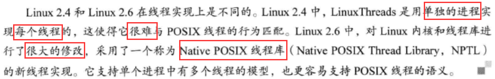

## 三、演示案例 1
```cpp
#include<pthread.h>
#include<stdio.h>
#include<stdlib.h>
pthread_t ntid;
 
void printids(const char *s){
    pid_t pid;
    pthread_t tid;
    pid = getpid();
    tid = pthread_self();
    printf("%s pid %lu tid %lu (0x%lx)\n", s, (unsigned long)pid,(unsigned long)tid, 
    (unsigned long)tid);
}
 
void *thr_fn(void *arg){
    printids("new thread: ");
    return((void *)0);
}
 
int main(void)
{
    int err;
    //create thread
    err = pthread_create(&ntid, NULL, thr_fn, NULL);
    if (err != 0)
        printf("can’t create thread\n");
    printids("main thread:");
    sleep(1);
    exit(0);
}
```

运行结果：
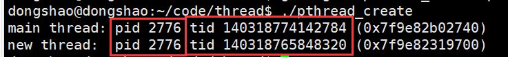
注意事项：尽管Linux线程的ID用无符号长整型表示，但是看起来像指针

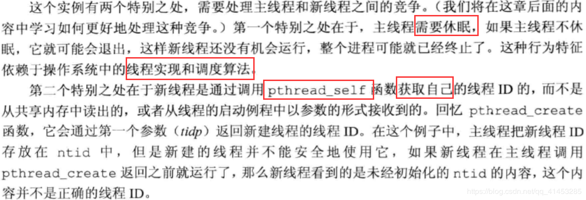

## 四、演示案例 2
```cpp
#include <pthread.h>
#include <stdio.h>
#include <stdlib.h>
#include <string.h>
#include <unistd.h>
#include <sys/syscall.h> 
struct message
{
	int i;
	int j;
};
void *hello(struct message *str)
{
	printf("child,the tid=%lu,pid=%ld\n",pthread_self(),syscall(SYS_gettid));
	printf("the arg.i is %d,arg.j is %d\n",str->i,str->j);
}
 
int main(int argc,char *agrv[])
{
	struct message test;
	pthread_t thread_id;
	test.i=10;
	test.j=20;
	pthread_create(&thread_id,NULL,(void *)*hello,&test);
	printf("parent,the tid=%lu,pid=%ld\n",pthread_self(),syscall(SYS_gettid));
	pthread_join(thread_id,NULL);
}
```
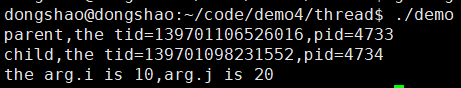


# 线程的退出、等待、取消、取消点(pthread_exit，pthread_join，pthread_cancel、pthread_setcancelstate)
## 一、线程终止时与进程的关系
①如果进程中的任意线程调用了exit、_Exit、_exit，那么整个进程就会终止
②如果线程中某个信号的默认动作是终止进程，那么，发送到某个线程的信号就会终止整个进程（在https://blog.csdn.net/qq_41453285/article/details/91316158文章中会详细介绍线程与信号的处理）
## 二、线程的终止方式
下面这三种方法是正常不终止整个进程的情况下，终止线程并且停止它的控制流：

①线程可以简单地从启动例程中返回，返回值是线程的退出码
②线程可以被同一进程中的其他线程取消（pthread_cancel）
③线程调用pthread_exit
下面是其他线程终止的情况：

①创建线程的进程退出，那么线程自然就没有了（因此没有孤儿线程的说法，只有孤儿进程的说法）
②其中一个线程执行exec，因为会替换当前进程所有的地址空间。子线程退出仅释放自己私有空间，私有栈空间
## 三、线程退出函数（pthread_exit）
```cpp
#include <pthread.h>
void pthread_exit(void *rval_ptr);
```
功能：线程调用此函数终止自己
参数：rval_ptr是一个无类型指针，退出进程可以在这个指针里面设置内容（常用来设置终止码）。进程中的其他线程也可以通过调用pthread_join函数访问这个指针
## 四、线程等待函数（pthread_join）
```cpp
#include <pthread.h>
int pthread_join(pthread_t thread, void **rval_ptr);
 
//返回值：成功返回0；失败返回错误编号
```
功能：用来等待参数1指定的线程结束
此函数会阻塞，直到指定的线程调用pthread_exit、从启动线程中返回、或者被取消，此函数才返回
参数：
参数1：指定等待的线程的ID
参数2：
* 填NULL：获取等待线程的终止信息，如果对线程的终止信息并不敢兴趣，可以设置为NULL。
* 非空：如果线程简单地从它的返回例程中返回，rval_ptr 就包含返回码。如果线程被取消，由rval_ptr指定的内存单元就被设置为PTHREAD_CANCELED
  
### pthread_join函数的使用与线程分离的关系（重要）：
调用pthread_join等待某一线程，被等待的线程结束之后就会被置于分离状态，这样线程所使用的资源就可以恢复
如果调用pthread_join等待一个线程时，如果线程已处于分离状态(例如调用pthread_detach函数)，pthread_join调用会失败，返回EINVAL，尽管这种行为是与具体实现相关的
### pthread_exit()参数与pthread_join()参数的注意事项（重点）：
pthread_create 和 pthread_exit 函数的无类型指针参数可以传递的值不止一个，这个指针可以传递包含复杂信息的结构体地址,但是注意，这个结构所使用的内存在调用者完成调用以后必须仍然是有效的
例如，在调用线程的栈上分配了该结构，那么其他的线程在使用这个结构时内存内容可能已经改变了
又如,线程在自己的栈上分配了一个结构,然后把指向这个结构的指针传给pthread_exit，那么调用 pthread_join 的线程试图使用该结构时，这个栈有可能已经被撤销,这块内存也另做他用（例如下面“十三”的演示案例中就有关于这个方面的介绍）
在pthread_join函数中，用一个申请的堆变量来保存线程的退出码，那么在获取了退出码之后，pthread_join函数会自动释放这个保存线程退出码的堆变量，因此我们自己申请的堆变量不需要手动free释放。为了防止内存丢失，可以申请栈变量来保存线程的退出码（例如下面“十四”的演示案例中就有关于这个方面的介绍）
## 五、线程取消函数（pthread_cancel）
```cpp
#include <pthread.h>
int pthread_cancel(pthread_t tid);
 
//返回值：成功返回0；否则返回错误编号
```
功能：线程可以通过pthread_cancel来请求取消同一进程中的其它线程
pthread_cancel并不等待线程终止，它仅仅提出请求
参数：
需要取消的线程ID
注意事项：

默认情况下，pthread_cancel函数会使得由tid标识的线程的行为表现为如同调用了参数为PTHREAD_CANCELED的pthread_exit函数，但是被取消的线程可以选择忽略取消或者控制如何被取消（见下面的一系列函数）
##六、线程取消点
概念：系统自定义了一些线程取消点。当一个线程接收到其他线程的取消请求时，如果还没有运行到取消点，该线程还是会继续运行，直到运行到某个取消点，线程才真正地被取消
线程取消点技术也称为“推迟取消”
下图是POSIX.1定义的取消点：
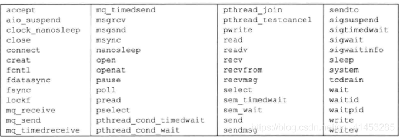


## 七、线程取消选项（pthread_setcancelstate）
```cpp
#include <pthread.h>
int pthread_setcancelstate(int state, int *oldstate);
 
//返回值：若成功返回0；失败返回错误编号
```
功能：用于设置线程在响应pthread_cancel函数时所呈现的行为，用于设置线程的取消选项
参数：
state：新设置的线程取消选项（见下面）
oldstate：用来保存原先的线程取消选项

取消选项值：
PTHREAD_CANCEL_ENABLE：（线程启动时的默认值）线程接收到另一个线程的pthread_cancel取消请求时，线程被杀死终结
PTHREAD_CANCEL_DISABLE：设置此选项后，线程接收到另一个线程的pthread_cancel取消请求时，线程并不会被杀死

注意（重点）：
设置PTHREAD_CANCEL_DISABLE之后，线程接收到了取消请求，虽然线程没有被杀死，但是取消的请求仍处于挂起状态。当取消选项变为PTHREAD_CANCEL_ENABLE之后，线程将在下一个取消点上对所有挂起的取消请求进行处理
## 八、自定义线程取消点（pthread_testcancel）
```cpp
#include <pthread.h>
void pthread_testcancel(void);
```
功能：如果应用程序在很长的时间不会调用系统自带的取消点，那么可以调用此函数设置自己的取消点
注意：在调用此函数时，如果有某个取消请求正处于挂起状态，而且取消并没有置为无效，那么线程就会被取消。但是，如果取消被置为无效，此函数调用就没有任何效果了
下图是POSIX.1定义的可选取消点：
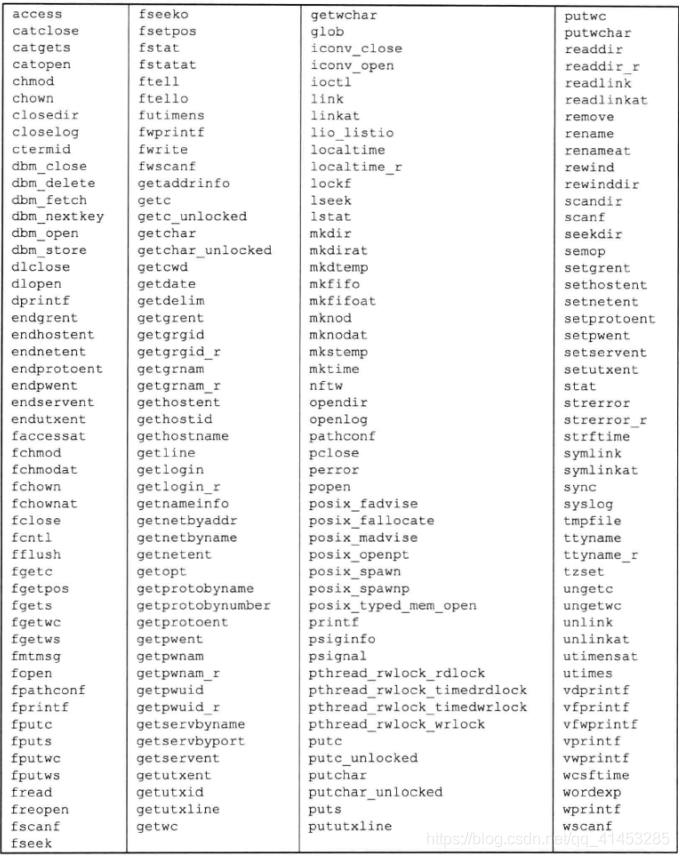


## 九、线程取消类型（pthread_setcanceltype）
```cpp
#include <pthread.h>
int pthread_setcanceltype(int type, int *oldtype);
 
//返回值：若成功返回0；失败返回错误编号
```
功能：上面介绍过当线程被取消时，只有当运行到取消点时线程才会被真正取消，但是还可以使用这个函数来设置线程是否运行到取消点才被取消
参数：
type：设置的新的取消类型（见下面）
oldtype：用来保存原先的取消类型
取消类型值：
PTHREAD_CANCEL_DEFERRED：（系统默认类型）只有线程到达一定的取消点，才会取消
PTHREAD_CANCEL_ASYNCHRONOUS：不论有没有到达取消点，立刻被取消。这种类型的取消称为“异步取消”
## 十、pthread_exit()参数的使用案例
```cpp
#include<pthread.h>
#include<stdlib.h>
#include<stdio.h>
void * thr_fn1(void *arg){
    printf("thread 1 returning\n");
    return((void *)1);
}
void *thr_fn2(void *arg){
    printf("thread 2 exiting\n");
    pthread_exit((void *)2);
}
int main(void)
{
    int err;
    pthread_t tid1, tid2;
    void *tret;
 
    err = pthread_create(&tid1, NULL, thr_fn1, NULL);//创建线程1
    if (err != 0)
        printf("can’t create thread 1\n");
    err = pthread_create(&tid2, NULL, thr_fn2, NULL);//创建线程2
    if (err != 0)
        printf("can’t create thread 2\n");
 
    err = pthread_join(tid1, &tret);//等待线程1
    if (err != 0)
        printf("can’t join with thread 1\n");
    printf("thread 1 exit code %ld\n", (long)tret);
    
    err = pthread_join(tid2, &tret);//等待线程2
    if (err != 0)
        printf("can’t join with thread 2\n");
    printf("thread 2 exit code %ld\n", (long)tret);
   
     exit(0);
}
```
演示结果
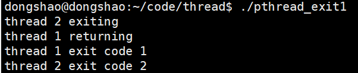


## 十一、pthread_exit()参数的不正确使用案例
```cpp
#include <pthread.h>
#include<stdio.h>
#include<stdlib.h>
struct foo {
    int a, b, c, d;
};
 
void printfoo(const char *s, const struct foo *fp){
    printf("%s", s);
    printf(" structure at 0x%lx\n", (unsigned long)fp);
    printf(" foo.a = %d\n", fp->a);
    printf(" foo.b = %d\n", fp->b);
    printf(" foo.c = %d\n", fp->c);
    printf(" foo.d = %d\n", fp->d);
}
 
void * thr_fn1(void *arg){
    struct foo foo = {1, 2, 3, 4};
    printfoo("thread 1:\n", &foo);
    pthread_exit((void *)&foo);
}
 
void * thr_fn2(void *arg){
    printf("thread 2: ID is %lu\n", (unsigned long)pthread_self());
    pthread_exit((void *)0);
}
 
int main(void)
{
    int err;
    pthread_t tid1, tid2;
    struct foo *fp;
 
    err = pthread_create(&tid1, NULL, thr_fn1, NULL);//创建线程1
    if (err != 0)
        printf("can’t create thread 1\n");
    err = pthread_join(tid1, (void *)&fp);//等待线程1结束
    if (err != 0)
        printf("can’t join with thread 1\n");
    sleep(1);
 
    printf("parent starting second thread\n");
    err = pthread_create(&tid2, NULL, thr_fn2, NULL);//创建线程2
    if (err != 0)
        printf("can’t create thread 2\n");
    sleep(1);
    
    printfoo("parent:\n", fp);
    exit(0);
}
```
运行结果：

在Linux上面运行
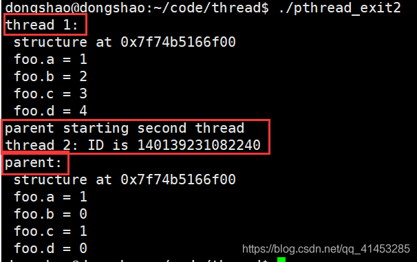

在Solaris上运行与Linux类似
在Max OS X上运行，父进程尝试访问已退出的第一个线程传递给他的结构时，内存不再有效，会产生SIGSEGV信号并进程终止产生core文件
在FresBSD运行时，父进程访问内存时，内存并没有覆盖，虽然线程已经退出了，但是内存依然是完整地
总结：虽然在FreeBSD可以运行，但是不同的平台效果不同，需要注意这一点

## 十二、线程取消选项演示案例
```cpp
#include <stdio.h>
#include <stdlib.h>
#include <pthread.h>
#include <unistd.h>
 
void *thread_func(void* arg);
 
int main()
{
    pthread_t tid;
    int *thread_exit_code=malloc(sizeof(int));
    if(pthread_create(&tid,NULL,thread_func,NULL)!=0){
        fprintf(stdout,"pthread_create error\n");
        exit(EXIT_FAILURE);
    }
 
    //进程休眠1秒，然后取消子线程
    sleep(1);
    if(pthread_cancel(tid)!=0){
        fprintf(stdout,"pthread_cancel error\n");
        exit(EXIT_FAILURE);
    }
 
    printf("pthread_cancel filaed\n");
    
    //睡眠8秒之后取消线程失败了，因为线程已经退出了
    sleep(8);
    if(pthread_cancel(tid)!=0){
        fprintf(stdout,"pthread_cancel error\n");
        exit(EXIT_FAILURE);
    }
    
    printf("kill thread success\n");
 
    if(pthread_join(tid,(void*)&thread_exit_code)==0){
        printf("pthread_join success,exit_code is %d\n",(int)*thread_exit_code);
    }else{
        fprintf(stdout,"pthread_join error\n");
        exit(EXIT_FAILURE);
    }
 
    exit(0);
}
 
void *thread_func(void* arg)
{
    int exit_code,i;
    
    //进入之后，先设置自己为不可取消状态
    printf("I am thread,now my cancle type is disable\n");
    if(pthread_setcancelstate(PTHREAD_CANCEL_DISABLE,NULL)!=0){
        fprintf(stdout,"pthread_setcancelstate error\n");
        exit_code=-1;
        pthread_exit(&exit_code);
    }
   
 
    for(i=1;i<=3;i++){
        sleep(1);
        printf("thread running (%d)\n",i);
    }
 
    //休眠3秒之后之后设置线程可以被取消
    printf("I am thread,now my cancle type is enable\n");
    if(pthread_setcancelstate(PTHREAD_CANCEL_ENABLE,NULL)!=0){
        fprintf(stdout,"pthread_setcancelstate error\n");
        exit_code=-1;
        pthread_exit(&exit_code);
    }
    
    printf("thread sleep....\n");
    sleep(20);
 
    pthread_exit(NULL);
}
```

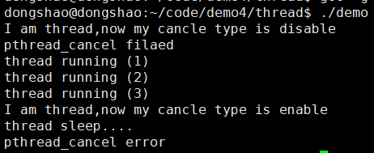
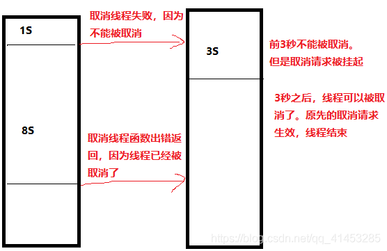

## 十三、演示案例（线程退出码的问题）
下面的exit1.c程序运行了两个子线程，子线程退出的时候返回自己的退出码，但是这个退出码是在子线程的执行函数中定义的（存在于栈中），当我们的子线程执行函数执行完之后，退出码就释放了（栈释放），因此返回到main主函数的时候，我们pthread_join再去获取子线程的退出码就获取的是一个乱值，因此程序运行结果显示“return error”
```cpp
//exit1.c
 
#include <stdio.h>
#include <stdlib.h>
#include <pthread.h>
 
void *func(void *arg);
 
int main()
{
    int num=10;
    int *retValue=(int*)malloc(sizeof(int));
    pthread_t tid1,tid2;
    
    if(pthread_create(&tid1,NULL,func,(void*)&num)!=0){
        perror("thread 1 create error");
        exit(EXIT_FAILURE);
    }
    if(pthread_create(&tid2,NULL,func,(void*)&num)!=0){
        perror("thread 2 create error");
        exit(EXIT_FAILURE);
    } 
 
    if(pthread_join(tid1,(void**)&retValue)!=0){
        perror("pthread_join 1 error");
        exit(EXIT_FAILURE);
    }else{
        if((*retValue)==0){
            printf("Thread1 return success\n");
        }else{
            printf("Thread1 return error\n");
        }
    }
    if(pthread_join(tid2,(void**)&retValue)!=0){
        perror("pthread_join 2 error");
        exit(EXIT_FAILURE);
    }else{
        if((*retValue)==0){
            printf("Thread2 return success\n");
        }else{
            printf("Thread2 return error\n");
        }
    }
 
    //pthread_join会自动释放这个内存，如果此处还释放retValue，程序就会出错
    /*if(retValue){
        free(retValue);
        retValue=NULL;
    }*/
    
    exit(EXIT_SUCCESS);
}
 
void *func(void *arg)
{
    sleep(3);
    int success=0;
    int error=1;
    pthread_exit(&success);
}

```
程序改进
 我们对exit1.c程序进行了更改，将子线程的退出码定义为全局变量，这样在子线程的函数执行完之后，退出码也不会释放，我们的main函数在获取退出码的时候就不会获取乱值，因此打印“retur success”
```cpp
//exit2.c
 
#include <stdio.h>
#include <stdlib.h>
#include <pthread.h>
 
int success=0;
int error=1;
 
void *func(void *arg);
 
int main()
{
    int num=10;
    int *retValue=(int*)malloc(sizeof(int));
    pthread_t tid1,tid2;
    
    if(pthread_create(&tid1,NULL,func,(void*)&num)!=0){
        perror("thread 1 create error");
        exit(EXIT_FAILURE);
    }
    if(pthread_create(&tid2,NULL,func,(void*)&num)!=0){
        perror("thread 2 create error");
        exit(EXIT_FAILURE);
    } 
 
    if(pthread_join(tid1,(void**)&retValue)!=0){
        perror("pthread_join 1 error");
        exit(EXIT_FAILURE);
    }else{
        if((*retValue)==0){
            printf("Thread1 return success\n");
        }else{
            printf("Thread1 return error\n");
        }
    }
    if(pthread_join(tid2,(void**)&retValue)!=0){
        perror("pthread_join 2 error");
        exit(EXIT_FAILURE);
    }else{
        if((*retValue)==0){
            printf("Thread2 return success\n");
        }else{
            printf("Thread2 return error\n");
        }
    }
 
    //pthread_join会自动释放这个内存，如果此处还释放retValue，程序就会出错
    /*if(retValue){
        free(retValue);
        retValue=NULL;
    }*/
    
    exit(EXIT_SUCCESS);
}
 
void *func(void *arg)
{
    sleep(3);
    pthread_exit(&success);
}

```
## 十四、演示案例（线程退出码的问题）
```cpp 
#include <stdio.h>
#include <stdlib.h>
#include <pthread.h>
 
int success=0;
int error=1;
 
void *func(void *arg);
 
int main()
{
    int num=10;
    int *retValue=(int*)malloc(sizeof(int));
    pthread_t tid1,tid2;
    
    if(pthread_create(&tid1,NULL,func,(void*)&num)!=0){
        perror("thread 1 create error");
        exit(EXIT_FAILURE);
    }
    if(pthread_create(&tid2,NULL,func,(void*)&num)!=0){
        perror("thread 2 create error");
        exit(EXIT_FAILURE);
    } 
 
    if(pthread_join(tid1,(void**)&retValue)!=0){
        perror("pthread_join 1 error");
        exit(EXIT_FAILURE);
    }else{
        if((*retValue)==0){
            printf("Thread1 return success\n");
        }else{
            printf("Thread1 return error\n");
        }
    }
    if(pthread_join(tid2,(void**)&retValue)!=0){
        perror("pthread_join 2 error");
        exit(EXIT_FAILURE);
    }else{
        if((*retValue)==0){
            printf("Thread2 return success\n");
        }else{
            printf("Thread2 return error\n");
        }
    }
 
    //pthread_join会自动释放这个内存，如果此处还释放retValue，程序就会出错
    if(retValue){
        free(retValue);
        retValue=NULL;
    }
    
    exit(EXIT_SUCCESS);
}
 
void *func(void *arg)
{
    sleep(3);
    pthread_exit(&success);
}
```

解决办法一
将代码中的释放代码注释掉，因为已经被释放了，所以不需要再次释放
 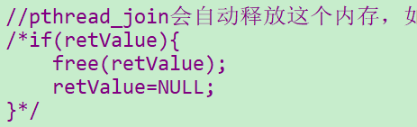

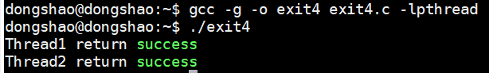

解决办法二
用申请的栈变量来保存子线程的退出码，栈不需要手动释放，在程序解决之后会自动释放
```cpp
#include <stdio.h>
#include <stdlib.h>
#include <pthread.h>
 
int success=0;
int error=1;
 
void *func(void *arg);
 
int main()
{
    int num=10;
    int retValue;
    int *p=&retValue;
    pthread_t tid1,tid2;
    
    if(pthread_create(&tid1,NULL,func,(void*)&num)!=0){
        perror("thread 1 create error");
        exit(EXIT_FAILURE);
    }
    if(pthread_create(&tid2,NULL,func,(void*)&num)!=0){
        perror("thread 2 create error");
        exit(EXIT_FAILURE);
    } 
 
    if(pthread_join(tid1,(void**)&p)!=0){
        perror("pthread_join 1 error");
        exit(EXIT_FAILURE);
    }else{
        if((retValue)==0){
            printf("Thread1 return success\n");
        }else{
            printf("Thread1 return error\n");
        }
    }
    if(pthread_join(tid2,(void**)&p)!=0){
        perror("pthread_join 2 error");
        exit(EXIT_FAILURE);
    }else{
        if((retValue)==0){
            printf("Thread2 return success\n");
        }else{
            printf("Thread2 return error\n");
        }
    }
 
    exit(EXIT_SUCCESS);
}
 
void *func(void *arg)
{
    sleep(3);
    pthread_exit(&success);
}

```

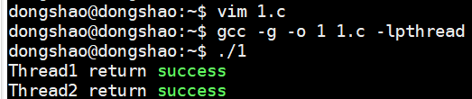

# 线程与信号处理（pthread_sigmask、sigwait、pthread_kill）

## 二、信号屏蔽字函数（pthread_sigmask）
```cpp
#include <signal.h>
int pthread_sigmask(int how, const sigset_t *set, sigset_t *oldset);
 
//返回值：成功返回0；失败返回错误编码
```
功能：用来设置或得到当前线程的信号屏蔽字
pthread_sigmask函数与sigprocmask函数的区别：
sigprocmask只适合单线程的进程使用。如果进程中有多线程，必须使用pthread_sigmask
pthread_sigmask是工作在线程中的，并且pthread_sigmask函数出错时返回错误编码，而不是设置errno的值
参数：
how参数：SIG_BOLCK（把参数2指向的信号集添加到线程信号屏蔽字中）、SIG_SETMASK（用参数2指向的信号集替换线程的信号屏蔽字）、SIG_UNBLOCK（从线程信号屏蔽字中移除参数2中所指向的那些信号）
set参数：是线程用于修改信号屏蔽字的信号集
oset参数：如果此参数非空，线程之前的信号屏蔽字存储在这个结构体中。如果set参数设置为NULL，oset参数设置为sigset_t结构的地址，来获取当前的信号屏蔽字。这种情况下，how参数被忽略
## 三、信号等待函数（sigwait）
```cpp
#include <signal.h>
int sigwait(const sigset_t *set, int *sig);
 
//返回值：成功返回0；失败返回错误编码
```
参数：
set参数：指定了线程等待的信号集
signop参数：sigwait函数返回时，此参数包含发送信号的数量
如果set参数指向的信号集中的某个信号在sigwait调用的时候处于挂起状态：那么sigwait将无阻塞地返回。在返回之前，sigwait将从进程中移除那些处于挂起等待状态的信号。如果具体实现支持排队信号，并且信号的多个实例被挂起，那么sigwait将会移除该信号的一个实例，其他的实例还要继续排队
为了避免错误行为发生，线程在调用sigwait之前，必须阻塞那些正在等待的信号。sigwait函数会原子地取消信号集的阻塞状态，直到有新的信号被递送。在返回之前，sigwait将恢复线程的信号屏蔽字。如果信号在sigwait被调用的时候没有被阻塞，那么在线程完成对sigwait的调用之前会出现一个时间窗，在这个时间窗中，信号就可以被发送给线程
使用sigwait的好处在于它可以简化信号处理，允许把异步产生的信号用同步的方式处理。为了防止信号中断线程，可以把信号加到每个线程的信号屏蔽字中。然后可以安排专业线程处理信号。这些专用线程可以进行函数调用，不需要担心咋信号处理程序中调用哪些函数是安全的，因为这些函数调用来自正常的线程上下文，而非会中断线程正常执行的传统信号处理程序
如果多个线程在sigwait的调用中因等待同一个信号而阻塞，那么在信号递送的时候，就只有一个线程可以从sigwait中返回。如果一个信号被捕获（例如进程通过使用sigwait建立了一个信号处理程序），而且一个线程正在sigwait调用中等待同一信号，那么这时将由操作系统实现来决定以何种方式递送信号。操作系统实现可以让sigwait返回，也可以激活信号处理程序，但这两种情况不会同时发生
## 四、线程信号发送函数（pthread_kill）
```cpp
#include <signal.h>
int pthread_kill(pthread_t thread,int signo);
 
//返回值：成功返回0；失败返回错误编号
```
功能：将信号发送给线程
与kill函数的区别：kill函数是将信号发送给进程，pthread_kill函数是将信号发送给线程
注意事项：

可以传一个0值给signo，来检查线程是否存在
如果信号的默认处理动作是终止该进程，那么把信号传递给某个线程也就会杀死整个进程
闹钟定时器是进程资源，并且所有的线程共享相同的闹钟。所以，进程中的多个线程不可能互不干扰（或互补合作）地使用闹钟定时器
## 五、演示案例
```cpp
#include "apue.h"
#include <pthread.h>
 
int			quitflag;	/* set nonzero by thread */
sigset_t	mask;
 
pthread_mutex_t lock = PTHREAD_MUTEX_INITIALIZER;
pthread_cond_t waitloc = PTHREAD_COND_INITIALIZER;
 
void *  thr_fn(void *arg)
{
	int err, signo;
 
	for (;;) {
		err = sigwait(&mask, &signo);
		if (err != 0)
			err_exit(err, "sigwait failed");
		switch (signo) {
		case SIGINT:
			printf("\ninterrupt\n");
			break;
 
		case SIGQUIT:
			pthread_mutex_lock(&lock);
			quitflag = 1;
			pthread_mutex_unlock(&lock);
			pthread_cond_signal(&waitloc);
			return(0);
 
		default:
			printf("unexpected signal %d\n", signo);
			exit(1);
		}
	}
}
 
int  main(void)
{
	int			err;
	sigset_t	oldmask;
	pthread_t	tid;
 
	sigemptyset(&mask);
	sigaddset(&mask, SIGINT);
	sigaddset(&mask, SIGQUIT);
	if ((err = pthread_sigmask(SIG_BLOCK, &mask, &oldmask)) != 0)
		err_exit(err, "SIG_BLOCK error");
 
	err = pthread_create(&tid, NULL, thr_fn, 0);
	if (err != 0)
		err_exit(err, "can't create thread");
 
	pthread_mutex_lock(&lock);
	while (quitflag == 0)
		pthread_cond_wait(&waitloc, &lock);
	pthread_mutex_unlock(&lock);
 
	/* SIGQUIT has been caught and is now blocked; do whatever */
	quitflag = 0;
 
	/* reset signal mask which unblocks SIGQUIT */
	if (sigprocmask(SIG_SETMASK, &oldmask, NULL) < 0)
		err_sys("SIG_SETMASK error");
	exit(0);
}
```
## 六、演示案例
主线程发送信号SIGUSR1、SIGUSR2给子线程1和子线程2，然后分别处理
```cpp
#include <stdio.h>
#include <unistd.h>
#include <stdlib.h>
#include <pthread.h>
#include <signal.h>
 
void* func_thread_one(void* arg);
void* func_thread_two(void* arg);
void  fun_sig(int signo);
 
int main()
{
    pthread_t tid1,tid2;
 
    //创建线程1
    if(pthread_create(&tid1,NULL,func_thread_one,NULL)!=0){
        perror("pthread_create");
        exit(EXIT_FAILURE);
    }
    //创建线程2
    if(pthread_create(&tid2,NULL,func_thread_two,NULL)!=0){
        perror("pthread_create");
        exit(EXIT_FAILURE);
    }
    
    
    printf("Farther thread:i will send SIGUSR1、SIGUSR2 to child thread...\n");
    sleep(3);
 
    printf("Farther thread:send SIGUSR1 to %ld thread...\n",tid1);
    sleep(2);
    if(pthread_kill(tid1,SIGUSR1)!=0){
        perror("pthread_kill");
        exit(EXIT_FAILURE);
    }
    
    printf("Farther thread:send SIGUSR2 to %ld thread...\n",tid1);
    sleep(2);
    if(pthread_kill(tid1,SIGUSR2)!=0){
        perror("pthread_kill");
        exit(EXIT_FAILURE);
    }
 
    printf("Farther thread:send SIGUSR1 to %ld thread...\n",tid2);
    sleep(2);
    if(pthread_kill(tid2,SIGUSR1)!=0){
        perror("pthread_kill");
        exit(EXIT_FAILURE);
    }
    printf("Farther thread:send SIGUSR2 to %ld thread...\n",tid2);
    if(pthread_kill(tid2,SIGUSR2)!=0){
        perror("pthread_kill");
        exit(EXIT_FAILURE);
    }
 
    printf("Farther thread:send SIGKILL to %ld thread...\n",tid1);
    sleep(2);
    if(pthread_kill(tid1,SIGKILL)!=0){
        perror("pthread_kill");
        exit(EXIT_FAILURE);
    }
    
 
    if(pthread_join(tid1,NULL)!=0){
        perror("pthread_join");
        exit(EXIT_FAILURE);
    }
    
    if(pthread_join(tid2,NULL)!=0){
        perror("pthread_join");
        exit(EXIT_FAILURE);
    }
 
    exit(0);
}
 
void* func_thread_one(void* arg)
{
    //线程1屏蔽SIGUSR1信号，处理SIGUSR2信号
    printf("thread %ld running...\n",pthread_self());
    sigset_t sig;
    sigemptyset(&sig);
    sigaddset(&sig,SIGUSR1);
    signal(SIGUSR2,fun_sig);
    if(pthread_sigmask(SIG_SETMASK,&sig,NULL)!=0){
        perror("pthread_mask");
        exit(EXIT_FAILURE);
    }
 
    sleep(15);
}
 
void* func_thread_two(void* arg)
{
    //线程2屏蔽SIGUSR2信号，处理SIGUSR1信号
    printf("thread %ld running...\n",pthread_self());
    sigset_t sig;
    sigemptyset(&sig);
    sigaddset(&sig,SIGUSR2);
    signal(SIGUSR1,fun_sig);
    if(pthread_sigmask(SIG_SETMASK,&sig,NULL)!=0){
        perror("pthread_mask");
        exit(EXIT_FAILURE);
    }
    sleep(15);
}
 
//信号处理函数
void  fun_sig(int signo)
{
    printf("My tid is %ld,receive signo,signo num is %d\n",pthread_self(),signo);
}
```
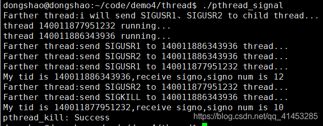

# 进程终止、处理函数(exit、_exit、_Exit、atexit、on_exit)
## 一、进程终止方式
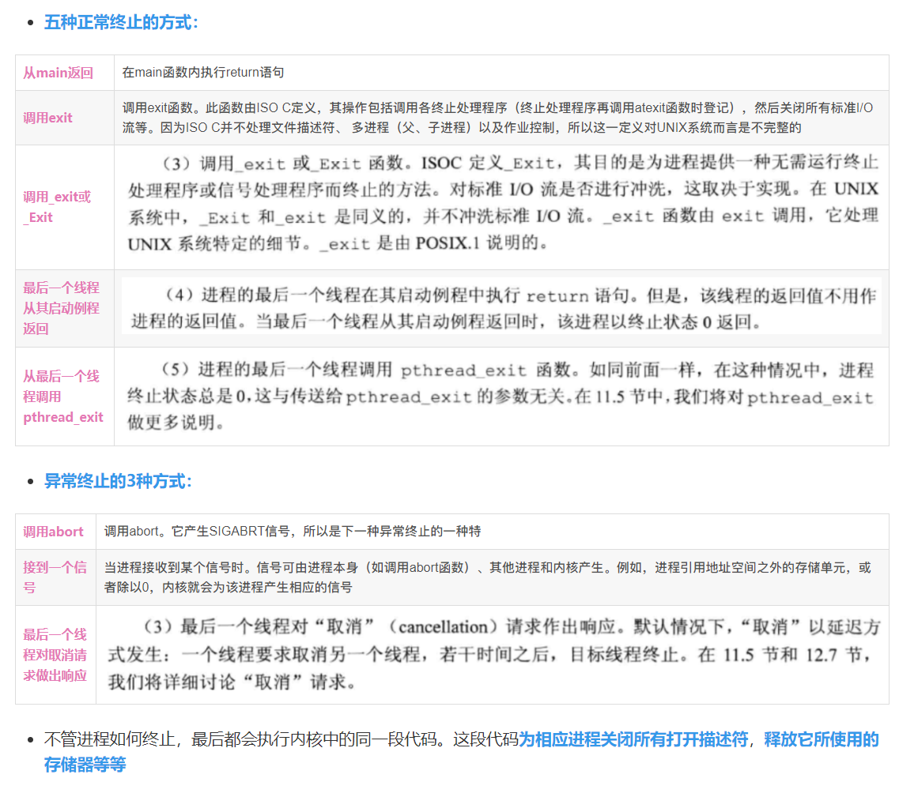

进程终止状态
对上述任意一种终止情形，我们都希望终止进程能够通知其父进程它是如何终止的。对于exit、_exit、_Exit，实现这一点的方法是，将其退出状态作为参数传送给函数。在异常终止情况，内核（不是进程本身）产生一个指示其异常终止原因的终止状态（ termination status）
在任意一种情况下，该终止进程的父进程都能用wait或waitpid函数取得其终止状态


子进程在父进程之前终止，父进程如何获取子进程的终止状态？
内核为每个终止子进程保存了一定量的信息，所以当终止进程的父进程调用wait或waitpid时，可以得到有关信息。这种信息至少包括进程ID、该进程的终止状态、以反该进程使用的CPU时间总量。内核可以释放终止进程所使用的所有存储器，关闭其所有打开文件

## 二、exit、_exit、_Exit
```cpp
#include <stdlib.h>
void exit(int status);
void _Exit(int status);
 
#include <unistd.h>
void _exit(int status);
```
3个函数都用于正常终止一个程序
_exit和_Exit立即进入内核。exit则先执行一些清理处理（例如关闭所有由内核打开的描述符），再返回内核
参数可取得值
0：表示进程正常结束
1~255：表示进程出错结束
C标准指定了两个常量也可以传递给exit作为参数使用：

EXIT_SUCCESS：成功退出
EXIT_FAILURE：出错退出
```cpp
//stdio.h中
 
#define EXIT_SUCCESS 0
#define EXIT_FAILURE 1
```
## 三、进程终止状态
exit、_exit、_Exit这三个函数都带一个整型参数，称为终止状态（或退出状态）

未定义的进程终止状态
如果程序符合下面的某一条件，那么就说这个进程的终止状态是未定义的：
①若调用这些函数时不带终止状态
②main执行了一个无返回值的return语句
③main没有声明返回类型为整型
案例：执行下面没有返回值的main函数，其终止码是随机的
```cpp
#include <stdio.h>
main()
{
    printf("hello, world\n");
}
``` 

如果使用gcc的1999 ISO C标准，就会提示警告信息
如果main的返回类型为整型，并且main执行到最后一条语句时返回（隐式返回），那么该进程的终止状态是0
main函数（仅限main函数）调用return和调用exit是等价的。例如，下面都返回0
exit(0); //等价于return(0);
## 四、return和exit区别
概念一：

如果main函数返回一个整型以及用exit代替return，对某些C编译程序和UNIX  lint(1)程序而言会产生不必要的警告信息，因为这些编译程序并不了解main中的exit与return语句的作用相同
概念二：

避开这种警告信息的一种方法是：在main中使用return语句而不是exit。但是这样做的结果是不能用UNIX  的grep实用程序来找出程序中所有的exit调用
概念三：

另外一个解决方法是将main说明为返回void而不是int，然后仍旧调用exit。这也避开了编译程序的警告，但从程序设计角度看却 并不正确，而且会产生其他的编译编辑警告，因为main的返回类型应当是带符号的整型
ISO C和POSIX.1定义main返回整型
## 五、atexit()函数
```cpp
#include <stdlib.h>
int atexit(void (*func)(void));
 
//参数：函数指针
//返回值：成功返回0，失败返回非0
```
功能与特点：
这个函数用于登记终止处理程序
atexit先登记的终止函数后执行，后登记的先执行
一个函数可以被登记多次
什么是终止处理程序？
程序结束时，main函数结束之后还可以调用登记函数
ISO C规定，一个进程可以登记多至32个函数
atexit()与exit()的关系：
atexit()来登记终止处理程序
然后exit()自动调用atexit()登记的这些终止处理程序
根据ANSI  C和POSIX.1，exit首先调用各终止处理程序，然后关闭（通过fclose）所有的打开流。POSIX.1扩展ISO C标准，它说明，如若程序调用exec函数族中的任一函数，则将清除所有已安装的终止处理程序
注意，内核使程序执行的唯一方法是调用一个exec函数。进程自愿终止的唯一方法是显式或隐式地(调用exit)调用_exit。进程也可非自愿地由一个信号使其终止
进程的开启与终止流程图
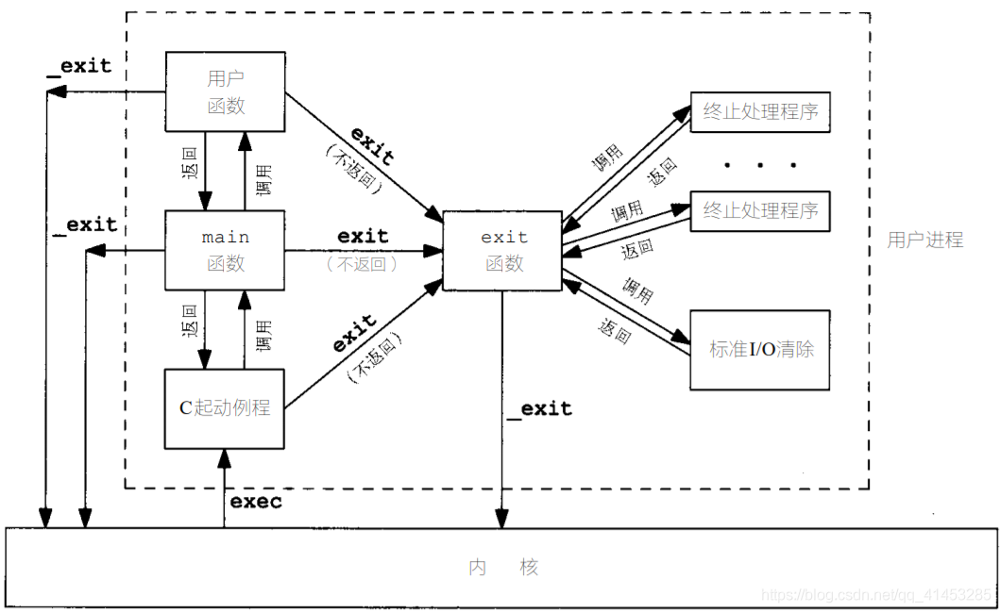

演示案例
```cpp
#include <stdio.h>
#include <stdlib.h>
static void my_exit1(void);
static void my_exit2(void);
int main(void)
{
    if (atexit(my_exit2) != 0)
        perror("can’t register my_exit2");
    if (atexit(my_exit1) != 0)
        perror("can’t register my_exit1");
    if (atexit(my_exit1) != 0)
        perror("can’t register my_exit1");
    printf("main is done\n");
    return(0);
}
static void my_exit1(void){
    printf("first exit handler\n");
}
static void my_exit2(void){
    printf("second exit handler\n");
}
```
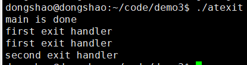
## 六、on_exit()函数
```cpp
#include <stdlib.h>
int on_exit(void (*function)(int , void *), void *arg);
 
//返回值：成功返回0;否则返回非零值
```
on_exit()与atexit()函数相同，都是用于登记终止处理程序
特点也与atexit()函数相同
参数：
参数1：进程终止处理函数（参数1为调用on_exit()函数进程的退出码，参数2为附加信息，为void*类型）
参数2：传递给on_exit()参数1所绑定的函数的第2个参数
演示案例
子进程绑定两个on_exit函数。父进程等待子进程结束
```cpp
#include <stdio.h>
#include <stdlib.h>
#include <sys/types.h>
#include <unistd.h>
 
void On_exit1(int status,void *arg)
{
    printf("%s：child exit,exit code is %d\n",(char*)arg,status);
}
 
void On_exit2(int status,void *arg)
{
    printf("%s：child exit,exit code is %d\n",(char*)arg,status);
}
 
int main()
{
    pid_t pid;
    int status;
    if((pid=fork())==-1){
        perror("fork");
        exit(1);
    }else if(pid==0){
        printf("I am child,pid=%d\n",getpid());
        sleep(1);
        char buff1[]="On_exit1 function";
        char buff2[]="On_exit2 function";
        on_exit(On_exit1,buff1);
        on_exit(On_exit2,buff2);
        exit(2);
    }else{
        printf("I am father,pid=%d\n",getpid());
    }
 
    if(wait(&status)<=0){
        perror("wait");
        exit(2);
    }
    printf("wait success,status code :%d\n",WEXITSTATUS(status));
    exit(0);
}
```

七、僵死进程案例
演示案例
子进程先结束，但是父进程处于sleep状态，因此子进程就变为僵死进程了
```cpp
#include<stdio.h>
#include<unistd.h>
#include<stdlib.h>
 
int main()
{
	pid_t pid;
	if((pid=fork())==-1)
		perror("fork");
	else if(pid==0)
	{
		printf("child_pid pid=%d\n",getpid());
		exit(0);
	}
	sleep(3);
	//子进程已经结束了，但是父进程没有对子进程进行任何处理，wait、waitpid之类的
	system("ps");
	exit(0);
}
```
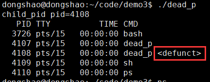
更改上面的案例，在父进程调用wait之前和调用wait之后都执行一次system("ps")。可以看到父进程之后wait处理子进程之后，子进程的僵死状态消失了
```cpp
#include<stdio.h>
#include<unistd.h>
#include<stdlib.h>
 
int main()
{
	pid_t pid;
	if((pid=fork())==-1)
		perror("fork");
	else if(pid==0)
	{
		printf("child_pid pid=%d\n",getpid());
		exit(0);
	}
	sleep(3);
	printf("****before wait:\n");
	system("ps");
	wait(NULL);
	printf("****after wait:\n");
	system("ps");
	exit(0);
}

```
## 八、父进程在子进程终止之前终止案例
 让子进程sleep(2)，父进程sleep(1)，使父进程先结束。子进程之后就被init进程领养了
 ```cpp
#include <stdio.h>
#include <stdlib.h>
#include <unistd.h>
int main()
{
    pid_t pid;
    if((pid=fork())<0){
        perror("frok");
        exit(1);
    }else if(pid==0){
        printf("I am child,myPid=%d,ppid=%d\n",getpid(),getppid());
        sleep(2);
        printf("I am child,myPid=%d,Ppid=%d\n",getpid(),getppid());
        exit(0);
    }else{
        printf("I am father,myPid=%d\n",getpid());
        sleep(1);
        exit(0);
    }
}
```
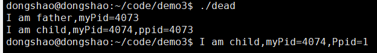