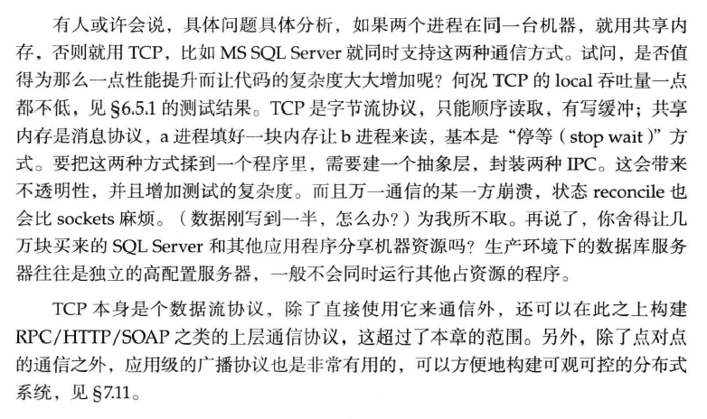
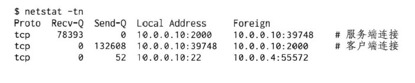

## 单线程服务器的常用编程模型
在高性能的网络程序中，使用得最广泛得恐怕要数“non-blocking IO + IO multiplexing” 这种模型，即 [Reactor 模式](annotation/Reactor.md)

lighttpd，单线程服务器。（Nginx与之类似，每个工作进程有一个event loop）
libevent，libev
ACE，Poco C++ libraries
Java NIO，包括Apache Mina和Netty
POE（Perl）
Twisted（Python）

相反，Boost.Asio和Windows I/O Completion Ports实现了Proactor模式，应用面似乎要窄一些。此外，ACE也实现了Proactor模式。

在“non-blocking IO＋IO multiplexing”这种模型中，程序的基本结构是一个事件循环（event loop），以事件驱和事件回调的方式实现业务逻辑：

Reactor模型的优点:
编程不难，效率也不错
不仅可以用于读写socket，连接的建立（connect/accept）甚至DNS解析（gethostbyname是阻塞的，对陌生域名解析的耗时可长达数秒）都可以用非阻塞方式进行，以提高并发度和吞吐量（throughput），对于IO密集的应用是个不错的选择
lighttpd就是这样，它内部的fdevent结构十分精妙，值得学习。

基于事件驱动的编程模型也有其本质的缺点：
它要求事件回调函数必须是非阻塞的
对于涉及网络IO的请求响应式协议，它容易割裂业务逻辑，使其散布于多个回调函数之中，相对不容易理解和维护

但现代的语言有一些应对方法（例如coroutine）

## 多线程服务器常用编程模型
1．每个请求创建一个线程，使用阻塞式IO操作。在Java 1.4引入 NIO之前，这是Java网络编程的推荐做法。可惜伸缩性不佳。
2．使用线程池，同样使用阻塞式IO操作。与第1种相比，这是提高性能的措施
3．使用non-blocking IO＋IO multiplexing。即Java NIO的方式
4．Leader/Follower等高级模式

在默认情况下一般使用第3种，即non-blocking IO＋one loop per thread模式来编写多线程C++网络服务程序。
### one(event) loop per thread 
### thread pool
## 推荐模式
总结起来，推荐的C++多线程服务端编程模式为：one (event) loop per thread+thread pool：
> event loop（也叫IO loop）用作IO multiplexing，配合non-blocking IO和定时器
> thread pool用来做计算，具体可以是任务队列或生产者消费者队列
以这种方式写服务器程序，需要一个优质的基于Reactor模式的网络库来支撑，muduo正是这样的网络库：

程序里具体用几个loop、线程池的大小等参数需要根据应用来设定，基本的原则是“阻抗匹配”，使得CPU和IO都能高效地运作。
此外，程序里或许还有个别执行特殊任务的线程，比如logging，这对应用程序来说基本是不可见的，但是在分配资源（CPU和IO）的时候要算进去，以免高估了系统的容量。

## 进程间通信只用 TCP 
Linux下进程间通信（IPC）的方式数不胜数，光《UNIX网络编程》列出的就有：匿名管道（pipe）、具名管道（FIFO）、POSIX消息队列、共享内存、信号（signals）等等，更不必说Sockets了。
同步原语 （synchronization primitives）也很多，如互斥器（mutex）、条件变量 （condition variable）、读写锁（reader-writer lock）、文件锁（record locking）、信号量（semaphore）等等。

进程间通信我首选Sockets（主要指TCP，我没有用过UDP，也不考虑Unix domain协议）。
1. 跨主机，具有伸缩性。
   其最大的好处在于：可以跨主机，具有伸缩性（scalability）
   反正都是多进程了，如果一台机器的处理能力不够，很自然地就能用多台机器来处理。把进程分散到同一局域网的多台机器上，程序改改host:port配置就能继续用。相反，前面列出的其他IPC都不能跨机器（比如共享内存效率最高，但受网络带宽及延迟限制，无论如何也不能高效地共享两台物理机器的内存）， 这就限制了scalability
2. 双向
   在编程上，TCP sockets和pipe都是操作文件描述符，用来收发字节流，都可以read/write/fcntl/select/poll等
   TCP VS pipe：
      TCP是双向的， Linux的pipe是单向的，进程间双向通信还得开两个文件描述符，不方便（可以用socketpair替代）
      而且进程要有父子关系才能用pipe，这些都限制了pipe的使用
   在收发字节流这一通信模型下，没有比Sockets/TCP更自然的IPC了
   当然， pipe也有一个经典应用场景，那就是：
      写Reactor/event loop时用来异步唤醒select（或等价的poll/epoll_wait）调用（在Linux下，可以用eventfd代替，效率更高）
      Sun HotSpot JVM在Linux就是这么做的
3. port独占，自动回收
   TCP port由一个进程独占，且操作系统会自动回收（listening port和已建立连接的TCP socket都是文件描述符，在进程结束时操作系统会关闭所有文件描述符）
   这说明，即使程序意外退出，也不会给系统留下垃圾，程序重启之后能比较容易地恢复，而不需要重启操作系统（用跨进程的mutex就有这个风险）
   还有一个好处，既然port是独占的，那么可以防止程序重复启动，后面那个进程抢不到port，自然就没法初始化 了，避免造成意料之外的结果
4. 关闭感知
   两个进程通过TCP通信，如果一个崩溃了，操作系统会关闭连接， 另一个进程几乎立刻就能感知，可以快速failover
   当然应用层的心跳也是必不可少的（可参阅后面的“分布式系统工程实践之分布式系统中心跳协议的设计”文章）
5. 可记录，可重现，跨语言
   与其他IPC相比，TCP协议的一个天生的好处是“可记录、可重 现”
   tcpdump和Wireshark是解决两个进程间协议和状态争端的好帮手， 也是性能（吞吐量、延迟）分析利器。我们可以借此编写分布式程序 的自动化回归测试。也可以用tcpcopy（http://code.google.com/p/tcpcopy）之类的工具进行压力测试
   TCP还能跨语言，服务端和客户端不必使用同一种语言。试想如果用共享内存作为IPC，C++程序如何与Java通信，难道用JNI吗？
6. 可再生
   另外，如果网络库带“连接重试”功能的话，我们可以不要求系统里的进程以特定的顺序启动，任何一个进程都能单独重启
   换句话说， TCP连接是可再生的，连接的任何一方都可以退出再启动，重建连接之后就能继续工作，这对开发牢靠的分布式系统意义重大。
   
使用TCP这种字节流（byte stream）方式通信，会有marshal/unmarshal的开销，这要求我们选用合适的消息格式，准确地说是wire format，目前我推荐Google Protocol Buffers。

### 分布式系统中使用 TCP 长连接通信

分布式系统的软件设计和功能划分一般应该以“进程”为单位。从宏观上看，一个分布式系统是由运行在多台机器上的多个进程组成的，进程之间采用TCP长连接通信
我提倡用多线程，并不是说把整个系统放到一个进程里实现，而是指功能划分之后，在实现每一类服务进程时，在必要时可以借助多线程来提高性能。对于整个分布式系统，要做到能scale out，即享受增加机器带来的好处。

TCP长连接的两个优点
一是容易定位分布式系统中的服务之间的依赖关系：
   只要在机器上运行netstat -tpna | grep :port就能立刻列出用到某服务的客户端地址（Foreign列），然后在客户端的机器上用 netstat或lsof命令找出是哪个进程发起的连接
   这样在迁移服务的时候能有效地防止出现outage
   TCP短连接和UDP则不具备这一特性
二是通过接收和发送队列的长度也较容易定位网络或程序故障：
   在正常运行的时候，netstat打印的Recv-Q和Send-Q都应该接近0，或者在0附近摆动
   如果Recv-Q保持不变或持续增加，则通常意味着服务进程的处理速度变慢，可能发生了死锁或阻塞
   如果Send-Q保持不变或持续增加，有可能是对方服务器太忙、来不及处理，也有可能是网络中间某个路由器或交换机故障造成丢包，甚至对方服务器掉线，这些因素都可能表现为数据发送不出去
   通过持续监控Recv-Q和Send-Q就能及早预警性能或可用性故障
   以下是服务端线程阻塞造成Recv-Q和客户端Send-Q激增的例子
   

## 多线程服务器的适用场合

“服务器开发”包罗万象，用一句话形容是：跑在多核机器上的Linux用户态的没有用户界面的长期运行（“长期运行”的意思不是指程序7 x 24不重启，而是程序不会因为无事可做而退出，它会等着下一个请求的到来。例如wget是不长期运行，httpd是长期运行的）的网络应用程序，通常是分布式系统的组成部件。

开发服务端程序的一个基本任务是处理并发连接，现在服务端网络编程处理并发连接主要有两种方式：
1. 当“线程”很廉价时，一台机器上可以创建远高于CPU数目的“线程”。
   这时一个线程只处理一个TCP连接（甚至半个），通常使用**阻塞 IO（至少看起来如此）**。例如，Python gevent、Go goroutine、Erlang actor。这里的“线程”由语言的runtime自行调度，与操作系统线程不是一回事。
2. 当线程很宝贵时，一台机器上只能创建与CPU数目相当的线程。 
   这时一个线程要处理多个TCP连接上的IO，通常使用**非阻塞IO和IO multiplexing。**例如，libevent、muduo、Netty。这是原生线程，能被操作系统的任务调度器看见。

首先，一个由多台机器组成的分布式系统必然是多进程的（字面意义上），因为进程不能跨OS边界。在这个前提下，我们把目光集中到 一台机器，一台拥有至少4个核的普通服务器。如果要在一台多核机器上提供一种服务或执行一个任务，可用的模式有（这里的“模式”不是pattern，而是model）：
1. 运行一个单线程的进程
2. 运行一个多线程的进程
3. 运行多个单线程的进程
4. 运行多个多线程的进程
   

这些模式之间的比较已经是老生常谈，简单地总结如下：
   模式1是不可伸缩的（scalable），不能发挥多核机器的计算能力
   模式3是目前公认的主流模式。它有以下两种子模式：
      3a．简单地把模式1中的进程运行多份（如果能用多个TCP port对外提供服务的话）
      3b．主进程+woker进程，如果必须绑定到一个TCP port，比如 httpd+fastcgi
   模式2是被很多人所鄙视的，认为多线程程序难写，而且与模式3 相比并没有什么优势
   模式4更是千夫所指，它不但没有结合2和3的优点，反而汇聚了二者的缺点

本文主要想讨论的是模式2和模式3b的优劣，即：什么时候一个服务器程序应该是多线程的：
   从功能上讲，没有什么是多线程能做到而单 线程做不到的，反之亦然，都是状态机嘛（我很高兴看到反例）
   从性能上讲，无论是IO bound还是CPU bound的服务，多线程都没有什么优势

### 必须使用单线程的场合
1. 程序可能会 fork();
   > 根据后面“多线程与fork()”文章的分析，一个设计为可能调用fork的程序必须是单线程的，比如后面“多线程与fork()”文章中提到的“看门狗进程”
   > 多线程程序不是不能调用fork，而是这么做会遇到很多麻烦， 我想不出做的理由
   > 一个程序fork之后一般有两种行为：
   > 1．立刻执行exec()，变身为另一个程序。例如shell和inetd；又比如 lighttpd fork()出子进程，然后运行fastcgi程序。或者集群中运行在计算 节点上的负责启动job的守护进程（即我所谓的“看门狗进程”）
   > 2．不调用exec()，继续运行当前程序。要么通过共享的文件描述符与父进程通信，协同完成任务；要么接过父进程传来的文件描述符，独 立完成工作，例如20世纪80年代的Web服务器NCSA httpd
   > 这些行为中，我认为只有“看门狗进程”必须坚持单线程，其他的均可替换为多线程程序（从功能上讲）
2. 限制程序的 CPU 占用率。
   单线程程序能限制程序的CPU占用率这个很容易理解。
   比如在一个8核的服务器上，一个单线程程序即便发生busy-wait（无论是因为bug，还是因为overload），占满1个core，其CPU使用率也只有12.5％。在这种最坏的情况下，系统还是有87.5％的计算资源可供其他服务进程使用。

### 单线程程序的优缺点
#### 从编程的角度，单线程程序的优势无须赘言：简单
#### 单线程程序的结构：
是一个基于IO multiplexing的event loop。event loop的典型代码框架参阅前文：https://blog.csdn.net/qq_41453285/article/details/104954338
或者如云风所言，直接用阻塞IO（参阅：http://blog.codingnow.com/2006/04/iocp_kqueue_epoll.html）
#### Event loop有一个明显的缺点，它是非抢占的：
假设事件a的优先级高于事件b，处理事件a需要1ms，处理事件b需要 10ms。如果事件b稍早于a发生，那么当事件a到来时，程序已经离开了 poll(2)调用，并开始处理事件b。事件a要等上10ms才有机会被处理，总的响应时间为11ms
这等于发生了优先级反转。这个缺点可以用多线程来克服，这也是多线程的主要优势

多线程程序有性能优势吗？

前面说过，无论是IO bound还是CPU bound的服务，多线程都没有什么绝对意义上的性能优势。这句话是说，如果用很少的CPU负载就能让IO跑满，或者用很少的IO流量就能让CPU跑满，那么多线程没啥用处。

### 使用多线程程序的场景
提高响应速度，让IO和“计算”相互重叠，降低latency（延迟）。虽然多线程不能提高绝对性能，但能提高平均响应性能。

一个程序要做成多线程的，大致要满足：
* 有多个CPU可用。单核机器上多线程没有性能优势（但或许能简 化并发业务逻辑的实现）
* 线程间有共享数据，即内存中的全局状态。如果没有共享数据， 用模型3b就行。虽然我们应该把线程间的共享数据降到最低，但不代表没有
* 共享的数据是可以修改的，而不是静态的常量表。如果数据不能修改，那么可以在进程间用shared memory，模式3就能胜任
* 提供非均质的服务。即，事件的响应有优先级差异，我们可以用专门的线程来处理优先级高的事件。防止优先级反转
* latency和throughput同样重要，不是逻辑简单的IO bound或CPU bound程序。换言之，程序要有相当的计算量
* 利用异步操作。比如logging。无论往磁盘写log file，还是往log server发送消息都不应该阻塞critical path
* 能scale up（按比例增加）。一个好的多线程程序应该能享受增加CPU数目带来的 好处，目前主流是8核，很快就会用到16核的机器了
* 具有可预测的性能。随着负载增加，性能缓慢下降，超过某个临界点之后会急速下降。线程数目一般不随负载变化
* 多线程能有效地划分责任与功能，让每个线程的逻辑比较简单， 任务单一，便于编码。而不是把所有逻辑都塞到一个event loop里，不同类别的事件之间相互影响

#### 线程的分类
1. IO线程，这类线程的主循环是IO multiplexing，阻塞地等在select/poll/epoll_wait系统调用上。这类线程也处理定时事件。当然它的功能不止IO，有些简单计算也可以放入其中，比如消息的编码或解码
2. 计算线程，这类线程的主循环是blocking queue，阻塞地等在 conditionvariable上。这类线程一般位于thread pool中。这种线程通常不 涉及IO，一般要避免任何阻塞操作
3. 第三方库所用的线程，比如logging，又比如database connection

服务器程序一般不会频繁地启动和终止线程。甚至，在我写过的程序里，create thread只在程序启动的时候调用，在服务运行期间是不调用的
总结：
在多核时代，要想充分发挥CPU性能，多线程编程是不可避免的，“鸵鸟算法”不是办法。
在学会多线程编程之前，我也一直认为单线程服务程序才是王道。在接触多线程编程之后，经过一段时间的训练和适应，我已能比较自如地编写正确且足够高效的多线程程序。
学习多线程编程还有一个好处，即训练异步思维，提高分析并发事件的能力。这对设计分布式系统帮助巨大，因为运行在多台机器上的服务进程本质上是异步的。熟悉多线程编程的话，很容易就能发现分布式系统在消息和 事件处理方面的race condition。