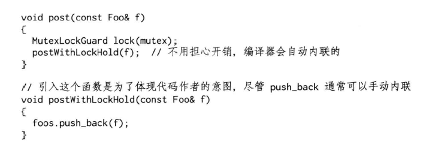
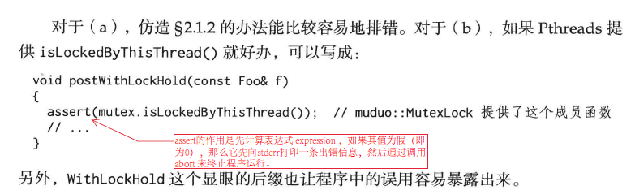
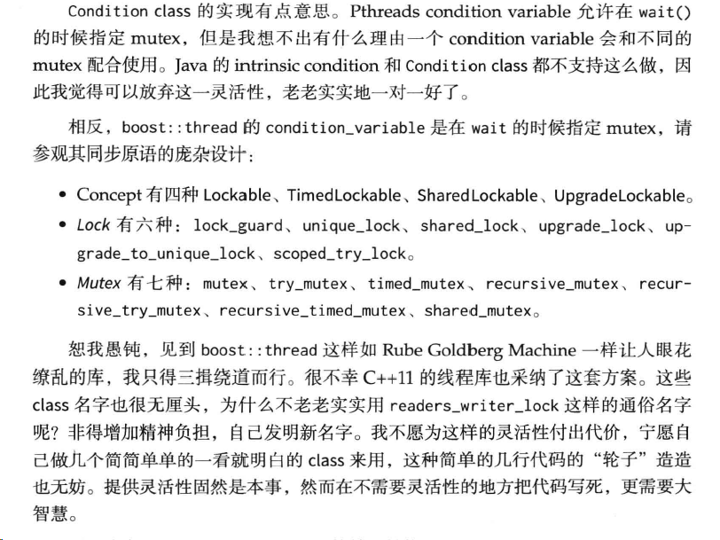

# 线程同步精要
并发编程有两种基本模型：message passing、shared memory。
在分布式系统中，运行在多台机器上的多个进程的并行编程只有一个实用模型：message passing。在单机上也可以照搬。
多线程编程中，message passing 更容易保证程序的正确性，有的语言 message passing。

线程同步的四项原则，按重要性排列：
1. 首要原则是尽量最低限度地共享对象，减少需要同步的场合。一个对象能不暴露给别的线程就不要暴露；如果要暴露，优先考虑immutable对象；实在不行才暴露可修改的对象，并用同步措施来充分保护它。
2. 其次是使用高级的并发编程构件，如TaskQueue、Producer-Consumer Queue、CountDownLatch等等。
3. 最后不得已必须使用底层同步原语（primitives）时，只用非递归的互斥器和条件变量，慎用读写锁，不要用信号量。
4. 除了使用atomic整数之外，不自己编写lock-free代码，也不要用“内核级”同步原语。不凭空猜测“哪种做法性能会更好”，比如spin lock vs mutex。
   
## 互斥器（mutex）
互斥器（mutex）恐怕是使用得最多的同步原语，粗略地说，它保护了临界区，任何一个时刻最多只能有一个线程在此mutex划出的临界区内活动。
单独使用mutex时，我们主要为了保护共享数据。
原则：
1. 用RAII 手法封装 mutex 的创建、销毁、加锁和解锁四个操作。
2. 只用非递归 mutex，即不可重入的 mutex。
3. 不手工调用 lock() \ unlock() 函数，一切交给栈上的 Guard 对象的构造和析构函数负责。
   > Guard对象的生命期正好等于临界区（分析对象在什么时候析构是C++程序员的基本功）。这样我们保证始终在同一个函数同一个scope里对某个mutex加锁和解锁。避免在foo（）里加锁，然后跑到bar（）里解锁；也避免在不同的语句分支中分别加锁、解锁。这种做法被称为Scoped Locking
4. 在每次构造 Guard 对象的时候，思考一路上（调用栈）上已经持有的锁，防止因加锁顺序不同而导致死锁。由于 Guard 对象式栈上对象，看函数调用栈就能分析用锁情况，非常便利。
   
次要原则：
* 不使用跨进程的mutex，进程间通信只用TCP sockets。
* 加锁、解锁在同一个线程，线程a不能去unlock线程b已经锁住的mutex（RAII自动保证）。
* 别忘了解锁（RAII自动保证）。
* 不重复解锁（RAII自动保证）。
* 必要的时候可以考虑用THREAD_MUTEX_ERRORCHECK来排错。


### 只使用非递归的 mutex

> note
> Boost提供了recursive/non-recursive mutex(支持排他访问),  以及shared mutex(支持共享访问).
>> recursive mutex:  lock后，unlock之前，可再次lock.
>> non-recursive mutex: lock后，unlock之前，不可再次lock.
>> shared mutex: 可被多个访问者lock.

> Mutex可以实现以下几种属性: 可加锁(排他访问)、加锁可超时、可被多个访问者加锁(共享访问)、加锁者可权限升级(将共享访问提升为排他访问)。
> The Lockable models exclusive ownership.
> The TimedLockable refines theLockable to add support for timeouts when trying to acquire the lock.
> The SharedLockable is a refinement of theTimedLockable that allows for shared ownership as well as exclusive ownership. 
> The UpgradeLockable is a refinement of theSharedLockable that allows for upgradable ownership as well as shared ownership and exclusive ownership.
> 
递归的 mutex 可能会隐藏代码中的一些问题。而非递归 mutex 会立刻导致死锁。能帮助我们思考代码对于锁的期求，并且及早（在编码阶段）发现问题。
如果一个函数既可能在已加锁的情况下调用，又可能在未加锁的情况下调用，那么就拆成两个函数：
1.跟原来的函数同名，函数加锁，转而调用第2个函数。
2.给函数名加上后缀Wi thLockHold，不加锁，把原来的函数体搬过来。


这有可能出现两个问题
（a）误用了加锁版本，死锁了，
（b）误用了不加锁版本，数据损坏了。

### 死锁

> Scoped locking（区域锁）
> 确切的说，区域锁(Scoped locking)不是一种锁的类型，而是一种锁的使用模式(pattern)。这个名词是Douglas C. Schmidt于1998年在其论文Scoped Locking提出，并在ACE框架里面使用。但作为一种设计思想，这种锁模式应该在更早之前就被业界广泛使用了。
> 区域锁实际上是RAII模式在锁上面的具体应用。RAII(Resource Acquisition Is Initialization)翻译成中文叫“资源获取即初始化”，最早是由C++的发明者 Bjarne Stroustrup为解决C++中资源分配与销毁问题而提出的。RAII的基本含义就是：C++中的资源（例如内存，文件句柄等等）应该由对象来管理，资源在对象的构造函数中初始化，并在对象的析构函数中被释放。STL中的智能指针就是RAII的一个具体应用。RAII在C++中使用如此广泛，甚至可以说，不会RAII的裁缝不是一个好程序员。
[Scoped locking](annotation/Scoped_locking.md)

死锁，gdb调试

## 条件变量（condition variable）

互斥器（mutex）是加锁原语，用来排他性地访问共享数据，它不是等待原语。在使用mutex的时候，我们一-般都会期望加锁不要阻塞，总是能立刻拿到锁。然后尽快访问数据，用完之后尽快解锁，这样才能不影响并发性和性能。
如果需要等待某个条件成立，我们应该使用条件变量（condition variable）。
条件变量顾名思义是一个或多个线程等待某个布尔表达式为真，即等待别的线程“唤醒”它。条件变量的学名叫管程（monitor）。Java Object内置的wait（）、notify（）、notifyAll（）是条件变量。

条件变量只有一种正确使用的方式，几乎不可能用错。对于wait端：
1. 必须与mutex一起使用，该布尔表达式的读写需受此mutex保护。
2. 在mutex已上锁的时候才能调用wait()。
3. 把判断布尔条件和wait()放到while循环中。
```cpp
muduo::MutexLock mutex;
muduo::Condition cond(mutex);
std::deque<int> queue;

int dequeue(){
    MutexLockGuard lock(mutex);
    while (queue.empty())//必须用循环；必须在判断之后再wait()
    {
        cond.wait();//这一步会原子地 unlock mutex 并进入等待，不会和 enqueue 死锁
        //wait() 执行完毕时会自动重新加锁
    }
    assert(!queue.empty());
    int top = queue.front();
    queue.pop_front();
    return top;
}
```

上面的代码中必须用while循环来等待条件变量，而不能用if语句，原因是[spurious wakeup](annotation/Scoped_locking.md)。这也是面试多线程编程的常见考点。

对于signal/broadcast端：
1. 不一定要在mutex已上锁的情况下调用signal（理论上）。
2. 在signal之前一般要修改布尔表达式。
3. 修改布尔表达式通常要用mutex保护（至少用作full memory barrier）。
4. 注意区分signal与broadcast:“broadcast 通常用于表明状态变化，signal通常用于表示资源可用。（broadcast should generally be used to indicate state change rather than resource availability。）
   
```cpp
void enqueue(int x)
{
    MutexLockGuard lock(mutex);
    queue.push_back();
    cond.notify();//可以移出临界区之外
}
```
> 上面的dequeue（）/enqueue（）实际上实现了一个简单的容量无限的（unbounded）BlockingQueue。
> enqueue()中每次添加元素都会调用Condition::notify()，如果改成只在queue.size()从0变1的时候才调用Condition::notify()，会出现什么后果? 会出现有的线程陷入饥饿的情况。有时队列中明明有资源但是dequeue thread 仍然等待。

CountDownLatch
条件变量是非常底层的同步原语，很少直接使用，一般都是用它来实现高层的同步措施，如：
BlockingQueue：已经在上面演示过了
CountDownLatch（倒计时）：是一种常用且易用的同步手段。代码可以参阅（muduo/base/CountDownLatch{h,cc}）
CountDownLatch它主要有两种用途：
1. 主线程发起多个子线程，等这些子线程各自都完成一定的任务之后，主线程才继续执行。通常用于主线程等待多个子线程完成初始化
2. 主线程发起多个子线程，子线程都等待主线程，主线程完成其他 一些任务之后通知所有子线程开始执行。通常用于多个子线程等待主线 程发出“起跑”命令
当然我们可以直接用条件变量来实现以上两种同步，不过如果用CountDownLatch的话，程序的逻辑更清晰
CountDownLatch的接口很简单，实现也很简单，几乎就是条件变量的教科书式应用：
```cpp
class CountDownLatch :boost::noncopyable
{
public:
    explicit CountDownLatch(int count); //倒数几次
    void wait();       //等待计数值变为0
    voiud countDown(); //计数减1
private:
    mutable MutexLock mutex_; //顺序很重要，先mutex后condition
    Condition condition_;
    int count_;
};
 
void CountDownLatch::wait()
{
    MutexLockGuard lock(mutex_);
    while (count_ > 0)
        condition_.wait();
}
 
void CountDownLatch::countDown()
{
    MutexLockGuard lock(mutex_);
    --count_;
    if (count_ == 0)
        condition_.notifyAll();
}
```
> 注意事项：
> 注意到CountDownLatch::countDown()使用的是Condition::notifyAll()，而前面此处的enqueue()使用的是Condition::notify()，这都是有意为之。

## 不要使用读写锁和信号量

### 不要使用读写锁

读写锁（rwlock）是个看上去很美的抽象，它明确区分了read和write两种行为。
初学者常干的一件事情是，一见到某个共享数据结构频繁读而很少写，就把mutex替换为rwlock。甚至首选rwlock来保护共享状态，这不见得是正确的（[RWC]：“Be wary of readers/writer locks”）
一些说明：
* 从正确性方面来说，一种典型的易犯错误是在持有read lock的时候修改了共享数据。这通常发生在程序的维护阶段，为了新增功能，程序员不小心在原来read lock保护的函数中调用了会修改状态的函数。这种错误的后果跟无保护并发读写共享数据是一样的
* 从性能方面来说，读写锁不见得比普通mutex更高效。无论如何reader lock加锁的开销不会比mutex lock小，因为它要更新当前reader的 数目。如果临界区很小(附：在多线程编程中，我们总是设法缩短临界区，不是吗？)，锁竞争不激烈，那么mutex往往会更快。见前面文章（“再论shared_ptr的线程安全”的例子）
* reader lock可能允许提升（upgrade）为writer lock，也可能不允许提升（Pthreads rwlock不允许提升）。考虑文章开始讨论的post()和traverse()示例，如果用读写锁来保护foos对 象，那么post()应该持有写锁，而traverse()应该持有读锁。如果允许把读锁提升为写锁，后果跟使用recursive mutex一样，会造成迭代器失效， 程序崩溃。如果不允许提升，后果跟使用non-recursive mutex一样，会 造成死锁。我宁愿程序死锁，留个“全尸”好查验
* 通常reader lock是可重入的，writer lock是不可重入的。但是为了防止writer饥饿，writer lock通常会阻塞后来的reader lock，因此reader lock 在重入的时候可能死锁。另外，在追求低延迟读取的场合也不适用读写锁（参阅后面介绍的“使用shared_ptr实现copt-on-write”文章）

> muduo线程库有意不提供读写锁的封装，因为我还没有在工作中遇到过用rwlock替换普通mutex会显著提高性能的例子。相反，我们一般建议首选mutex
> 遇到并发读写，如果条件合适，我通常会用“使用shared_ptr实现copt-on-write”技术（后面文章介绍），而不用读写锁，同时避免reader被writer阻塞
> 如果确实对并发读写有极高的性能要求，可以考虑read-copy-update（参阅：http://en.wikipedia.org/wiki/Read-copy-update）

Pthreads还提供了barrier这个同步原语，作者认为不如CountDownLatch实用

### 不要使用信号量
> 信号量（Semaphore）：我没有遇到过需要使用信号量的情况，无 从谈及个人经验。我认为信号量不是必备的同步原语，因为条件变量配 合互斥器可以完全替代其功能，而且更不易用错。除了[RWC]指出 的“semaphore has no notion of ownership”之外，信号量的另一个问题在 于它有自己的计数值，而通常我们自己的数据结构也有长度值，这就造 成了同样的信息存了两份，需要时刻保持一致，这增加了程序员的负担 和出错的可能。如果要控制并发度，可以考虑用muduo::ThreadPool。

## sleep不是同步原语
一些说明：
我认为sleep()/usleep()/nanosleep()只能出现在测试代码中，比如写单元测试的时候（备注：设计时间的单元测试不那么好写，短的如一两秒可以用sleep()；长的如一小时、一天，则得想其他办法，比如把算法提取出来并把时间注入进去）
或者用于有意延长临界区，加速复现死锁的情况，就像“前文介绍的死锁”示范的那样
sleep不具备memory barrier语义，它不能保证内存的可见性（参阅后面“C++多线程系统编程精要”的文章最开始的例子）
生产代码中线程的等待可分为两种：
1. 一种是等待资源可用（要么等在select/poll/epoll_wait上，要么等在条件变量上，我们自己设计的“等待BlockingQueue/CountDownLatch”也可归入此处）
2. 一种是等着进入临界区（等在mutex上）以便读写共享数据。这一种等待通常极短，否则程序性能和伸缩性就会有问题
在程序的正常执行中：
如果需要等待一段已知的时间，应该往event loop里注册一个timer，然后在timer的回调函数里接着干活，因为线程是个珍贵的共享资源，不能轻易浪费（阻塞也是浪费）
如果等待某个事件发生，那么应该采用条件变量或IO事件回调，不能用sleep来轮询
不要使用下面这种业余做法：
```cpp
while (true)
{
    if (!dataAvailable)
        sleep(some_time);
    else
        consumeDta();
}
```
总结：
1. 如果多线程的安全性和效率要靠代码主动调用sleep来保证，这显然是设计出了问题
2. 等待某个事件发生，正确的做法是用select()等价物或Condition，抑或（更理想地）高层同步工具
3. 在用户态做轮询 （polling）是低效的

## 封装 MutexLock、MutexLockGuard、Condition

### MutexLock
MutexLock：封装临界区（critical section），这是一个简单的资源类，用RAII手法封装互斥器的创建与销毁。MutexLock一般是别的class的数据成员
临界区在Windows上是struct CRITICAL_SECTION，是可重入的
在Linux下是pthread_mutex_t，默认是不可重入的

MutexLockGuard：封装临界区的进入和退出，即加锁和解锁。 MutexLockGuard一般是个栈上对象，它的作用域刚好等于临界区域

MutexLock
说明:
    MutexLock 的附加值在于其提供了 isLockedByThisThread() 函数，用于程序断言
    关于 tid() 函数将在 Linux线程标识 介绍

```cpp
class MutexLock: boost::noncopyable
{
public:
    MutexLock():holder_(0)
    {
        pthread_mutex_init(&mutex_,NULL);
    }

    ~MutexLock()
    {
        assert(holder_ == 0)
        pthread_mutex_destroy(&mutex_);
    }

    bool isLockedByThisThread()
    {
        return holder_ == CurrentThread::tid();
    }

    void assertLocked()
    {
        assert(isLockedByThisThread());
    }

    void lock() //仅供 MutexLockGuard 调用，严禁用户代码调用
    {
        pthread_mutex_lock(&mutex_);    //这两行顺序不能反
        holder_ = CurrentThread::tid();
    }

    void unlock()   //仅供 MutexLockGuard 调用，严禁用户代码调用
    {
        holder_ = 0;    //这两行顺序不能反
        pthread_mutex_unlock(&mutex_);
    }

    pthread_mutex_t * getPthreadMutex() //仅供 Condition 调用，严禁用户代码调用
    {
        return &mutex_;
    }

private:
    pthread_mutex_t mutex_;
    pid_t holder_;
};

class MutexLockGuard: boost::noncopyable
{
public:
    explicit MutexLockGuard(MutexLock& mutex):(mutex_(mutex))
    {
        mutex_.lock();
    }

    ~MutexLockGuard()
    {
        mutex_.unlock();
    }
private:
    MutexLock& mutex_;
};

#define MutexLockGuard(x) static_assert(false,"missing mutex guard var name")
```

注意上面代码的最后一行定义了一个宏，这个宏是为了防止程序里出现下面这样的错误：
```cpp
void doit()
{
    MutexLockGuard(mutex);//遗漏变量名，产生一个临时对象，互斥器建立之后立马又销毁了，结果没有锁住临界区
    //正确的做法要加上变量名，例如： MutexLockGuard lock(mutex);
}
```

有人把MutexLockGuard写成template，此处没有这么做是因为它的模板类型参数只有MutexLock一种可能，没有必要随意增加灵活性，于是我手工把模板具现化（instantiate）了。
此外一种更激进的写法是，把lock/unlock放到private区，然后把MutexLockGuard设为MutexLock的friend。我认为在注释里告知程序员即可，另外check-in之前的code review也很容易发现误用的情况（grep getPthreadMutex）。

这段代码没有达到工业强度：
mutex创建为PTHREAD_MUTEX_DEFAULT类型，而不是我们预想的PTHREAD_MUTEX_NORMAL类型（实际上这二者很可能是等同的），严格的做法是用mutexattr来显示指定mutex的类型
没有检查返回值。这里不能用assert()检查返回值，因为assert()在release build里是空语句。我们检查返回值的意义在于防止ENOMEM之类的资源不足情况，这一般只可能在负载很重的产品程序中出现。一旦出现这种错误，程序必须立刻清理现场并主动退出，否则会莫名其妙地崩溃，给事后调查造成困难。这里我们需要non-debug的assert，或许google-glog的CHECK()宏是个不错的思路

muduo库的一个特点是只提供最常用、最基本的功能，特别有意避免提供多种功能近似的选择。muduo不是“杂货铺”，不会不分青红皂白地把各种有用的、没用的功能全铺开摆出来。muduo删繁就简，举重若轻；减少选择余地，生活更简单
MutexLock没有提供trylock()函数，因为我没有在生成代码中用过它。我想不出什么时候程序需要“试着去锁一锁”，或许我写过的代码太简单了（trylock的一个用途是用来观察lock contention，见[RWC]“Consider using nonblocking synchronization routines to monitor contention”）


### Condition



这里用notify/notifyAll作为函数名，因为signal有别的含义，C++里的signal/slot、C里的signalhandler等等。

```cpp
class Condition: boost::noncopyable
{
public:
    explicit Condition (MutexLock & mutex):mutex(mutex_)
    {
        pthread_cond_init(&pcond_, NULL);
    }

    ~Condition(){
        pthread_cond_destroy(&pcond_);
    }

    void wait()
    {
        pthread_cond_wait(&pcond_, mutex_.getPthreadMutex());
    }
    void notify()
    {
        pthread_cond_signal(&pcond_);
    }
    void notifyAll()
    {
        pthread_cond_broadcast(&pcond_);
    }
private:
    MutexLock& mutex_;
    pthread_cond_t pcond_;
 
};
```
如果一个class 要包含MutexLock和Condition，请注意它们的声明顺序和初始化顺序，mutex_应先于condition_构造，并作为后者的构造参数：
```cpp

class CountDownLatch
{
public:
    CountDownLatch(MutexLock& mutex):mutex_(mutex), conditon_(mutex_), count_(0) {} //初始化顺序要与成员声明保持一致
private:
    MutexLock& mutex_;   //顺序很重要，先 Mutex 后 Condition
    Condition conditon_;
    int count_;
};
```

请允许我再次强调，虽然本章花了大量篇幅介绍如何正确使用mutex和condition variable，但并不代表我鼓励到处使用它们:
这两者都是非常底层的同步原语，主要用来实现更高级的并发编程工具
一个多线程程序里如果大量使用mutex和condition variable来同步，基本跟用铅笔刀锯大树（孟岩语）没啥区别
在程序里使用Pthreads库有一个额外的好处：分析工具认得它们， 懂得其语意。线程分析工具如Intel Thread Checker和Valgrind-Helgrind 33 等能识别Pthreads调用，并依据happens-before关系，分析程序有无data race。