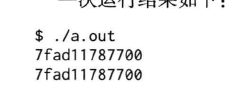
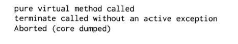

## C++多线程系统编程精要

学习多线程面临的最大思维方式的转变：

1. 当前线程而可能随时被切换出去，或者说被抢占(preempt)了
2. 多线程程序中时间的发生顺序不再有全局统一的先后关系

### 4.1 基本线程原语的选用
我认为用C/C++编写跨平台(只针对POSIX操作系统)的多线程程序不是普遍的需求，因此我们只谈现代Linux(2004年Linux 2.6内核发布之后，NPTL线程库)下的多线程编程。

**POSIX threads的函数有110多个，真正常用的不过十几个。**

而且在C++程序中通常会有更为易用的wrapper，不会直接调用Pthreads函数。

> 这11个最基本的Pthreads函数是：
> 2个：线程的创建和等待结束(join)。封装为muduo::Thread
> 4个：mutex的创建、销毁、加锁、解锁。封装为 muduo::MutexLock
> 5个：条件变量的创建、销毁、等待、通知、广播。封装为 muduo::Condition

这些封装class都很直截了当，加起来也就一两百行代码，却已经构成了多线程编程的全部必备原语。
用这三样东西(thread、mutex、 condition)可以完成任何多线程编程任务。
当然我们一般也不会直接使用它们(mutex除外)，而是使用更高层的封装，例如mutex::ThreadPool和mutex::CountDownLatch等(见前面“线程同步精要”文章)。
除此之外，Pthreads还提供了其他一些原语，有些是可以酌情使用的，有些则是不推荐使用的：

可以酌情使用的有：
>   pthread_once，封装为muduo::Singleton。其实不如直接用全局 变量
>   pthread_key*，封装为muduo::ThreadLocal。可以考虑用 __thread替换之
不建议使用：
>   pthread_rwlock，读写锁通常应慎用。muduo没有封装读写锁，这是有意的
>   sem_*，避免用信号量(semaphore)。它的功能与条件变量重合，但容易用错
>   pthread_{cancel, kill}。程序中出现了它们，则通常意味着设计出了问题

不推荐使用读写锁的原因是：它往往造成提高性能的错觉(允许多个线程并发读)，**实际上在很多情况下，与使用最简单的mutex相比，它实际上降低了性能。另外，写操作会阻塞读操作，如果要求优化读操作的延迟，用读写锁是不合适的。**
多线程系统编程的难点不在于学习线程原语(primitives)，而在于理解多线程与现有的C/C++库函数和系统调用的交互关系，以进一步学习如何设计并实现线程安全且高效的程序。

### 4.2 C/C++ 系统库的线程安全性
**对于标准而言，关键的不是定义线程库，而是规定内存模型(memory model)。**

**特别是规定一个线程对某个共享变量的修改何时能被其他线程看到，这称为内存序(memory ordering)或者内存能见度(memory visibility)。**

从理论上讲，如果没有合适的内存模型，编写正确的多线程程序属于撞大运行为，见Hans-J.Boehm的论文《Threads Cannot be Implemented as a Library》。不过我认为不必担心这篇文章提到的问题，标准的滞后不会对实践构成影响。

现在，多线程程序工作不正常很难归结于编译器bug，毕竟POSIX threads线程标准在20世纪90年代中期就制定了。当然，新标准的积极意义在于让编写跨平台的多线程程序更有保障了。

Unix系统库(libc和系统调用)的接口风格是在20世纪70年代早期确立的，而第一个支持用户态线程的Unix操作系统出现在20世纪90年代早期。线程的出现立刻给系统函数库带来了冲击，破坏了20年来一贯的编程传统和假定。例如：
● errno不再是一个全局变量，因为每个线程可能会执行不同的系统库函数。
● 有些“纯函数”不受影响，例如memset/strcpy/snprintf等等。
● 有些影响全局状态或者有副作用的函数可以通过加锁来实现线程安全，例如ma alloc/free、printf、fread/fseek等等。
● 有些返回或使用静态空间的函数不可能做到线程安全，因此要提供另外的版本，例如asctime_r/ctime_r/gmtime_r、stderror-r、strtok_r等等。
● 传统的fork()并发模型不再适用于多线程程序。

我们不必担心 系统调用的线程安全性，因为系统调用对于用户态程序来说是原子的。但是要注意系统调用对于内核状态的改变可能影响其他线程。

因此，可以说现在glibc库函数大部分都是线程安全的。

特别是FILE*系列函数是安全的，glibc 甚至提供了非线程安全的版本以应对某些特殊场合的性能需求。尽管单个函数是线程安全的，但两个或多个函数放到一起就不再安全了。例如fseek()和fread()都是安全的，但是对某个文件“先seek再read”这两步操作中间有可能会被打断，其他线程有可能趁机修改了文件的当前位置，让程序逻辑无法正确执行。
在这种情况下，我们可以用flockfile(FILE*)和funlockfile(FILE*)函数来显式地加锁。并且由于FILE*的锁是可重人的，加锁之后再调用fread()不会造成死锁。如果程序直接使用lseek(2)和read(2)这两个系统调用来随机读取文件，也存在“先seek再read”这种race condition，但是似乎我们无法高效地对系统调用加锁。解决办法是改用pread(2)系统调用，它不会改变文件的当前位置。

由此可见，编写线程安全程序的一个难点在于线程安全是不可组合的(composable)，一个函数foo()调用了两个线程安全的函数，而这个foo()函数本身很可能不是线程安全的。即便现在大多数glibc库函数是线程安全的，我们也不能像写单线程程序那样编写代码。例如，在单线程程序中，如果我们要临时转换时区，可以用tzset()函数，这个函数会改变程序全局的“当前时区”

尽管C+ +03标准没有明说标准库的线程安全性，但我们可以遵循一一个基本原则：
凡是非共享的对象都是彼此独立的，如果一个对象从始至终只被一个线程用到，那么它就是安全的。
另外一个事实标准是：共享的对象的read-only 操作是安全的，前提是不能有并发的写操作。例如两个线程各自访问自己的局部vector对象是安全的；同时访问共享的const vector对象也是安全的，但是这个vector不能被第三个线程修改。旦有writer，那么read only操作也必须加锁，例如vector:：size()。

根据1.1.1对线程安全的定义，C++的标准库容器和std:：string都不是线程安全的，只有std:：allocator保证是线程安全的。一方面的原因是为了避免不必要的性能开销，另一方面的原因是单个成员函数的线程安全并不具备可组合性(composable)。假设有safe_vector<T> class，它的接口与std：：vector相同，不过每个成员函数都是线程安全的(类似Java synchronized方法)。但是用safe_vector<T>并不一定能写出线程安全的代码。

C++标准库中的绝大多数泛型算法是线程安全的，因为这些都是无状态纯函数。只要输入区间是线程安全的，那么泛型丽数就是线程安全的。

C++的iostream不是线程安全的，因为流式输出std:：cout <<"Now is”<< time(NULL)；等价于两个函数调用
std::cout.operator <<("Now is")
        .operator<<(time(NULL));
即便ostream：：operator<<()做到了线程安全，也不能保证其他线程不会在两次函数调用之前向stdout输出其他字符。

对于“线程安全的stdout输出”这个需求，我们可以改用printf，以达到安全性和输出的原子性。
但是这等于用了全局锁，任何时刻只能有一个线程调用printf，恐怕不见得高效。在多线程程序中高效的日志需要特殊设计，见第5章。

### 4.3 Linux 上的线程标识

#### pthread_t
POSIX threads库提供了pthread_self函数用于返回当前进程的标识符，其类型为pthread_t。
pthread_t不一定是一个数值类型（整数或指针），也有可能是一个结构体，因此Pthreads专门提供了pthread_equal函数用于对比两个线程标识符是否相等。

这就带来一系列问题，包括：

1. 无法打印输出pthread_t，因为不知道其确切类型。也就没法在日志中用它表示当前线程的id
2. 无法比较pthread_t的大小或计算其hash值，因此无法用作关联容器的key
3. 无法定义一个非法的pthread_t值，用来表示绝对不可能存在的线程id，因此MutexLock class没有办法有效判断当前线程是否已经持有本锁
4. pthread_t值只在进程内有意义，与操作系统的任务调度之间无法建立有效关联。比方说在/proc文件系统中找不到pthread_t对应的task


另外，glibc的Pthreads实现实际上把pthread_t用作一个结构体指针 （它的类型是unsigned long），指向一块动态分配的内存，而且这块内存是反复使用的。**这就造成pthread_t的值很容易重复。**
Pthreads只保证同一进程之内，同一时刻的各个线程的id不同；不能保证同一进程先后多个线程具有不同的id，更不要说一台机器上多个进程之间的id唯一性了。

例如，下面这段代码中先后两个线程的标识符是相同的：
[pthread_create](annotation/pthread_create.md)
```cpp
#include <stdio.h>
#include <pthread.h>
 
void *threadFunc(void*){}
 
int main()
{
    pthread_t t1,t2;
    
    pthread_create(&t1,NULL,threadFunc,NULL); 
    pthread_join(t1,NULL);                    
 
    pthread_create(&t2,NULL,threadFunc,NULL);
    printf("%lx\n",t2);
    pthread_join(t2,NULL);
    
    return 0;
}
```


因此，pthread_t 并不适合作程序中对线程的标识符。

#### pid_t
在Linux上，我建议使用gettid系统调用的返回值作为线程id
这么做的好处有：
1. 它的类型是pid_t，其值通常是一个小整数（最大值是/proc/sys/kernel/pid_max，默认值是32768），便于在日志中输出
2. 在现代Linux中，它直接表示内核的任务调度id，因此在/proc文件系统中可以轻易找到对应项：/proc/tid或/prod/pid/task/tid
3. 在其他系统工具中也容易定位到具体某一个线程，例如在top中我们可以按线程列出任务，然后找出CPU使用率最高的线程id，再根据程序日志判断到底哪一个线程在耗用CPU
4. 任何时刻都是全局唯一的，并且由于Linux分配新pid采用递增轮回办法，短时间内启动的多个线程也会具有不同的线程id
5. 0是非法值，因为操作系统第一个进程init的pid是1
但是glibc并没有封装这个系统调用，需要我们自己实现。封装gettid很简单，但是每次都执行一次系统调用似乎有些浪费，如何才能做到更高效呢？
**muduo::CurrentThread::tid()采取的办法是：用__thread变量来缓存gettid的返回值**
这样只有在本线程第一次调用的时候才进行系统调用，以后都是直接从thread local缓存的线程id拿到结果（这个做法是受了glibc封装getpid()的启发），效率无忧
多线程程序在打日志的时候可以在每一条日志消息中包含当前线程的id，不必担心有效率损失。读者有兴趣的话可以对比一下boost::this_thread::get_id()的实现效率

还有一个小问题，万一程序执行了fork，，那么子进程会不会看到stale的缓存结果呢？解决办法是用**pthread_atfork()**注册一个回调，用于清空缓存的线程id。具体代码见muduo/base/CurrentThread.h和Thread.cc


## 4.4 线程的创建与销毁的守则
线程的创建和销毁是编写多线程程序的基本要素。
线程的创建比销毁要容易得多，只需要遵循几条简单的原则：

1. 程序库不应该在未提前告知的情况下创建自己的“背景线程”
2. 尽量用相同的方式创建线程，例如muduo::Thread
3. 在进入main()函数之前不应该启动线程
4. 程序中线程的创建最好能在初始化阶段全部完成

### 程序库不应该在未提前告知的情况下创建自己的“背景线程”

线程是稀缺资源：
* 一个进程可以创建的并发线程数目受限于地址空间的大小和内核参数
* 一台机器可以同时并行运行的线程数目受限于CPU的数目

因此我们在设计一个服务端程序的时候要精心规划线程的数目，特别是根据机器的CPU数目来设置工作线程的数目，并为关键任务保留足够的计算资源。
如果程序库在背地里使用了额外的线程来执行任务，我们这种资源规划就漏算了。可能会导致高估系统的可用资源， 结果处理关键任务不及时，达不到预设的性能指标。
还有一个重要原因是，一旦程序中有不止一个线程，就很难安全地 fork()了（参阅后面的“多线程与fork()”文章）。因此“库”不能偷偷创建线程。

如果确实有必要使用背景线程，至少应该让使用者知道。另外，如果有可能，可以让使用者在初始化库的时候传入线程池或event loop对象，这样程序可以统筹线程的 数目和用途，避免低优先级的任务独占某个线程。

### 尽量用相同的方式创建线程，例如muduo::Thread

理想情况下，程序里的线程都是用同一个class创建的（例如muduo::Thread）
这样容易在线程的启动和销毁阶段做一些统一的簿记（bookkeeping）工作，比如说：
> 调用一次muduo::CurrentThread::tid()把当前线程id缓存起来，以后再取线程id就不会陷入内核了
> 也可以统计当前有多少活动线程（线程数目可以cong/proc/pid/status拿到），进程一共创建了多少线程，每个线程的用途分别是什么
> C/C++的线程不像Java线程那样有名字，但是我们可以通过Thread class实现类似的效果
> 如果每个线程都是通过muduo::Thread启动的，上面这些都不难做到。必要的话可以写一个ThreadManager singleton class，用它来记录当前活动线程，可以方便调试与监控

对于“野生”线程的处理：
但是这不是总能做到的，有些第三方库（C语言库）会自己启动线程，这样的“野生”线程就没有纳入全局的ThreadManager管理之中。
**muduo::CurrentThread::tid()必须要考虑被这种“野生”线程调用的可能，因此它必须每次都检查缓存的线程id是否有效，而不能假定在线程启动阶段已经缓存好了id，直接返回缓存值就行了。**
如果库提供异步回调， 一定要明确说明会在哪个（哪些）线程调用用户提供的回调函数，这样用户可以知道在回调函数中能不能执行耗时的操作，会不会阻塞其他任务的执行。

### 在进入main()函数之前不应该启动线程
这会影响到全局对象的安全构造。这里的全局对象也包括namespace级全局对象、文件级静态对象，class的静态对象，但不包含函数内的静态对象。

C++保证在进入main()之前完成全局对象的构造；
同时，各个编译单元之间的对象构造顺序是不确定的，我们也有一些办法来影响初始化顺序，保证在初始化某个全局对象时使用到的其他全局对象都是构造完成的；
但无论如何这些全局对象的构造是依次进行的， 都在主线程中完成，无须考虑并发与线程安全。

> 如果其中一个全局对象创建了线程，那就危险了：
> 因为这破坏了初始化全局对象的基本假设
> 万一将来代码改动之后造成该线程访问了未经初始化的全局对象，那么这种隐晦错误查起来就很费劲了
> 或许你想用锁来保证全局对象初始化完成，但是怎么保证这个全局的锁对象的构造能在线程启动之前完成呢？

因此，全局对象不能创建线程
如果一个库需要创建线程，那么应该进入main()函数之后再调用库的初始化函数去做

### 程序中线程的创建最好能在初始化阶段全部完成

不要为了每个计算任务，每次请求去创建线程。一般也不会为每个网络连接创建线程，除非并发连接数与CPU数相近。
一个服务程序的线程数目应该与当前负载无关，而应该与机器的CPU数目有关，即load average有比较小（最好不大于CPU数目）的上限。这样尽量避免出现thrashing（抖动），不会因为负载急剧增加而导致机器失去正常响应。这么做的重要原因是，在机器失去响应期间，我们无法探查它究竟在做什么，也没办法立刻终止有问题的进程，防止损害进一步扩大。
如果有实时性方面的要求，线程数目不应该超过CPU数目，这样可以基本保证新任务总能及时得到执行，因为总有CPU是空闲的
**最好在程序的初始化阶段创建全部工作线程，在程序运行期间不再创建或销毁线程**。
**借助 muduo::ThreadPool和muduo::EventLoop，我们很容易就能把计算任务和 IO任务分配到已有的线程，代价只有新建线程的几分之一。**

### 线程销毁的几种方式
（https://blog.csdn.net/program_think/article/details/3991107）：
1. 自然死亡。从线程主函数返回，线程正常退出
2. 非正常死亡。从线程主函数抛出异常或线程触发segfault信号等非法操作（通常伴随进程死亡。如果程序中的某个线程意外终止，我不认为让进程继续带伤运行下去有何必要）
3. 自杀。在线程中调用pthread_exit()来立刻退出线程
4. 他杀。其他线程调用pthread_cancel()来强制终止某个线程
pthread_kill()是往线程发信号，留到后面的“多线程与signal”文章再介绍。

线程正常退出的方式只有一种，即自然死亡。任何从外部强行终止线程的做法和想法都是错的。
因为强行终止线程的话（无论是自杀还是他杀），它没有机会清理资源。也没有机会释放已经持有的锁， 其他线程如果再想对同一个mutex加锁，那么就会立刻死锁。因此我认为不用去研究cancellation point（取消点）这种“鸡肋”概念。

如果确实需要强制终止线程
如果确实需要强行终止一个耗时很长的计算任务，而又不想在计算期间周期性地检查某个全局退出标志，那么可以考虑把那一部分代码**fork()为新的进程，这样杀（kill）一个进程比杀本进程内的线程要安全得多**
当然，fork()的新进程与本进程的通信方式也要慎重选取：
最好用文件描述符（pipe/socketpair/TCP socket）来收发数据，而不要用共享内存和跨进程的互斥器等IPC，因为这样仍然有死锁的可能。

muduo::Thread不是传统意义上的RAII class，因为它析构的时候没有销毁持有的Pthreads线程句柄（pthread_t），也就是说Thread的析构不会等待线程结束
一般而言，我们会让Thread对象的生命期长于线程， 然后通过Thread::join()来等待线程结束并释放线程资源。如果Thread对象的生命期短于线程，那么就没有机会释放pthread_t了 。
muduo::Thread没有提供detach()成员函数，因为我不认为这是必要的。

线程有时不需要销毁
最后，我认为如果能做到前面提到的“程序中线程的创建最好能在初始化阶段全部完成”，如果能做到这一点，则线程是不必销毁的。
因为线程将伴随进程一直运行，彻底避开了线程安全退出可能面临的各种困难，包括：Thread对象生命期管理、资源释放等等。

### pthread_cancel 与 C++

POSIX threads有cancellation point（取消点）这个概念，意思是线程执行到取消点有可能会被终止（cancel）（如果别的线程对它调用了pthread_cancel()的话）
POSIX标准列出了必须或者可能是cancellation point的函数，相关链接为：
https://stackoverflow.com/questions/433989/what-are-the-posix-cancellation-points
https://pubs.opengroup.org/onlinepubs/000095399/functions/xsh_chap02_09.html#tag_02_09_05_02
C++与C的不同：
在C++中，cancellation point的实现与C语言有所不同，线程不是执行到此函数就立刻终止，而是该函数会抛出异常
这样可以有机会执行stack unwind（栈展开），析构栈上对象（特别是释放持有的锁）
如果一定要使用cancellation point，建议读一读Ulrich Drepper写的Cancellation and C++ Exceptions短文（http://udrepper.livejournal.com/21541.html）。不过按我的观点，不应该从外部杀死线程。

### exit() 在 C++中不是线程安全的

exit()函数在C++中的作用除了终止进程，还会析构全局对象和已经构造完的函数静态对象。这有潜在死锁的可能。


```cpp
void someFunctionMayCallExit()
{
    exit(1);
}
 
class GlobalObject   //:boost::noncopyable
{
public:
    void doit(){
        MutexLockGuard lock(mutex_);
        someFunctionMayCallExit();
    }
 
    ~GlobalObject(){
        printf("GlobalObject:~GlobalObject\n");
        MutexLockGuard lock(mutex_);
        //clean up
        printf("GlobalObject:~GlobalObject cleanning\n");
    }
private:
    MutexLock mutex_;
};
 
GlobalObject g_obj;
 
int main()
{
    g_obj.doit();
}
```
doit()函数调用了someFunctionMayCallExit()，其中someFunctionMayCallExit()又调用了exit()，从而使全局g_obj对象析构了，但是doit()函数没有执行完，因此mutex_锁也没有释放。
当g_obj全局对象析构的时候会调用析构函数，析构函数需要对mutex_进行加锁，但是锁被doit()所指持有，因此产生死锁。

再举一个调用纯虚函数导致程序崩溃的例子。（纯虚函数也可以叫抽象函数，一般来说它只有函数名、参数和返回值类型，不需要函数体。这意味着它没有函数的实现，需要让派生类去实现。）
现在我们假设有一个策略基类，在运行时我们会根据情况用不同的无状态策略（派生类对象）。由于策略是无状态的，因此我们可以共享派生类对象，不必每次都新建。
这里以日历（Calendar）基类和不同国家的假期（AmericanCalendar和BritishCalendar）为例，factory 函数返回某个全局对象的引用，而不是每次都创建新的派生类对象。
```cpp
//日期类
class Date{};
 
class Calendar:boost::noncopyable
{
public:
    //传入一个日期，检测是否为假日
    virtual bool isHoliday(Date d)const=0;
    virtual ~ Calendar(){}
};
 
class AmericanCalendar:public Calendar
{
public:
    virtual bool isHoliday(Date d)const;
};
 
class BritishCalendar:public Calendar
{
public:
    virtual bool isHoliday(Date d)const;
};
 
//在其中创建AmericanCalendar或BritishCalendar对象，并返回
Calendar& getCalendar(const std::string& region);

```
通常的使用方式是：
通过调用factory函数返回一个国家对象，然后再调用某个日期对于该国家来说是否为假日
代码如下：
```cpp
struct Request
{
    std::string region;   //地区
    Date settlement_date; //日期
};
 
void processRequest(const Request& req)
{
    //创建一个Calendar对象
    Calendar& calendar=getCalendar(req.region);
 
    //传入日期，判断该日期对于该地区是否为假日
    if(Calendar.isHoliday(req.settlement_date));
    {
        //do something
    }
}
```
上面的代码都没有问题，但是：
如果有一天我们想主动退出这个服务程序，于是某个线程调用了exit()，析构了全局对象，结果造成另一个线程在调用Calendar::isHoliday()时发生了崩溃
结果如下图所示：


当然，这只是举例说明“用全局对象实现无状态策略”在多线程中析构可能有危险。在真实的项目中，Calendar应该在运行的时候从外部配置读入（比如，中国每年几大节日放假安排要等到头一年年底才由国务院假日办公布。又比如2012年英女王登基60周年，英国新加了一两个节日），而不能写死在代码中。

**其实不是exit()的过错，而是全局对象析构的问题**：
C++标准没有照顾全局对象在多线程环境下的析构，据我看似乎也没有更好的办法
如果确实需要主动结束线程，则可以考虑用_exit系统调用。它不会试图析构全局对象，但是也不会执行其他任何清理工作，比如flush标准输出

总结：
由此可见，安全地退出一个多线程的程序并不是一件容易的事情
何况这里还没有涉及如何安全地退出其他正在运行的线程，这需要精心设计共享对象的析构顺序，防止各个线程在退出时访问已失效的对象
在编写长期运行的多线程服务程序的时候，可以不必追求安全地退出， 而是让进程进入拒绝服务状态，然后就可以直接杀掉了（参阅后面的“分布式系统中心跳协议的设计”文章）