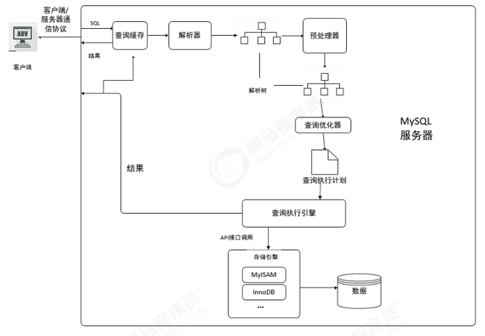

## 查询缓存优化
开启Mysql的查询缓存，当执行完全相同的SQL语句的时候，服务器就会直接从缓存中读取结果，当数据被修改，之前的缓存会失效，修改比较频繁的表不适合做查询缓存。

### 操作流程
1. 客户端发送一条查询给服务器
2. 服务器先检查查询缓存，如果命中缓存，则立刻返回存储在缓存中的结果。否则进入下一阶段
3. 服务器端进行 SQL 解析、预处理，再由优化器生成对应的执行计划
4. MySQL 根据优化器生成的执行计划，调用存储引擎的 API 来执行查询
5. 将结果返回客户端
   


### 查询缓存配置
1. 查看当 MySQL　数据库是否支持查询缓存
   ```sql
   SHOW VARIABLES LIKE 'have_query_cache';
   ```
2. 查看当前　MySQL 是否开启了查询缓存
   ```sql
   SHOW VARIABLES LIKE 'query_cache_type';
   ```
3. 查看查询缓存的占用大小
   ```sql
   SHOW VARIABLES LIKE 'query_cache_size';
   ```
4. 查看查询缓存的状态变量
   ```sql
   SHOW STATUS LIKE 'Qcache%';
   ```


```sql
mysql> SHOW VARIABLES LIKE 'have_query_cache';
+------------------+-------+
| Variable_name    | Value |
+------------------+-------+
| have_query_cache | YES   |
+------------------+-------+
1 row in set (0.00 sec)

mysql> SHOW VARIABLES LIKE 'query_cache_type';
+------------------+-------+
| Variable_name    | Value |
+------------------+-------+
| query_cache_type | OFF   |
+------------------+-------+
1 row in set (0.00 sec)

mysql> SHOW VARIABLES LIKE 'query_cache_size';
+------------------+---------+
| Variable_name    | Value   |
+------------------+---------+
| query_cache_size | 1048576 |
+------------------+---------+
1 row in set (0.00 sec)

mysql> SHOW STATUS LIKE 'Qcache%';
+-------------------------+---------+
| Variable_name           | Value   |
+-------------------------+---------+
| Qcache_free_blocks      | 1       |
| Qcache_free_memory      | 1031352 |
| Qcache_hits             | 0       |
| Qcache_inserts          | 0       |
| Qcache_lowmem_prunes    | 0       |
| Qcache_not_cached       | 2       |
| Qcache_queries_in_cache | 0       |
| Qcache_total_blocks     | 1       |
+-------------------------+---------+
8 rows in set (0.00 sec)


```

|参数|含义|
|---|---|
|Qcache_free_blocks |查询缓存中的可用内存块数|
|Qcache_free_memory |查询缓存的可用内存量|
|Qcache_hits |查询缓存命中数|
|Qcache_inserts |添加到查询缓存的查询数|
|Qcache_lowmen_prunes |由于内存不足而从查询缓存中删除的查询数|
|Qcache_not_cached |非缓存查询的数量（由于 query_cache_type 设置而无法缓存或未缓存）|
|Qcache_queries_in_cache |查询缓存中注册的查询数|
|Qcache_total_blocks |查询缓存中的块总数|

### 开启查询缓存
MySQL的查询缓存默认是关闭的，需要手动配置参数 query_cache_type ， 来开启查询缓存。query_cache_type该参数的可取值有三个 ：

OFF 或 0 ：查询缓存功能关闭
ON 或 1 ：查询缓存功能打开，SELECT的结果符合缓存条件即会缓存，否则，不予缓存，显式指定SQL_NO_CACHE，不予缓存
DEMAND 或 2 ：查询缓存功能按需进行，显式指定 SQL_CACHE 的SELECT语句才会缓存；其它均不予缓存

在 /usr/my.cnf 配置中，增加以下配置 ：

配置完毕之后，重启服务既可生效 ；
然后就可以在命令行执行SQL语句进行验证 ，执行一条比较耗时的SQL语句，然后再多执行几次，查看后面几次的执行时间；获取通过查看查询缓存的缓存命中数，来判定是否走查询缓存。

### 查询缓存的 SELECT 选项
可以在SELECT语句中指定两个与查询缓存相关的选项 ：
SQL_CACHE : 如果查询结果是可缓存的，并且 query_cache_type 系统变量的值为ON或 DEMAND ，则缓存查询结果 。
SQL_NO_CACHE : 服务器不使用查询缓存。它既不检查查询缓存，也不检查结果是否已缓存，也不缓存查询结果。
例子：
```sql
SELECT SQL_CACHE id, name FROM customer;
SELECT SQL_NO_CACHE id, name FROM customer;
```

### 查询缓存失效的情况
1. SQL 语句不一致的情况， 要想命中查询缓存，查询的SQL语句必须一致。
    ```sql
    SQL1 : select count(*) from tb_item;
    SQL2 : Select count(*) from tb_item;
    ```
2. 当查询语句中有一些不确定的时，则不会缓存。如 ： now() , current_date() , curdate() , curtime() , rand() ,uuid() , user() , database() 。
   ```sql
   SQL1 : select * from tb_item where updatetime < now() limit 1;
   SQL2 : select user();
   SQL3 : select database();
   ```
3. 不使用任何表查询语句。
   ```sql
   select 'A';
   ```
4. 查询 mysql， information_schema或 performance_schema 数据库中的表时，不会走查询缓存。
   ```sql
   select * from information_schema.engines;
   ```
5. 在存储的函数，触发器或事件的主体内执行的查询。
6. 如果表更改，则使用该表的所有高速缓存查询都将变为无效并从高速缓存中删除。这包括使用MERGE 映射到已更改表的表的查询。一个表可以被许多类型的语句，如被改变 INSERT， UPDATE， DELETE， TRUNCATE TABLE， ALTER TABLE， DROP TABLE，或 DROP DATABASE 。