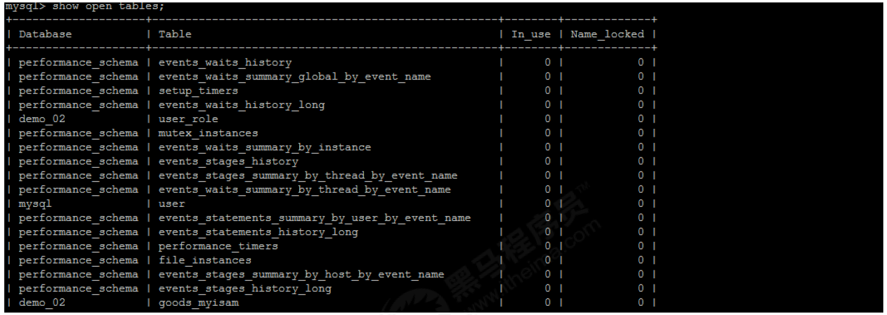
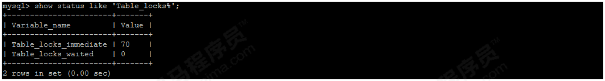
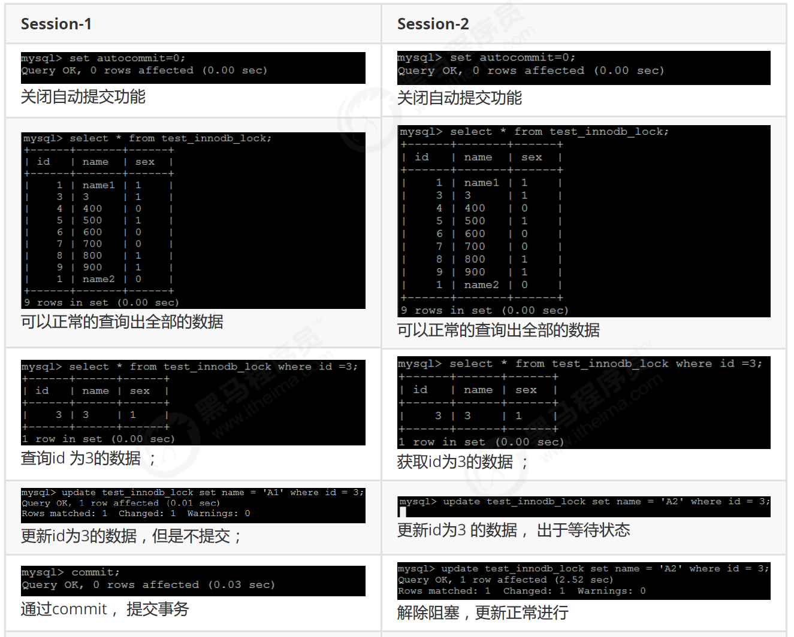
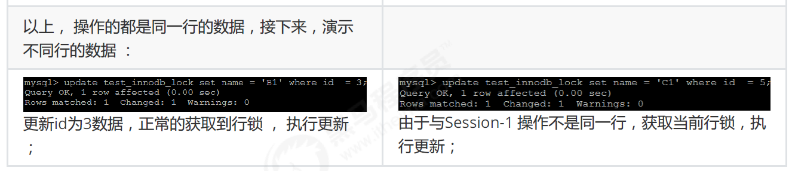
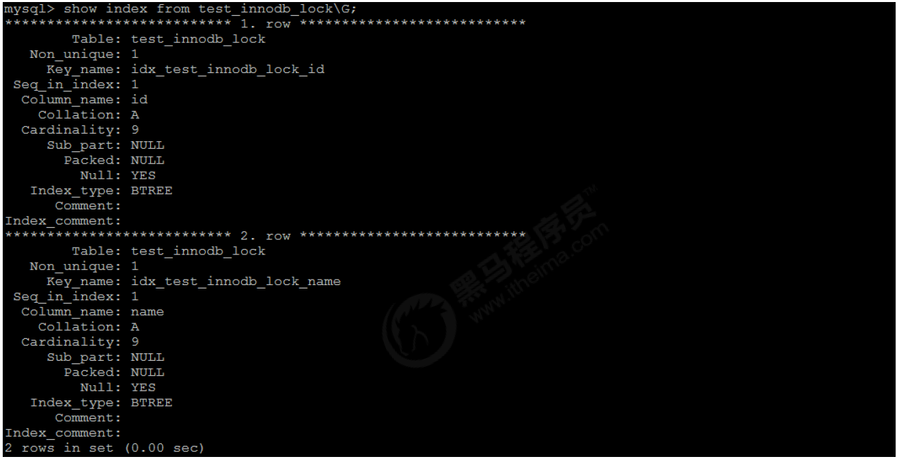
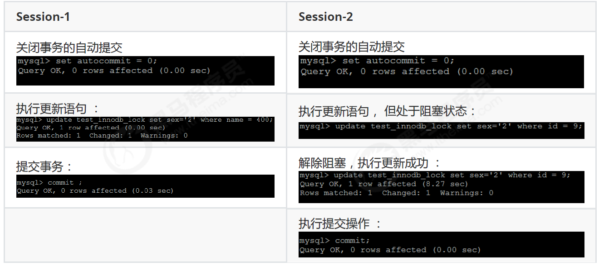
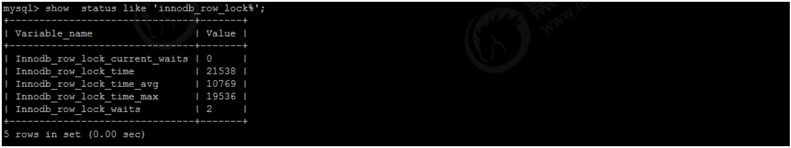

## MySQL 锁问题

### 锁概述
锁是计算机协调多个进程或线程并发访问某一资源的机制（避免争抢）。

在数据库中，除传统的计算资源（如 CPU、RAM、I/O 等）的争用以外，数据也是一种供许多用户共享的资源。如何保证数据并发访问的一致性、有效性是所有数据库必须解决的一个问题，锁冲突也是影响数据库并发访问性能的一个重要因素。从这个角度来说，锁对数据库而言显得尤其重要，也更加复杂。

#### 锁分类

从对数据操作的粒度分 ：
1） 表锁：操作时，会锁定整个表。
2） 行锁：操作时，会锁定当前操作行。

从对数据操作的类型分：
1） 读锁（共享锁）：针对同一份数据，多个读操作可以同时进行而不会互相影响。
2） 写锁（排它锁）：当前操作没有完成之前，它会阻断其他写锁和读锁。

#### MySQL 锁
相对其他数据库而言，MySQL的锁机制比较简单，其最显著的特点是不同的存储引擎支持不同的锁机制。

|存储引擎|表级锁|行级锁|页面锁|
|---|---|---|---|
|MyISAM |⭕|❌|❌|
|InnoDB |⭕|⭕|❌|
|MEMORY |⭕|❌|❌|
|BDB |⭕|❌|⭕|

|锁类型|特点|
|---|---|
|表级锁|偏向MyISAM 存储引擎，开销小，加锁快；不会出现死锁；锁定粒度大，发生锁冲突的概率最高,并发度最低。|
|行级锁|偏向InnoDB 存储引擎，开销大，加锁慢；会出现死锁；锁定粒度最小，发生锁冲突的概率最低,并发度也最高。|
|页面锁|开销和加锁时间界于表锁和行锁之间；会出现死锁；锁定粒度界于表锁和行锁之间，并发度一般。|

从上述特点可见，很难笼统地说哪种锁更好，只能就具体应用的特点来说哪种锁更合适！
仅从锁的角度来说：
表级锁更适合于以查询为主，只有少量按索引条件更新数据的应用，如Web 应用；
而行级锁则更适合于有大量按索引条件并发更新少量不同数据，同时又有并查询的应用，如一些在线事务处理（OLTP）系统。

### MyISAM 表锁


MyISAM 存储引擎只支持表锁，这也是MySQL开始几个版本中唯一支持的锁类型。

#### 如何加表锁
MyISAM 在执行查询语句（SELECT）前，会自动给涉及的所有表加读锁，在执行更新操作（UPDATE、DELETE、INSERT 等）前，会自动给涉及的表加写锁，这个过程并不需要用户干预，因此，用户一般不需要直接用 LOCK TABLE 命令给 MyISAM 表显式加锁。

显式加表锁语法：
```sql
//加读锁：
lock table table_name read;
//加写锁：
lock table table_name write;
```

#### 读锁案例

准备环境：
```sql
create database demo_03 default charset=utf8mb4;
use demo_03;
CREATE TABLE `tb_book` (
    `id` INT(11) auto_increment,
    `name` VARCHAR(50) DEFAULT NULL,
    `publish_time` DATE DEFAULT NULL,
    `status` CHAR(1) DEFAULT NULL,
    PRIMARY KEY (`id`)
) ENGINE=myisam DEFAULT CHARSET=utf8 ;

INSERT INTO tb_book (id, name, publish_time, status) VALUES(NULL,'java编程思想','2088-08-01','1');
INSERT INTO tb_book (id, name, publish_time, status) VALUES(NULL,'solr编程思想','2088-08-08','0');

CREATE TABLE `tb_user` (
`id` INT(11) auto_increment,
`name` VARCHAR(50) DEFAULT NULL,
PRIMARY KEY (`id`)
) ENGINE=myisam DEFAULT CHARSET=utf8 ;
INSERT INTO tb_user (id, name) VALUES(NULL,'令狐冲');
INSERT INTO tb_user (id, name) VALUES(NULL,'田伯光');

```

1. 获取tb_book 表的读锁 `lock table tb_book read`--客户端一
2. 执行查询操作 `select * from tb_book`
   可以正常执行
   
3. 执行查询操作`select  * from tb_book;`：--客户端二：
   
4. 查询未锁定的表`select name from tb_user` -- 客户端一
   
5. 查询未锁定的表`select name from tb_user` -- 客户端二
   
6. 执行插入操作 `insert into tb_book values(null,'Mysql高级 ','2088-01-01','1');` -- 客户端一
   
   执行插入， 直接报错 ， 由于当前tb_book 获得的是 读锁， 不能执行更新操作。
7. 执行插入操作`insert into tb_book values(null,'Mysql高级 ','2088-01-01','1');` --客户端二
   
   当在客户端一中释放锁指令 `unlock tables `后 ， 客户端二中的 inesrt 语句 ， 立即执行 ；

#### 写锁案例

1. 获取tb_book 表的写锁 `lock table tb-book write` --客户端一
2. 执行查询操作 `select * from tb_book` --客户端一
   
3. 执行更新操作 `update tb_book set name = 'java编程思想（第二版）' where id = 1;` --客户端一
   
4. 执行查询操作`select * from tb_book` --客户端二
   
   当在客户端一中释放锁指令 unlock tables 后 ， 客户端二中的 select 语句 ， 立即执行 ；
   

#### 结论


由上表可见：
1. 对MyISAM 表的读操作，不会阻塞其他用户对同一表的读请求，但会阻塞对同一表的写请求；
2. 对MyISAM 表的写操作，则会阻塞其他用户对同一表的读和写操作；
   
简而言之，就是读锁会阻塞写，但是不会阻塞读。而写锁，则既会阻塞读，又会阻塞写。
此外，MyISAM 的读写锁调度是写优先，这也是MyISAM不适合做写为主的表的存储引擎的原因。因为写锁后，其他线程不能做任何操作，大量的更新会使查询很难得到锁，从而造成永远阻塞。

#### 查看锁争用情况
```sql
show open tables;
```


In_user : 表当前被查询使用的次数。如果该数为零，则表是打开的，但是当前没有被使用。
Name_locked：表名称是否被锁定。名称锁定用于取消表或对表进行重命名等操作。

```sql
show status like 'Table_locks%';
```

Table_locks_immediate ： 指的是能够立即获得表级锁的次数，每立即获取锁，值加1。
Table_locks_waited ： 指的是不能立即获取表级锁而需要等待的次数，每等待一次，该值加1，此值高说明存在着较为严重的表级锁争用情况。

### InnoDB 行锁
#### 行锁介绍
行锁特点 ：偏向InnoDB 存储引擎，开销大，加锁慢；会出现死锁；锁定粒度最小，发生锁冲突的概率最低,并发度也最高。

InnoDB 与 MyISAM 的最大不同有两点：一是支持事务；二是 采用了行级锁。

#### 背景知识

##### 事务 及其 ACID 属性
事务是由一组SQL语句组成的逻辑处理单元。
事务具有以下4个特性，简称为事务ACID属性。

|ACID属性|含义|
|---|---|
|原子性（Atomicity）|事务是一个原子操作单元，其对数据的修改，要么全部成功，要么全部失败。|
|一致性（Consistent）|在事务开始和完成时，数据都必须保持一致状态。|
|隔离性（Isolation）|数据库系统提供一定的隔离机制，保证事务在不受外部并发操作影响的 “独立” 环境下运行。|
|持久性（Durable） |事务完成之后，对于数据的修改是永久的。|

##### 并发事务处理带来的问题
|问题|含义|
|---|---|
|丢失更新（Lost Update）|当两个或多个事务选择同一行，最初的事务修改的值，会被后面的事务修改的值覆盖。|
|脏读（Dirty Reads）|当一个事务正在访问数据，并且对数据进行了修改，而这种修改还没有提交到数据库中，这时，另外一个事务也访问这个数据，然后使用了这个数据。|
|不可重复读（Non-Repeatable Reads）|一个事务在读取某些数据后的某个时间，再次读取以前读过的数据，却发现和以前读出的数据不一致。|
|幻读（Phantom Reads）|一个事务按照相同的查询条件重新读取以前查询过的数据，却发现其他事务插入了满足其查询条件的新数据。|

##### 事务隔离级别
为了解决上述提到的事务并发问题，数据库提供一定的事务隔离机制来解决这个问题。数据库的事务隔离越严格，并发副作用越小，但付出的代价也就越大，因为事务隔离实质上就是使用事务在一定程度上“串行化” 进行，这显然与“并发” 是矛盾的。
数据库的隔离级别有4个，由低到高依次为Read uncommitted、Read committed、Repeatable read、Serializable，这四个级别可以逐个解决脏写、脏读、不可重复读、幻读这几类问题。

“更新丢失”通常是应该完全避免的。但防止更新丢失，并不能单靠数据库事务控制器来解决，需要应用程序对要更新的数据加必要的锁来解决，因此，防止更新丢失应该是应用的责任。“脏读”、“不可重复读”和“幻读”，其实都是数据库读一致性问题，必须由数据库提供一定的事务隔离机制来解决。数据库实现事务隔离的方式，基本上可分为以下两种。
1. 一种是在读取数据前，对其加锁，阻止其他事务对数据进行修改。
2. 另一种是不用加任何锁，通过一定机制生成一个数据请求时间点的一致性数据快照（Snapshot)，并用这个快照来提供一定级别（语句级或事务级）的一致性读。从用户的角度来看，好象是数据库可以提供同一数据的多个版本，因此，这种技术叫做数据多版本并发控制，（MultiVersion Concurrency Control,MVCC或MCC）也经常称为多版本数据库。
   
数据库的事务隔离越严格，并发副作用越小，但付出的代价也就越大，因为事务隔离实质上就是使事务在一定程度上“串行化”进行，这显然与“并发”是矛盾的。同时，不同的应用对读一致性和事务隔离程度的要求也是不同的，比如许多应用对“不可重复读”和“幻读”并不敏感，可能更关心数据并发访问的能力。

|隔离级别|丢失更新|脏读|不可重复读|幻读|读数据一致性|
|---|---|---|---|---|---|
|Read uncommitted (未提交读)|× |√ |√ |√|最低级别，只能保证不读取物理上损坏的数据|
|Read committed （已提交读）|× |× |√ |√|语句级|
|Repeatable read （可重复读）（默认） |× |× |× |√ |事务级|
|Serializable （可序列化）|× |× |× |×|最高级别，事务级|
备注 ： √ 代表可能出现 ， ? 代表不会出现 。


Mysql 的数据库的默认隔离级别为 Repeatable read ， 查看方式：
```sql
show variables like 'tx_isolation';
```

#### InnoDB 行锁模式
InnoDB 行锁是通过给索引上的索引项加锁来实现的，这一点MySQL 与Oracle 不同，后者是通过在数据块中对相应数据行加锁来实现的。

InnoDB 这种行锁实现特点意味着：只有通过索引条件检索数据，InnoDB 才使用行级锁，否则，InnoDB 将使用表锁！
在实际应用中，要特别注意InnoDB 行锁的这一特性，不然的话，可能导致大量的锁冲突，从而影响并发性能。
1. 在不通过索引条件查询的时候，InnoDB 确实使用的是表锁，而不是行锁。
2. 由于MySQL 的行锁是针对索引加的锁，不是针对记录加的锁，所以虽然是访问不同行的记录，但是如果是使用相同的索引键，是会出现锁冲突的。应用设计的时候要注意这一点。
3. 当表有多个索引的时候，不同的事务可以使用不同的索引锁定不同的行，另外，不论是使用主键索引、唯一索引或普通索引，InnoDB 都会使用行锁来对数据加锁。
4. 即便在条件中使用了索引字段，但是否使用索引来检索数据是由MySQL 通过判断不同执行计划的代价来决定的，如果MySQL 认为全表扫描效率更高，比如对一些很小的表，它就不会使用索引，这种情况下InnoDB 将使用表锁，而不是行锁。因此，在分析锁冲突时，别忘了检查SQL 的执行计划，以确认是否真正使用了索引。关于MySQL 在什么情况下不使用索引的详细讨论，参见本章“索引问题”一节的介绍。

InnoDB 实现了以下两种类型的行锁。
共享锁（S）：又称为读锁，简称S锁，共享锁就是多个事务对于同一数据可以共享一把锁，都能访问到数据，但是只能读不能修改。
排他锁（X）：又称为写锁，简称X锁，排他锁就是不能与其他锁并存，如一个事务获取了一个数据行的排他锁，其他事务就不能再获取该行的其他锁，包括共享锁和排他锁，但是获取排他锁的事务是可以对数据就行读取和修改。

对于UPDATE、DELETE和INSERT语句，InnoDB会自动给涉及数据集加排他锁（X)；
对于普通SELECT语句，InnoDB不会加任何锁；

显式给记录集加共享锁或者排他锁
```sql
//共享锁
SELECT * FROM table_name WHERE ...  LOCK IN SHARE MODE
//排他锁
SELECT * FROM table_name WHERE ... FOR UPDATE
```

案例准备工作：
```sql
create table test_innodb_lock(
   id int(11),
   name varchar(16),
   sex varchar(1)
)engine = innodb default charset=utf8;

insert into test_innodb_lock values(1,'100','1');
insert into test_innodb_lock values(3,'3','1');
insert into test_innodb_lock values(4,'400','0');
insert into test_innodb_lock values(5,'500','1');
insert into test_innodb_lock values(6,'600','0');
insert into test_innodb_lock values(7,'700','0');
insert into test_innodb_lock values(8,'800','1');
insert into test_innodb_lock values(9,'900','1');
insert into test_innodb_lock values(1,'200','0');

create index idx_test_innodb_lock_id on test_innodb_lock(id);
create index idx_test_innodb_lock_name on test_innodb_lock(name);
```

行锁基本演示：



##### 无索引行锁升级为表锁
如果不通过索引条件检索数据，那么InnoDB将对表中的所有记录加锁，实际效果跟表锁一样。
`查看当前表的索引 ： show index from test_innodb_lock`



由于 执行更新时 ， name字段本来为varchar类型， 我们是作为数组类型使用，存在类型转换，索引失效，最终行锁变为表锁 ；

##### 间隙锁危害
当我们用范围条件而不是相等条件检索数据，并请求共享或排他锁时，InnoDB 会给符合条件的已有数据记录的索引项加锁；对于键值在条件范围内但并不存在的记录，叫做“间隙（GAP)”，InnoDB 也会对这个“间隙”加锁，这种锁机制就是所谓的间隙锁（Next-Key 锁）。举例来说，假如emp 表中只有101 条记录，其empid 的值分别是 1,2,...,100,101，下面的SQL：
   `Select * from emp where empid > 100 for update;`
是一个范围条件的检索，InnoDB 不仅会对符合条件的empid 值为101 的记录加锁，也会对empid 大于101（这些记录并不存在）的“间隙”加锁。

InnoDB 使用间隙锁的目的，一方面是为了防止幻读，以满足相关隔离级别的要求，对于上面的例子，要是不使用间隙锁，如果其他事务插入了empid 大于100 的任何记录，那么本事务如果再次执行上述语句，就会发生幻读；另外一方面，是为了满足其恢复和复制的需要。有关其恢复和复制对锁机制的影响，以及不同隔离级别下InnoDB 使用间隙锁的情况，在后续的章节中会做进一步介绍。

因此，在实际应用开发中，尤其是并发插入比较多的应用，我们要尽量优化业务逻辑，尽量使用相等条件来访问更新数据，避免使用范围条件。
还要特别说明的是，InnoDB 除了通过范围条件加锁时使用间隙锁外，如果使用相等条件请求给一个不存在的记录加锁，InnoDB 也会使用间隙锁！

##### 行锁争用的情况
`show status like 'innodb_row_lock%';`


Innodb_row_lock_current_waits: 当前正在等待锁定的数量
Innodb_row_lock_time: 从系统启动到现在锁定总时间长度
Innodb_row_lock_time_avg:每次等待所花平均时长
Innodb_row_lock_time_max:从系统启动到现在等待最长的一次所花的时间
Innodb_row_lock_waits: 系统启动后到现在总共等待的次数
当等待的次数很高，而且每次等待的时长也不小的时候，我们就需要分析系统中为什么会有如此多的等待，然后根据分析结果着手制定优化计划。

#### 总结
InnoDB存储引擎由于实现了行级锁定，虽然在锁定机制的实现方面带来了性能损耗可能比表锁会更高一些，但是在整体并发处理能力方面要远远由于MyISAM的表锁的。当系统并发量较高的时候，InnoDB的整体性能和MyISAM相比就会有比较明显的优势。
但是，InnoDB的行级锁同样也有其脆弱的一面，当我们使用不当的时候，可能会让InnoDB的整体性能表现不仅不能比MyISAM高，甚至可能会更差。

> 优化建议：
> 尽可能让所有数据检索都能通过索引来完成，避免无索引行锁升级为表锁。
> 合理设计索引，尽量缩小锁的范围
> 尽可能减少索引条件，及索引范围，避免间隙锁
> 尽量控制事务大小，减少锁定资源量和时间长度
>尽可使用低级别事务隔离（但是需要业务层面满足需求）