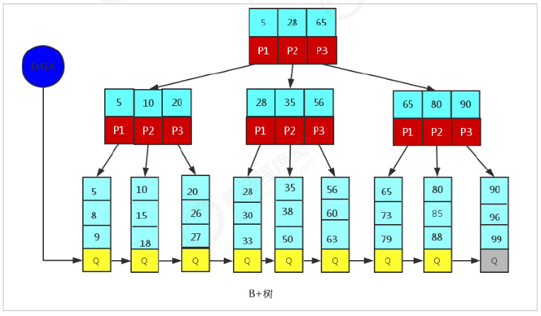
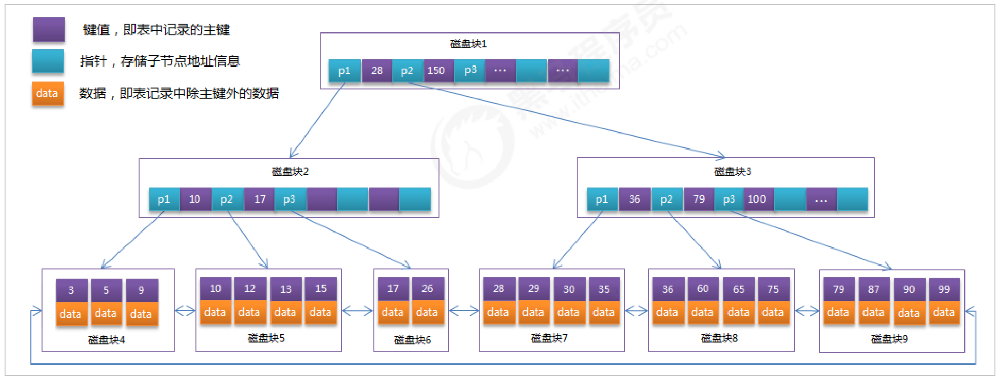

## 索引
MySQL官方对索引的定义为：**索引（index）是帮助MySQL高效获取数据的数据结构（有序）。** 在数据之外，数据库系统还维护者满足特定查找算法的数据结构，这些数据结构以某种方式引用（指向）数据， 这样就可以在这些数据结构上实现高级查找算法，这种数据结构就是 **索引**。
> 优势
> 1） 类似于书籍的目录索引，提高数据检索的效率，降低数据库的IO成本。
> 2） 通过索引列对数据进行排序，降低数据排序的成本，降低CPU的消耗。

> 劣势
> 1） 实际上索引也是一张表，该表中保存了主键与索引字段，并指向实体类的记录，所以索引列也是要占用空间的。
> 2） 虽然索引大大提高了查询效率，同时却也降低更新表的速度，如对表进行INSERT、UPDATE、DELETE。因为更新表时，MySQL 不仅要保存数据，还要保存一下索引文件每次更新添加了索引列的字段，都会调整因为更新所带来的键值变化后的索引信息。

### 索引结构
索引是在MySQL的存储引擎层中实现的，而不是在服务器层实现的。所以每种存储引擎的索引都不一定完全相同，也不是所有的存储引擎都支持所有的索引类型的。

> MySQL目前提供了以下4种索引：
> 1. BTREE 索引 ： 最常见的索引类型，大部分索引都支持 B 树索引。
> 2. HASH 索引：只有Memory引擎支持 ， 使用场景简单 。
> 3. R-tree 索引（空间索引）：空间索引是MyISAM引擎的一个特殊索引类型，主要用于地理空间数据类型，通常使用较少，不做特别介绍。
> 4. Full-text （全文索引） ：全文索引也是MyISAM的一个特殊索引类型，主要用于全文索引，InnoDB从Mysql5.6版本开始支持全文索引。


|索引|InnoDB引擎|MyISAM引擎|Memory引擎|
|---|---|---|---|
|BTREE 索引|支持|支持|支持|
|HASH 索引|不支持|不支持|支持|
|R-tree 索引|不支持|支持|不支持|
|Full-text |5.6版本之后支持|支持|不支持|

我们平常所说的索引，如果没有特别指明，都是指B+树（多路搜索树，并不一定是二叉的）结构组织的索引。其中聚集索引、复合索引、前缀索引、唯一索引默认都是使用 B+tree 索引，统称为 索引。

#### BTREE

BTree 又叫多路平衡搜索树。
* 树中每个节点最多包含 m 个孩子
* 除根结点和叶子节点，每个节点至少有 [ceil(m/2)] 个孩子
* 若根节点不是叶子节点，则至少有两个孩子
* 所有叶子节点在同一层
* 每个非叶子节点由 n 个 key 与 n+1 个指针组成。其中 [ceil(m/2)-1] <= n <= m-1

> 举例：
以5叉BTree为例，key的数量：公式推导[ceil(m/2)-1] <= n <= m-1。所以 2 <= n <=4 。当n>4时，中间节点分裂到父节点，两边节点分裂。

BTREE树 和 二叉树 相比， 查询数据的效率更高， 因为对于相同的数据量来说，BTREE的层级结构比二叉树小，因此搜索速度快。

#### B+ Tree

B+ Tree 和 B Tree 的区别
* n 叉 B+ Tree 最多含有 n 个 key，而B Tree 最多含有 n-1 个 key
* B+ Tree 的叶子节点保存所有的 key 信息， 依 key 大小顺序排列
* 所有非叶子节点都可以看作是 key 的索引部分

由于B+ Tree 只有叶子节点保存 key 的信息，查询任何 key 都要从 root 走到叶子节点。所以 B+ Tree 的查询效率更加稳定。


####　MySQL中的B+Tree
MySQL 索引数据结构对经典的 B+Tree 进行了优化。在原 B+Tree 的基础上，增加一个指向相邻叶子节点的链表指针。这就形成了带有顺序指针的 B+Tree，提高区间访问的性能。



### 索引分类

1） 单值索引 ：即一个索引只包含单个列，一个表可以有多个单列索引
2） 唯一索引 ：索引列的值必须唯一，但允许有空值
3） 复合索引 ：即一个索引包含多个列

### 索引语法

索引在创建表的时候，可以同时创建，也可以随时增加新的索引

准备环境：
``` sql
create database demo_01 default charset=utf8mb4;
use demo_01;
CREATE TABLE `city` (
`city_id` int(11) NOT NULL AUTO_INCREMENT,
`city_name` varchar(50) NOT NULL,
`country_id` int(11) NOT NULL,
PRIMARY KEY (`city_id`)
) ENGINE=InnoDB DEFAULT CHARSET=utf8;

CREATE TABLE `country` (
`country_id` int(11) NOT NULL AUTO_INCREMENT,
`country_name` varchar(100) NOT NULL,
PRIMARY KEY (`country_id`)
) ENGINE=InnoDB DEFAULT CHARSET=utf8;

insert into `city` (`city_id`, `city_name`, `country_id`) values(1,'西安',1);
insert into `city` (`city_id`, `city_name`, `country_id`) values(2,'NewYork',2);
insert into `city` (`city_id`, `city_name`, `country_id`) values(3,'北京',1);
insert into `city` (`city_id`, `city_name`, `country_id`) values(4,'上海',1);

insert into `country` (`country_id`, `country_name`) values(1,'China');
insert into `country` (`country_id`, `country_name`) values(2,'America');
insert into `country` (`country_id`, `country_name`) values(3,'Japan');
insert into `country` (`country_id`, `country_name`) values(4,'UK');
```

#### 创建索引

语法：
``` sql
CREATE [UNIQUE|FULLTEXT|SPATIAL] INDEX index_name
[USING index_type]
ON tbl_name(index_col_name,...)

index_col_name : column_name[(length)][AEC|DESC]

```

示例：
为city表中 city_name字段创建索引；
```sql
mysql> create index idx_city_name on city(city_name);
Query OK, 0 rows affected (0.03 sec)
Records: 0  Duplicates: 0  Warnings: 0

```

#### 查看索引
语法：
```sql
show index from table_name;
```
示例：
查看city表中的索引信息；
```sql
mysql>show index from city;
+-------+------------+---------------+--------------+-------------+-----------+-------------+----------+--------+------+------------+---------+---------------+
| Table | Non_unique | Key_name      | Seq_in_index | Column_name | Collation | Cardinality | Sub_part | Packed | Null | Index_type | Comment | Index_comment |
+-------+------------+---------------+--------------+-------------+-----------+-------------+----------+--------+------+------------+---------+---------------+
| city  |          0 | PRIMARY       |            1 | city_id     | A         |           4 |     NULL | NULL   |      | BTREE      |         |               |
| city  |          1 | idx_city_name |            1 | city_name   | A         |           4 |     NULL | NULL   |      | BTREE      |         |               |
+-------+------------+---------------+--------------+-------------+-----------+-------------+----------+--------+------+------------+---------+---------------+
2 rows in set (0.00 sec)

mysql> show index from city\G;
*************************** 1. row ***************************
        Table: city
   Non_unique: 0
     Key_name: PRIMARY
 Seq_in_index: 1
  Column_name: city_id
    Collation: A
  Cardinality: 4
     Sub_part: NULL
       Packed: NULL
         Null:
   Index_type: BTREE
      Comment:
Index_comment:
*************************** 2. row ***************************
        Table: city
   Non_unique: 1
     Key_name: idx_city_name
 Seq_in_index: 1
  Column_name: city_name
    Collation: A
  Cardinality: 4
     Sub_part: NULL
       Packed: NULL
         Null:
   Index_type: BTREE
      Comment:
Index_comment:
2 rows in set (0.00 sec)


```

#### 删除索引
语法： 
```sql
DROP INDEX index_name ON tbl_name;
```
示例：想要删除city表上的索引idx_city_name，可以操作如下：
```sql
mysql> drop index idx_city_name on city;
Query OK, 0 rows affected (0.01 sec)
Records: 0  Duplicates: 0  Warnings: 0

mysql> show index from city;
+-------+------------+----------+--------------+-------------+-----------+-------------+----------+--------+------+------------+---------+---------------+
| Table | Non_unique | Key_name | Seq_in_index | Column_name | Collation | Cardinality | Sub_part | Packed | Null | Index_type | Comment | Index_comment |
+-------+------------+----------+--------------+-------------+-----------+-------------+----------+--------+------+------------+---------+---------------+
| city  |          0 | PRIMARY  |            1 | city_id     | A         |           4 |     NULL | NULL   |      | BTREE      |         |               |
+-------+------------+----------+--------------+-------------+-----------+-------------+----------+--------+------+------------+---------+---------------+
1 row in set (0.00 sec)

```
#### ALTER 命令 
```sql
1). alter table tb_name add primary key(column_list);
该语句添加一个主键，这意味着索引值必须是唯一的，且不能为NULL
2). alter table tb_name add unique index_name(column_list);
这条语句创建索引的值必须是唯一的（除了NULL外，NULL可能会出现多次）
3). alter table tb_name add index index_name(column_list);
添加普通索引， 索引值可以出现多次。
4). alter table tb_name add fulltext index_name(column_list);
该语句指定了索引为FULLTEXT， 用于全文索引
```
示例：
```sql
mysql> select * from city;
+---------+-----------+------------+
| city_id | city_name | country_id |
+---------+-----------+------------+
|       1 | 西安      |          1 |
|       2 | NewYork   |          2 |
|       3 | 北京      |          1 |
|       4 | 上海      |          1 |
+---------+-----------+------------+
4 rows in set (0.00 sec)

mysql> ALTER TABLE city ADD UNIQUE (country_id);
ERROR 1062 (23000): Duplicate entry '1' for key 'country_id'
mysql> ALTER TABLE city ADD UNIQUE (city_name);
Query OK, 0 rows affected (0.00 sec)
Records: 0  Duplicates: 0  Warnings: 0

```
### 索引设计原则
索引的设计可以遵循一些已有的原则，创建索引的时候请尽量考虑符合这些原则，便于提升索引的使用效率，更高效的使用索引。
* 对查询频次较高，且数据量比较大的表建立索引。
* 索引字段的选择，最佳候选列应当从where子句的条件中提取，如果where子句中的组合比较多，那么应当挑选最常用、过滤效果最好的列的组合。
* 使用唯一索引，区分度越高，使用索引的效率越高。
* 索引可以有效的提升查询数据的效率，但索引数量不是多多益善，索引越多，维护索引的代价自然也就水涨船高。对于插入、更新、删除等DML操作比较频繁的表来说，索引过多，会引入相当高的维护代价，降低DML操作的效率，增加相应操作的时间消耗。另外索引过多的话，MySQL也会犯选择困难病，虽然最终仍然会找到一个可用的索引，但无疑提高了选择的代价。
* 使用短索引，索引创建之后也是使用硬盘来存储的，因此提升索引访问的I/O效率，也可以提升总体的访问效率。假如构成索引的字段总长度比较短，那么在给定大小的存储块内可以存储更多的索引值，相应的可以有效的提升MySQL访问索引的I/O效率。
* 利用最左前缀，N个列组合而成的组合索引，那么相当于是创建了N个索引，如果查询时where子句中使用了组成该索引的前几个字段，那么这条查询SQL可以利用组合索引来提升查询效率。

```sql
创建复合索引:(回顾创建索引)
CREATE INDEX idx_name_email_status ON tb_seller(NAME,email,STATUS);
就相当于
对name 创建索引 ;
对name , email 创建了索引 ;
对name , email, status 创建了索引 ;
```