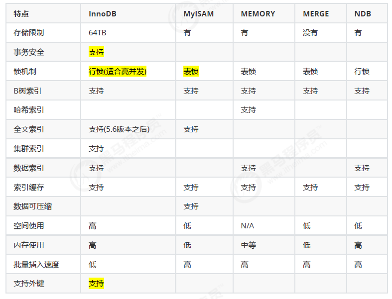
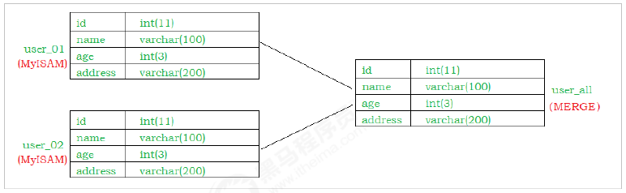

## 存储引擎
### 概述

和大多数的数据库不同, MySQL中有一个存储引擎的概念, 针对不同的存储需求可以选择最优的存储引擎。
存储引擎就是存储数据，建立索引，更新查询数据等等技术的实现方式 。

存储引擎是基于表的，而不是基于库的。所以存储引擎也可被称为表类型。

Oracle，SqlServer等数据库只有一种存储引擎。MySQL提供了插件式的存储引擎架构。所以MySQL存在多种存储引擎，可以根据需要使用相应引擎，或者编写存储引擎。

MySQL5.0支持的存储引擎包含 ： InnoDB 、MyISAM 、BDB、MEMORY、MERGE、EXAMPLE、NDB Cluster、ARCHIVE、CSV、BLACKHOLE、FEDERATED等，
其中InnoDB和BDB提供事务安全表，其他存储引擎是非事务安全表。

```sql
mysql> show engines;//查询当前数据库支持的存储引擎 ：
+--------------------+---------+----------------------------------------------------------------+--------------+------+------------+
| Engine             | Support | Comment                                                        | Transactions | XA   | Savepoints |
+--------------------+---------+----------------------------------------------------------------+--------------+------+------------+
| FEDERATED          | NO      | Federated MySQL storage engine                                 | NULL         | NULL | NULL       |
| MRG_MYISAM         | YES     | Collection of identical MyISAM tables                          | NO           | NO   | NO         |
| MyISAM             | YES     | MyISAM storage engine                                          | NO           | NO   | NO         |
| BLACKHOLE          | YES     | /dev/null storage engine (anything you write to it disappears) | NO           | NO   | NO         |
| CSV                | YES     | CSV storage engine                                             | NO           | NO   | NO         |
| MEMORY             | YES     | Hash based, stored in memory, useful for temporary tables      | NO           | NO   | NO         |
| ARCHIVE            | YES     | Archive storage engine                                         | NO           | NO   | NO         |
| InnoDB             | DEFAULT | Supports transactions, row-level locking, and foreign keys     | YES          | YES  | YES        |
| PERFORMANCE_SCHEMA | YES     | Performance Schema                                             | NO           | NO   | NO         |
+--------------------+---------+----------------------------------------------------------------+--------------+------+------------+
9 rows in set (0.00 sec)

```
MySQL5.5之前的默认存储引擎是MyISAM，
5.5之后就改为了InnoDB。
```sql
mysql> show variables like '%storage_engine%'; //查看MySQL数据库默认存储引擎
+----------------------------+--------+
| Variable_name              | Value  |
+----------------------------+--------+
| default_storage_engine     | InnoDB |
| default_tmp_storage_engine | InnoDB |
| storage_engine             | InnoDB |
+----------------------------+--------+
3 rows in set (0.00 sec)

```
### 各种存储引擎特性


主要：InnoDB,MyISAM
MEMORY,MERGE 了解即可

#### InnoDB
InnoDB存储引擎是Mysql的默认存储引擎。InnoDB存储引擎提供了具有提交、回滚、崩溃恢复能力的事务安全。
但是对比MyISAM的存储引擎，InnoDB写的处理效率差一些，并且会占用更多的磁盘空间以保留数据和索引。
InnoDB存储引擎不同于其他存储引擎的特点 ：
##### 事务控制：
```sql
mysql> create table goods_innodb(
    -> id int NOT NULL AUTO_INCREMENT,
    -> name varchar(20) NOT NULL,
    -> primary key(id)
    -> )ENGINE=innodb DEFAULT CHARSET=utf8;
Query OK, 0 rows affected (0.01 sec)

mysql> start transaction;
Query OK, 0 rows affected (0.00 sec)

mysql> insert into goods_innodb(id,name)values(null,'Meta20');
commit;Query OK, 1 row affected (0.00 sec)

mysql> commit;
Query OK, 0 rows affected (0.00 sec)

```
发现 InnoDB中是存在事务的。

##### 外键约束
MySQL 支持外键的存储引擎只有 InnoDB.
在创建外键的时候， 要求父表必须有对应的索引 ， 子表在创建外键的时候， 也会自动的创建对应的索引。

```sql
mysql> create table country_innodb(
    -> country_id int NOT NULL AUTO_INCREMENT,
    -> country_name varchar(100) NOT NULL,
    -> primary key(country_id)
    -> )ENGINE=InnoDB DEFAULT CHARSET=utf8;
Query OK, 0 rows affected (0.00 sec)

mysql> create table city_innodb(
    -> city_id int NOT NULL AUTO_INCREMENT,
    -> city_name varchar(50) NOT NULL,
    -> country_id int NOT NULL,
    -> primary key(city_id),
    -> key idx_fk_country_id(country_id),
    -> CONSTRAINT `fk_city_country` FOREIGN KEY(country_id) REFERENCES
    -> country_innodb(country_id) ON DELETE RESTRICT ON UPDATE CASCADE
    -> )ENGINE=InnoDB DEFAULT CHARSET=utf8;
insert into country_innodb values(null,'China'),(null,'America'),(null,'Japan');
insert into city_innodb values(null,'Xian',1),(null,'NewYork',2),
(null,'BeiJing',1);Query OK, 0 rows affected (0.01 sec)

mysql> insert into country_innodb values(null,'China'),(null,'America'),(null,'Japan');
Query OK, 3 rows affected (0.00 sec)
Records: 3  Duplicates: 0  Warnings: 0

mysql> insert into city_innodb values(null,'Xian',1),(null,'NewYork',2),
    -> (null,'BeiJing',1);
Query OK, 3 rows affected (0.00 sec)
Records: 3  Duplicates: 0  Warnings: 0

```
country_innodb是父表 ， country_id为主键索引，city_innodb表是子表，country_id字段为外键，对应于country_innodb表的主键country_id 。

在创建索引时， 可以指定在删除、更新父表时，对子表进行的相应操作，包括 RESTRICT、CASCADE、SET NULL和 NO ACTION。
RESTRICT和NO ACTION相同， 是指限制在子表有关联记录的情况下， 父表不能更新；
CASCADE表示父表在更新或者删除时，更新或者删除子表对应的记录；
SET NULL 则表示父表在更新或者删除的时候，子表的对应字段被SET NULL 。

针对上面创建的两个表， 子表的外键指定是ON DELETE RESTRICT ON UPDATE CASCADE 方式的， 那么在主表删除记录的时候， 如果子表有对应记录， 则不允许删除， 主表在更新记录的时候， 如果子表有对应记录， 则子表对应更新 。
```sql
mysql> select * from city_innodb;
+---------+-----------+------------+
| city_id | city_name | country_id |
+---------+-----------+------------+
|       1 | Xian      |          1 |
|       2 | NewYork   |          2 |
|       3 | BeiJing   |          1 |
+---------+-----------+------------+
3 rows in set (0.00 sec)

mysql> select * from country_innodb;
+------------+--------------+
| country_id | country_name |
+------------+--------------+
|          1 | China        |
|          2 | America      |
|          3 | Japan        |
+------------+--------------+
3 rows in set (0.00 sec)

```
查看外键信息；
```sql
mysql> show create table city_innodb\G;
*************************** 1. row ***************************
       Table: city_innodb
Create Table: CREATE TABLE `city_innodb` (
  `city_id` int(11) NOT NULL AUTO_INCREMENT,
  `city_name` varchar(50) NOT NULL,
  `country_id` int(11) NOT NULL,
  PRIMARY KEY (`city_id`),
  KEY `idx_fk_country_id` (`country_id`),
  CONSTRAINT `fk_city_country` FOREIGN KEY (`country_id`) REFERENCES `country_innodb` (`country_id`) ON UPDATE CASCADE
) ENGINE=InnoDB AUTO_INCREMENT=4 DEFAULT CHARSET=utf8
1 row in set (0.00 sec)

mysql> delete from country_innodb where country_id = 1;
ERROR 1451 (23000): Cannot delete or update a parent row: a foreign key constraint fails (`demo_01`.`city_innodb`, CONSTRAINT `fk_city_country` FOREIGN KEY (`country_id`) REFERENCES `country_innodb` (`country_id`) ON UPDATE CASCADE)


```

更新主表country表的字段 country_id :
```sql
mysql> update country_innodb set country_id = 100 where country_id = 1;
Query OK, 1 row affected (0.00 sec)
Rows matched: 1  Changed: 1  Warnings: 0

mysql> select * from city_innodb;
+---------+-----------+------------+
| city_id | city_name | country_id |
+---------+-----------+------------+
|       1 | Xian      |        100 |
|       2 | NewYork   |          2 |
|       3 | BeiJing   |        100 |
+---------+-----------+------------+
3 rows in set (0.00 sec)

```
##### 存储方式
InnoDB 存储表和索引有以下两种方式 ：
①. 使用共享表空间存储， 这种方式创建的表的表结构保存在.frm文件中， 数据和索引保存在innodb_data_home_dir 和 innodb_data_file_path定义的表空间中，可以是多个文件。
②. 使用多表空间存储， 这种方式创建的表的表结构仍然存在 .frm 文件中，但是每个表的数据和索引单独保存在.ibd 中。


#### MyISAM
MyISAM 不支持事务、也不支持外键。
其优势是访问的速度快，对事务的完整性没有要求或者以SELECT、INSERT为主的应用基本上都可以使用这个引擎来创建表 。
有以下两个比较重要的特点：
##### 不支持事务
??? 事务 ???
```sql
mysql> start transaction;
Query OK, 0 rows affected (0.00 sec)

mysql> insert into goods_myisam values(null,'diannao3');
Query OK, 1 row affected (0.00 sec)

mysql> rollback;
Query OK, 0 rows affected, 1 warning (0.00 sec)

```
##### 文件存储方式
每个MyISAM 在磁盘上存储成3个文件，其文件名和都和表名相同。
但扩展名分别为：
|.frm|存储表定义|
|---|---|    
|.MYD|MYData，存储数据|
|.MYI|MYIndex，存储索引|


#### MEMORY
Memory存储引擎将表的数据存放在内存中。
每个MEMORY表实际对应一个磁盘文件，格式是.frm ，该文件中只存储表的结构，而其数据文件，都是存储在内存中，这样有利于数据的快速处理，提高整个表的效率。
MEMORY类型的表访问非常地快，因为他的数据是存放在内存中的，并且默认使用HASH索引 ，但是服务一旦关闭，表中的数据就会丢失

#### MERGE
MERGE存储引擎是一组MyISAM表的组合，这些MyISAM表必须结构完全相同，MERGE表本身并没有存储数据，对MERGE类型的表可以进行查询、更新、删除操作，这些操作实际上是对内部的MyISAM表进行的。
对于MERGE类型表的插入操作，是通过INSERT_METHOD子句定义插入的表，可以有3个不同的值，使用FIRST 或LAST 值使得插入操作被相应地作用在第一或者最后一个表上，不定义这个子句或者定义为NO，表示不能对这个MERGE表执行插入操作。
可以对MERGE表进行DROP操作，但是这个操作只是删除MERGE表的定义，对内部的表是没有任何影响的。


MERGE 表 示例：
```sql
//创建
mysql> create table order_1990(
    -> order_id int ,
    -> order_money double(10,2),
    -> order_address varchar(50),
    -> primary key (order_id))engine = myisam default charset=utf8;
Query OK, 0 rows affected (0.00 sec)

mysql> create table order_1991(
    -> order_id int ,
    -> order_money double(10,2),
    -> order_address varchar(50),
    -> primary key (order_id)
    -> )engine = myisam default charset=utf8;
Query OK, 0 rows affected (0.00 sec)

mysql> create table order_all(
    -> order_id int ,
    -> order_money double(10,2),
    -> order_address varchar(50),
    -> primary key (order_id)
    -> )engine = merge union = (order_1990,order_1991) INSERT_METHOD=LAST default
    -> charset=utf8;
Query OK, 0 rows affected (0.00 sec)

mysql> insert into order_1990 values(1,100.0,'北京');
Query OK, 1 row affected (0.00 sec)

mysql> insert into order_1990 values(2,100.0,'上海');
Query OK, 1 row affected (0.00 sec)

mysql> insert into order_1991 values(10,200.0,'北京');
Query OK, 1 row affected (0.00 sec)

mysql> insert into order_1991 values(11,200.0,'上海');
Query OK, 1 row affected (0.00 sec)

mysql> select * from order_1990;
+----------+-------------+---------------+
| order_id | order_money | order_address |
+----------+-------------+---------------+
|        1 |      100.00 | 北京          |
|        2 |      100.00 | 上海          |
+----------+-------------+---------------+
2 rows in set (0.00 sec)

mysql> select * from order_1991;
+----------+-------------+---------------+
| order_id | order_money | order_address |
+----------+-------------+---------------+
|       10 |      200.00 | 北京          |
|       11 |      200.00 | 上海          |
+----------+-------------+---------------+
2 rows in set (0.00 sec)

mysql> select * from order_all;
+----------+-------------+---------------+
| order_id | order_money | order_address |
+----------+-------------+---------------+
|        1 |      100.00 | 北京          |
|        2 |      100.00 | 上海          |
|       10 |      200.00 | 北京          |
|       11 |      200.00 | 上海          |
+----------+-------------+---------------+
4 rows in set (0.00 sec)
//插入
mysql> insert into order_all values(100,10000.0,'西安');
Query OK, 1 row affected (0.01 sec)

mysql> select * from order_all;
+----------+-------------+---------------+
| order_id | order_money | order_address |
+----------+-------------+---------------+
|        1 |      100.00 | 北京          |
|        2 |      100.00 | 上海          |
|       10 |      200.00 | 北京          |
|       11 |      200.00 | 上海          |
|      100 |    10000.00 | 西安          |
+----------+-------------+---------------+
5 rows in set (0.00 sec)

mysql> select * from order_1991;
+----------+-------------+---------------+
| order_id | order_money | order_address |
+----------+-------------+---------------+
|       10 |      200.00 | 北京          |
|       11 |      200.00 | 上海          |
|      100 |    10000.00 | 西安          |
+----------+-------------+---------------+
3 rows in set (0.00 sec)
//删除
mysql> drop table order_all;
Query OK, 0 rows affected (0.00 sec)

mysql> select * from order_1991;
+----------+-------------+---------------+
| order_id | order_money | order_address |
+----------+-------------+---------------+
|       10 |      200.00 | 北京          |
|       11 |      200.00 | 上海          |
|      100 |    10000.00 | 西安          |
+----------+-------------+---------------+
3 rows in set (0.00 sec)

mysql> select * from order_1990;
+----------+-------------+---------------+
| order_id | order_money | order_address |
+----------+-------------+---------------+
|        1 |      100.00 | 北京          |
|        2 |      100.00 | 上海          |
+----------+-------------+---------------+
2 rows in set (0.00 sec)

mysql> select * from order_all;
ERROR 1146 (42S02): Table 'demo_01.order_all' doesn't exist


```

### 存储引擎的选择

1. InnoDB : 
    * 是Mysql的默认存储引擎，用于事务处理应用程序，支持外键。
    * 如果应用对事务的完整性有比较高的要求，在并发条件下要求数据的一致性，数据操作除了插入和查询意外，还包含很多的更新、删除操作，那么InnoDB存储引擎是比较合适的选择。
    * InnoDB存储引擎除了有效的降低由于删除和更新导致的锁定， 还可以确保事务的完整提交和回滚，对于类似于计费系统或者财务系统等对数据准确性要求比较高的系统，InnoDB是最合适的选择。
2. MyISAM ： 
   * 如果应用是以读操作和插入操作为主，只有很少的更新和删除操作
   * 并且对事务的完整性、并发性要求不是很高，那么选择这个存储引擎是非常合适的。
3. MEMORY：
   * 将所有数据保存在RAM中，在需要快速定位记录和其他类似数据环境下，可以提供几块的访问。
   * MEMORY的缺陷就是对表的大小有限制，太大的表无法缓存在内存中
   * 其次是要确保表的数据可以恢复，数据库异常终止后表中的数据是可以恢复的
   * MEMORY表通常用于更新不太频繁的小表，用以快速得到访问结
果。
4. MERGE：
   * 用于将一系列等同的MyISAM表以逻辑方式组合在一起，并作为一个对象引用他们。
   * MERGE表的优点在于可以突破对单个MyISAM表的大小限制，并且通过将不同的表分布在多个磁盘上，可以有效的改善MERGE表的访问效率。
   * 这对于存储诸如数据仓储等VLDB环境十分合适。