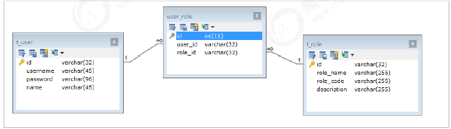

## 优化SQL步骤
### 1 查看 SQL 执行频率
语法：
```sql
SHOW [SESSION | GLOBAL] STATUS

SESSION: 显示session 级（当前连接）的结果
GLOBAL: 显示global 级别（自数据库上次启动至今）的统计结果
如果不写，默认 SESSION
```
举例:
```sql
show status like 'Com_____';
show status like 'Innodb_rows_%';


mysql> show status like 'Com_____';
+---------------+-------+
| Variable_name | Value |
+---------------+-------+
| Com_help      | 0     |
| Com_kill      | 0     |
| Com_load      | 0     |
+---------------+-------+
3 rows in set (0.00 sec)

mysql> show status like 'Com____________';
+-----------------+-------+
| Variable_name   | Value |
+-----------------+-------+
| Com_alter_event | 0     |
| Com_alter_table | 0     |
| Com_create_user | 0     |
| Com_create_view | 0     |
| Com_dealloc_sql | 0     |
| Com_drop_server | 0     |
| Com_empty_query | 0     |
| Com_execute_sql | 0     |
| Com_lock_tables | 0     |
| Com_prepare_sql | 0     |
| Com_rename_user | 0     |
| Com_show_events | 0     |
| Com_show_errors | 0     |
| Com_show_fields | 10    |
| Com_show_grants | 0     |
| Com_show_status | 5     |
| Com_show_tables | 1     |
| Com_slave_start | 0     |
| Com_xa_rollback | 0     |
+-----------------+-------+
19 rows in set (0.00 sec)

mysql> show status like 'Com________________';
+---------------------+-------+
| Variable_name       | Value |
+---------------------+-------+
| Com_alter_procedure | 0     |
| Com_create_function | 0     |
| Com_get_diagnostics | 0     |
| Com_show_collations | 0     |
| Com_show_privileges | 0     |
+---------------------+-------+
5 rows in set (0.00 sec)

mysql> show status like 'Innodb_rows_%';
+----------------------+-------+
| Variable_name        | Value |
+----------------------+-------+
| Innodb_rows_deleted  | 1     |
| Innodb_rows_inserted | 21    |
| Innodb_rows_read     | 83    |
| Innodb_rows_updated  | 4     |
+----------------------+-------+
4 rows in set (0.00 sec)
```

Com_xxx 表示每个 xxx 语句执行的次数
我们通常比较关心的是以下几个统计参数。
|参数|含义|
|---|---|
|Com_select |执行 SELECT 操作的次数，一次查询只累加 1。|
|Com_insert |执行 INSERT 操作的次数，对于批量插入的 INSERT 操作，只累加一次。|
|Com_update |执行 UPDATE 操作的次数。|
|Com_delete |执行 DELETE 操作的次数。|
|Innodb_rows_read |select 查询返回的行数。|
|Innodb_rows_inserted |执行 INSERT 操作插入的行数。|
|Innodb_rows_updated |执行 UPDATE 操作更新的行数。|
|Innodb_rows_deleted |执行 DELETE 操作删除的行数。|
|Connections |试图连接 MySQL 服务器的次数。|
|Uptime |服务器工作时间。|
|Slow_queries |慢查询的次数。|

Com_*** : 这些参数对于所有存储引擎的表操作都会进行累计。
Innodb_*** : 这几个参数只是针对InnoDB 存储引擎的，累加的算法也略有不同。

### 2 定位低效率执行 SQL

可以通过以下两种方式定位执行效率较低的 SQL 语句。

慢查询日志 : 通过慢查询日志定位那些执行效率较低的 SQL 语句，用--log-slow-queries[=file_name]选项启动时，mysqld 写一个包含所有执行时间超过 long_query_time 秒的 SQL 语句的日志文件。具体可以查看本书第 26 章中日志管理的相关部分。 ???

show processlist : 慢查询日志在查询结束以后才纪录，所以在应用反映执行效率出现问题的时候查询慢查询日志并不能定位问题，可以使用show processlist命令查看当前MySQL在进行的线程，包括线程的状态、是否锁表等，可以实时地查看 SQL 的执行情况，同时对一些锁表操作进行优化。

```sql
mysql> show processlist;
+----+------+-----------+---------+---------+------+-------+------------------+
| Id | User | Host      | db      | Command | Time | State | Info             |
+----+------+-----------+---------+---------+------+-------+------------------+
| 12 | root | localhost | demo_01 | Query   |    0 | init  | show processlist |
+----+------+-----------+---------+---------+------+-------+------------------+
1 row in set (0.00 sec)

```
```
1） id列，用户登录mysql时，系统分配的"connection_id"，可以使用函数connection_id()查看
2） user列，显示当前用户。如果不是root，这个命令就只显示用户权限范围的sql语句
3） host列，显示这个语句是从哪个ip的哪个端口上发的，可以用来跟踪出现问题语句的用户
4） db列，显示这个进程目前连接的是哪个数据库
5） command列，显示当前连接的执行的命令，一般取值为休眠（sleep），查询（query），连接（connect）等
6） time列，显示这个状态持续的时间，单位是秒
7） state列，显示使用当前连接的sql语句的状态，很重要的列。state描述的是语句执行中的某一个状态。一个sql语句，以查询为例，可能需要经过copying to tmp table、sorting result、sending data等状态才可以完成
8） info列，显示这个sql语句，是判断问题语句的一个重要依据
```
### 3 explain 分析执行计划

通过以上步骤查询到效率低的 SQL 语句后，可以通过 EXPLAIN或者 DESC命令获取 MySQL如何执行 SELECT 语句的信息，包括在 SELECT 语句执行过程中表如何连接和连接的顺序。

查询SQL语句的执行计划 ：
```sql
mysql> explain select * from emp where age = 55;
+----+-------------+-------+------+---------------+------+---------+------+------+-------------+
| id | select_type | table | type | possible_keys | key  | key_len | ref  | rows | Extra       |
+----+-------------+-------+------+---------------+------+---------+------+------+-------------+
|  1 | SIMPLE      | emp   | ALL  | NULL          | NULL | NULL    | NULL |    6 | Using where |
+----+-------------+-------+------+---------------+------+---------+------+------+-------------+
1 row in set (0.00 sec)

mysql> select * from emp where age = 55;
+----+--------------+------+--------+
| id | name         | age  | salary |
+----+--------------+------+--------+
|  1 | 金毛狮王     |   55 |   3800 |
+----+--------------+------+--------+
1 row in set (0.00 sec)

mysql> explain select * from emp where id =1;
+----+-------------+-------+-------+---------------+---------+---------+-------+------+-------+
| id | select_type | table | type  | possible_keys | key     | key_len | ref   | rows | Extra |
+----+-------------+-------+-------+---------------+---------+---------+-------+------+-------+
|  1 | SIMPLE      | emp   | const | PRIMARY       | PRIMARY | 4       | const |    1 | NULL  |
+----+-------------+-------+-------+---------------+---------+---------+-------+------+-------+
1 row in set (0.00 sec)
;
```
|字段|含义|
|---|---|
|id |select查询的序列号，是一组数字，表示的是查询中执行select子句或者是操作表的顺序。|
|select_type |表示 SELECT 的类型，常见的取值有 SIMPLE（简单表，即不使用表连接或者子查询）、PRIMARY（主查询，即外层的查询）、UNION（UNION 中的第二个或者后面的查询语句）、SUBQUERY（子查询中的第一个 SELECT）等|
|table |输出结果集的表|
|type |表示表的连接类型，性能由好到差的连接类型为( system ---> const -----> eq_ref ------> ref-------> ref_or_null----> index_merge ---> index_subquery -----> range -----> index ------>all )|
|possible_keys |表示查询时，可能使用的索引|
|key |表示实际使用的索引|
|key_len |索引字段的长度|
|rows |扫描行的数量|
|extra |执行情况的说明和描述|

#### 环境准备

```sql
mysql> CREATE TABLE `t_role` (
    -> `id` varchar(32) NOT NULL,
    -> `role_name` varchar(255) DEFAULT NULL,
    -> `role_code` varchar(255) DEFAULT NULL,
    -> `description` varchar(255) DEFAULT NULL,
    -> PRIMARY KEY (`id`),
    -> UNIQUE KEY `unique_role_name` (`role_name`)
    -> ) ENGINE=InnoDB DEFAULT CHARSET=utf8;
Query OK, 0 rows affected (0.01 sec)

mysql> CREATE TABLE `t_user` (
    -> `id` varchar(32) NOT NULL,
    -> `username` varchar(45) NOT NULL,
    -> `password` varchar(96) NOT NULL,
    -> `name` varchar(45) NOT NULL,PRIMARY KEY (`id`),
    -> UNIQUE KEY `unique_user_username` (`username`)
    -> ) ENGINE=InnoDB DEFAULT CHARSET=utf8;
Query OK, 0 rows affected (0.01 sec)

mysql> CREATE TABLE `user_role` (
    -> `id` int(11) NOT NULL auto_increment ,
    -> `user_id` varchar(32) DEFAULT NULL,
    -> `role_id` varchar(32) DEFAULT NULL,
    -> PRIMARY KEY (`id`),
    -> KEY `fk_ur_user_id` (`user_id`),
    -> KEY `fk_ur_role_id` (`role_id`),
    -> CONSTRAINT `fk_ur_role_id` FOREIGN KEY (`role_id`) REFERENCES `t_role` (`id`) ON
    -> DELETE NO ACTION ON UPDATE NO ACTION,
    -> CONSTRAINT `fk_ur_user_id` FOREIGN KEY (`user_id`) REFERENCES `t_user` (`id`) ON
    -> DELETE NO ACTION ON UPDATE NO ACTION
    -> ) ENGINE=InnoDB DEFAULT CHARSET=utf8;
Query OK, 0 rows affected (0.02 sec)

insert into `t_user` (`id`, `username`, `password`, `name`)values('1','super','$2a$10$TJ4TmCdK.X4wv/tCqHW14.w70U3CC33CeVncD3SLmyMXMknstqKRe','超级管理员');
insert into `t_user` (`id`, `username`, `password`, `name`)values('2','admin','$2a$10$TJ4TmCdK.X4wv/tCqHW14.w70U3CC33CeVncD3SLmyMXMknstqKRe','系统管理员');
insert into `t_user` (`id`, `username`, `password`, `name`)values('3','itcast','$2a$10$8qmaHgUFUAmPR5pOuWhYWOr291WJYjHelUlYn07k5ELF8ZCrW0Cui','test02');
insert into `t_user` (`id`, `username`, `password`, `name`)values('4','stu1','$2a$10$pLtt2KDAFpwTWLjNsmTEi.oU1yOZyIn9XkziK/y/spH5rftCpUMZa','学生1');
insert into `t_user` (`id`, `username`, `password`, `name`)values('5','stu2','$2a$10$nxPKkYSez7uz2YQYUnwhR.z57km3yqKn3Hr/p1FR6ZKgc18u.Tvqm','学生2');
insert into `t_user` (`id`, `username`, `password`, `name`)values('6','t1','$2a$10$TJ4TmCdK.X4wv/tCqHW14.w70U3CC33CeVncD3SLmyMXMknstqKRe','老师1');

INSERT INTO `t_role` (`id`, `role_name`, `role_code`, `description`) VALUES('5','学生','student','学生');
INSERT INTO `t_role` (`id`, `role_name`, `role_code`, `description`) VALUES('7','老师','teacher','老师');
INSERT INTO `t_role` (`id`, `role_name`, `role_code`, `description`) VALUES('8','教学管理员','teachmanager','教学管理员');
INSERT INTO `t_role` (`id`, `role_name`, `role_code`, `description`) VALUES('9','管理员','admin','管理员');
INSERT INTO `t_role` (`id`, `role_name`, `role_code`, `description`) VALUES('10','超级管理员','super','超级管理员');
INSERT INTO user_role(id,user_id,role_id) VALUES(NULL, '1', '5'),(NULL, '1', '7'),(NULL, '2', '8'),(NULL, '3', '9'),(NULL, '4', '8'),(NULL, '5', '10') ;

```
结果：
```sql
mysql> select * from user_role;
+----+---------+---------+
| id | user_id | role_id |
+----+---------+---------+
|  1 | 1       | 5       |
|  2 | 1       | 7       |
|  3 | 2       | 8       |
|  4 | 3       | 9       |
|  5 | 4       | 8       |
|  6 | 5       | 10      |
+----+---------+---------+
6 rows in set (0.00 sec)

mysql> select * from t_role;
+----+-----------------+--------------+-----------------+
| id | role_name       | role_code    | description     |
+----+-----------------+--------------+-----------------+
| 10 | 超级管理员      | super        | 超级管理员      |
| 5  | 学生            | student      | 学生            |
| 7  | 老师            | teacher      | 老师            |
| 8  | 教学管理员      | teachmanager | 教学管理员      |
| 9  | 管理员          | admin        | 管理员          |
+----+-----------------+--------------+-----------------+
5 rows in set (0.00 sec)

mysql> select * from t_user;
+----+----------+--------------------------------------------------------------+-----------------+
| id | username | password                                                     | name            |
+----+----------+--------------------------------------------------------------+-----------------+
| 1  | super    | $2a$10$TJ4TmCdK.X4wv/tCqHW14.w70U3CC33CeVncD3SLmyMXMknstqKRe | 超级管理员      |
| 2  | admin    | $2a$10$TJ4TmCdK.X4wv/tCqHW14.w70U3CC33CeVncD3SLmyMXMknstqKRe | 系统管理员      |
| 3  | itcast   | $2a$10$8qmaHgUFUAmPR5pOuWhYWOr291WJYjHelUlYn07k5ELF8ZCrW0Cui | test02          |
| 4  | stu1     | $2a$10$pLtt2KDAFpwTWLjNsmTEi.oU1yOZyIn9XkziK/y/spH5rftCpUMZa | 学生1           |
| 5  | stu2     | $2a$10$nxPKkYSez7uz2YQYUnwhR.z57km3yqKn3Hr/p1FR6ZKgc18u.Tvqm | 学生2           |
| 6  | t1       | $2a$10$TJ4TmCdK.X4wv/tCqHW14.w70U3CC33CeVncD3SLmyMXMknstqKRe | 老师1           |
+----+----------+--------------------------------------------------------------+-----------------+
6 rows in set (0.00 sec)

```

#### explain 之 id
id 字段是 select查询的序列号，是一组数字，表示的是查询中执行select子句或者是操作表的顺序。id 情况有三种：
1） id 相同表示加载表的顺序是从上到下。
```sql
mysql> explain select * from t_role r, t_user u, user_role ur where r.id = ur.role_id and u.id = ur.user_id ;
+----+-------------+-------+--------+-----------------------------+---------------+---------+--------------------+------+-------------+
| id | select_type | table | type   | possible_keys               | key           | key_len | ref                | rows | Extra       |
+----+-------------+-------+--------+-----------------------------+---------------+---------+--------------------+------+-------------+
|  1 | SIMPLE      | r     | ALL    | PRIMARY                     | NULL          | NULL    | NULL               |    5 | NULL        |
|  1 | SIMPLE      | ur    | ref    | fk_ur_user_id,fk_ur_role_id | fk_ur_role_id | 99      | demo_01.r.id       |    1 | Using where |
|  1 | SIMPLE      | u     | eq_ref | PRIMARY                     | PRIMARY       | 98      | demo_01.ur.user_id |    1 | NULL        |
+----+-------------+-------+--------+-----------------------------+---------------+---------+--------------------+------+-------------+
3 rows in set (0.00 sec)

```
2） id 不同id值越大，优先级越高，越先被执行。
```sql
mysql> EXPLAIN SELECT * FROM t_role WHERE id = (SELECT role_id FROM user_role WHERE user_id = (SELECT id FROM t_user WHERE username = 'stu1'));
+----+-------------+-----------+-------+----------------------+----------------------+---------+-------+------+-------------+
| id | select_type | table     | type  | possible_keys        | key                  | key_len | ref   | rows | Extra       |
+----+-------------+-----------+-------+----------------------+----------------------+---------+-------+------+-------------+
|  1 | PRIMARY     | t_role    | const | PRIMARY              | PRIMARY              | 98      | const |    1 | NULL        |
|  2 | SUBQUERY    | user_role | ref   | fk_ur_user_id        | fk_ur_user_id        | 99      | const |    1 | Using where |
|  3 | SUBQUERY    | t_user    | const | unique_user_username | unique_user_username | 137     | const |    1 | Using index |
+----+-------------+-----------+-------+----------------------+----------------------+---------+-------+------+-------------+
3 rows in set (0.00 sec)
```
3） id 有相同，也有不同，同时存在。id相同的可以认为是一组，从上往下顺序执行；在所有的组中，id的值越大，优先级越高，越先执行。
```sql
mysql> EXPLAIN SELECT * FROM t_role r , (SELECT * FROM user_role ur WHERE ur.`user_id` = '2') a WHERE r.id = a.role_id ;
+----+-------------+------------+--------+---------------+---------------+---------+-----------+------+-----------------------+
| id | select_type | table      | type   | possible_keys | key           | key_len | ref       | rows | Extra                 |
+----+-------------+------------+--------+---------------+---------------+---------+-----------+------+-----------------------+
|  1 | PRIMARY     | <derived2> | ALL    | NULL          | NULL          | NULL    | NULL      |    2 | Using where           |
|  1 | PRIMARY     | r          | eq_ref | PRIMARY       | PRIMARY       | 98      | a.role_id |    1 | NULL                  |
|  2 | DERIVED     | ur         | ref    | fk_ur_user_id | fk_ur_user_id | 99      | const     |    1 | Using index condition |
+----+-------------+------------+--------+---------------+---------------+---------+-----------+------+-----------------------+
3 rows in set (0.00 sec)

```

#### explain 之 select_type
表示 SELECT 的类型，常见的取值，如下表所示：
|select_type |含义|
|---|---|
|SIMPLE |简单的select查询，查询中不包含子查询或者UNION|
|PRIMARY |查询中若包含任何复杂的子查询，最外层查询标记为该标识|
|SUBQUERY |在SELECT 或 WHERE 列表中包含了子查询|
|DERIVED |在FROM 列表中包含的子查询，被标记为 DERIVED（衍生） MYSQL会递归执行这些子查询，把结果放在临时表中|
|UNION |若第二个SELECT出现在UNION之后，则标记为UNION ； 若UNION包含在FROM子句的子查询中，外层SELECT将被标记为 ： DERIVED|
|UNION RESULT |从UNION表获取结果的SELECT|

#### explain 之 table
展示这一行的数据是关于哪一张表的

#### explain 之 type
type 显示的是访问类型，是较为重要的一个指标，可取值为：
|type |含义|
|---|---|
|NULL |MySQL不访问任何表，索引，直接返回结果|
|system |表只有一行记录(等于系统表)，这是const类型的特例，一般不会出现|
|const |表示通过索引一次就找到了，const 用于比较primary key 或者 unique 索引。因为只匹配一行数据，所以很快。如将主键置于where列表中，MySQL 就能将该查询转换为一个常亮。const于将"主键" 或 "唯一" 索引的所有部分与常量值进行比较|
|eq_ref |类似ref，区别在于使用的是唯一索引，使用主键的关联查询，关联查询出的记录只有一条。常见于主键或唯一索引扫描|
|ref |非唯一性索引扫描，返回匹配某个单独值的所有行。本质上也是一种索引访问，返回所有匹配某个单独值的所有行（多个）|
|range |只检索给定返回的行，使用一个索引来选择行。 where 之后出现 between ， < , > , in 等操作。|
|index |index 与 ALL的区别为 index 类型只是遍历了索引树， 通常比ALL 快， ALL 是遍历数据文件。|
|all |将遍历全表以找到匹配的行|

从好到坏：
NULL > system > const > eq_ref > ref > fulltext > ref_or_null > index_merge > unique_subquery > index_subquery > range > index > ALL

system > const > eq_ref > ref > range > index > ALL

一般来说， 我们需要保证查询至少达到 range 级别， 最好达到ref 。

#### explain 之 key
possible_keys : 显示可能应用在这张表的索引， 一个或多个。
key ： 实际使用的索引， 如果为NULL， 则没有使用索引。
key_len : 表示索引中使用的字节数， 该值为索引字段最大可能长度，并非实际使用长度，在不损失精确性的前提下， 长度越短越好 。


#### explain 之 rows
扫描行的数量

#### explain 之 extra
其他的额外的执行计划信息，在该列展示 。

using filesort：说明mysql会对数据使用一个外部的索引排序，而不是按照表内的索引顺序进行读取， 称为“文件排序”, 效率低。
using temporary：使用了临时表保存中间结果，MySQL在对查询结果排序时使用临时表。常见于 order by 和 group by； 效率低
using index 表示相应的select操作使用了覆盖索引， 避免访问表的数据行， 效率不错。

### 4 show profile 分析 SQL

Mysql从5.0.37版本开始增加了对 show profiles 和 show profile 语句的支持。show profiles 能够在做SQL优化时帮助我们了解时间都耗费到哪里去了。

通过 have_profiling 参数，能够看到当前 MySQL 是否支持profile：
```sql
select @@have_profiling;
set profiling = 1;
```
示例：
```sql
mysql> select @@profiling;
+-------------+
| @@profiling |
+-------------+
|           1 |
+-------------+
1 row in set, 1 warning (0.00 sec)

mysql> show tables;
+-------------------+
| Tables_in_demo_01 |
+-------------------+
| city              |
| city_innodb       |
| country           |
| country_innodb    |
| emp               |
| emp_logs          |
| goods_innodb      |
| goods_myisam      |
| order_1990        |
| order_1991        |
| t_role            |
| t_user            |
| user_role         |
+-------------------+
13 rows in set (0.00 sec)

mysql> select * from t_user where id < 3;
+----+----------+--------------------------------------------------------------+-----------------+
| id | username | password                                                     | name            |
+----+----------+--------------------------------------------------------------+-----------------+
| 1  | super    | $2a$10$TJ4TmCdK.X4wv/tCqHW14.w70U3CC33CeVncD3SLmyMXMknstqKRe | 超级管理员      |
| 2  | admin    | $2a$10$TJ4TmCdK.X4wv/tCqHW14.w70U3CC33CeVncD3SLmyMXMknstqKRe | 系统管理员      |
+----+----------+--------------------------------------------------------------+-----------------+
2 rows in set (0.00 sec)

mysql> select count(*) from user_role;
+----------+
| count(*) |
+----------+
|        6 |
+----------+
1 row in set (0.00 sec)

mysql> show profilesl
    -> ;
ERROR 1064 (42000): You have an error in your SQL syntax; check the manual that corresponds to your MySQL server version for the right syntax to use near 'profilesl' at line 1
mysql> show profiles;
+----------+------------+-----------------------------------+
| Query_ID | Duration   | Query                             |
+----------+------------+-----------------------------------+
|        1 | 0.00012175 | select @@profiling                |
|        2 | 0.00032025 | show tables                       |
|        3 | 0.00017850 | select * from t_user where id < 3 |
|        4 | 0.00017750 | select count(*) from user_role    |
|        5 | 0.00003600 | show profilesl                    |
+----------+------------+-----------------------------------+
5 rows in set, 1 warning (0.00 sec)


```
通过show profile for query query_id 语句可以查看到该SQL执行过程中每个线程的状态和消耗的时间：

```sql
mysql> show profile for query 4;
+----------------------+----------+
| Status               | Duration |
+----------------------+----------+
| starting             | 0.000036 |
| checking permissions | 0.000004 |
| Opening tables       | 0.000013 |
| init                 | 0.000009 |
| System lock          | 0.000006 |
| optimizing           | 0.000004 |
| statistics           | 0.000018 |
| preparing            | 0.000010 |
| executing            | 0.000002 |
| Sending data         | 0.000022 |
| end                  | 0.000003 |
| query end            | 0.000003 |
| closing tables       | 0.000006 |
| freeing items        | 0.000022 |
| cleaning up          | 0.000022 |
+----------------------+----------+
15 rows in set, 1 warning (0.00 sec)

```
tips:
    Sending data 状态表示MySQL线程开始访问数据行并把结果返回给客户端，而不仅仅是返回个客户端。由于在Sending data状态下，MySQL 线程往往需要做大量的磁盘读取操作，所以经常是整个查询中耗时最长的状态。

在获取到最消耗时间的线程状态后，MySQL支持进一步选择
all、cpu、block io 、context switch、page faults等
明细类型类查看MySQL在使用什么资源上耗费了过高的时间。例如，选择查看CPU的耗费时间 ：
```sql
mysql> show profile cpu for query 4;
+----------------------+----------+----------+------------+
| Status               | Duration | CPU_user | CPU_system |
+----------------------+----------+----------+------------+
| starting             | 0.000036 | 0.000005 |   0.000026 |
| checking permissions | 0.000004 | 0.000000 |   0.000004 |
| Opening tables       | 0.000013 | 0.000002 |   0.000010 |
| init                 | 0.000009 | 0.000002 |   0.000007 |
| System lock          | 0.000006 | 0.000001 |   0.000005 |
| optimizing           | 0.000004 | 0.000000 |   0.000003 |
| statistics           | 0.000018 | 0.000003 |   0.000017 |
| preparing            | 0.000010 | 0.000001 |   0.000007 |
| executing            | 0.000002 | 0.000001 |   0.000001 |
| Sending data         | 0.000022 | 0.000003 |   0.000019 |
| end                  | 0.000003 | 0.000001 |   0.000002 |
| query end            | 0.000003 | 0.000000 |   0.000003 |
| closing tables       | 0.000006 | 0.000001 |   0.000005 |
| freeing items        | 0.000022 | 0.000004 |   0.000019 |
| cleaning up          | 0.000022 | 0.000003 |   0.000017 |
+----------------------+----------+----------+------------+
15 rows in set, 1 warning (0.01 sec)

```
Status sql : 语句执行的状态
Duration sql : 执行过程中每一个步骤的耗时
CPU_user : 当前用户占有的cpu
CPU_system : 系统占有的cpu
### 5 trace 分析优化器执行计划
MySQL5.6提供了对SQL的跟踪trace, 通过trace文件能够进一步了解为什么优化器选择A计划, 而不是选择B计划。
打开trace ， 设置格式为 JSON，并设置trace最大能够使用的内存大小，避免解析过程中因为默认内存过小而不能完整展示。
```sql
SET optimizer_trace = "enabled=on",end_markers_in_json=on;
set optimizer_trace_max_mem_size = 1000000;
```

随便执行一条语句 后，检查information_schema.optimizer_trace 就知道MySQL 是如何执行SQL的；
```sql
select * from emp where age <= 55;
select * from information_schema.optimizer_trace\G;
```
