## 索引的使用
索引是数据库优化的最常用的也是最重要的手段之一。通过索引通常可以帮助用户解决大多数的MySQL的性能优化问题

### 验证索引提升查询效率

表结构tb_item，存储了300万记录。
1. 根据ID 查询
    `select * from tb_item where id = 1999\G;`
    

    查询速度很快， 接近0s ， 主要的原因是因为id为主键， 有索引；

    
2. 根据 title 进行精确查询
    `select * from tb_item where title = 'iphoneX 移动3G 32G941'\G;`
    
    

3. 针对 title 字段创建索引
    `create index idx_item_title on tb_item(title);`
    
    索引创建完成后，再次查询。
    
    

### 索引的使用

#### 环境准备
```sql
create table `tb_seller` (
   `sellerid` varchar (100),
   `name` varchar (100),
   `nickname` varchar (50),
   `password` varchar (60),
   `status` varchar (1),
   `address` varchar (100),
   `createtime` datetime,
   primary key(`sellerid`)
)engine=innodb default charset=utf8mb4;

insert into `tb_seller` (`sellerid`, `name`, `nickname`, `password`, `status`,`address`, `createtime`) values('alibaba','阿里巴巴','阿里小店','e10adc3949ba59abbe56e057f20f883e','1','北京市','2088-01-01 12:00:00');
insert into `tb_seller` (`sellerid`, `name`, `nickname`, `password`, `status`,`address`, `createtime`) values('baidu','百度科技有限公司','百度小店','e10adc3949ba59abbe56e057f20f883e','1','北京市','2088-01-01 12:00:00');
insert into `tb_seller` (`sellerid`, `name`, `nickname`, `password`, `status`,`address`, `createtime`) values('huawei','华为科技有限公司','华为小店','e10adc3949ba59abbe56e057f20f883e','0','北京市','2088-01-01 12:00:00');
insert into `tb_seller` (`sellerid`, `name`, `nickname`, `password`, `status`,`address`, `createtime`) values('itcast','传智播客教育科技有限公司','传智播客','e10adc3949ba59abbe56e057f20f883e','1','北京市','2088-01-01 12:00:00');
insert into `tb_seller` (`sellerid`, `name`, `nickname`, `password`, `status`,`address`, `createtime`) values('itheima','黑马程序员','黑马程序员','e10adc3949ba59abbe56e057f20f883e','0','北京市','2088-01-01 12:00:00');
insert into `tb_seller` (`sellerid`, `name`, `nickname`, `password`, `status`,`address`, `createtime`) values('luoji','罗技科技有限公司','罗技小店','e10adc3949ba59abbe56e057f20f883e','1','北京市','2088-01-01 12:00:00');
insert into `tb_seller` (`sellerid`, `name`, `nickname`, `password`, `status`,`address`, `createtime`) values('oppo','OPPO科技有限公司','OPPO官方旗舰店','e10adc3949ba59abbe56e057f20f883e','0','北京市','2088-01-01 12:00:00');
insert into `tb_seller` (`sellerid`, `name`, `nickname`, `password`, `status`,`address`, `createtime`) values('ourpalm','掌趣科技股份有限公司','掌趣小店','e10adc3949ba59abbe56e057f20f883e','1','北京市','2088-01-01 12:00:00');
insert into `tb_seller` (`sellerid`, `name`, `nickname`, `password`, `status`,`address`, `createtime`) values('qiandu','千度科技','千度小店','e10adc3949ba59abbe56e057f20f883e','2','北京市','2088-01-01 12:00:00');
insert into `tb_seller` (`sellerid`, `name`, `nickname`, `password`, `status`,`address`, `createtime`) values('sina','新浪科技有限公司','新浪官方旗舰店','e10adc3949ba59abbe56e057f20f883e','1','北京市','2088-01-01 12:00:00');
insert into `tb_seller` (`sellerid`, `name`, `nickname`, `password`, `status`,`address`, `createtime`) values('xiaomi','小米科技','小米官方旗舰店','e10adc3949ba59abbe56e057f20f883e','1','西安市','2088-01-01 12:00:00');
insert into `tb_seller` (`sellerid`, `name`, `nickname`, `password`, `status`,`address`, `createtime`) values('yijia','宜家家居','宜家家居旗舰店','e10adc3949ba59abbe56e057f20f883e','1','北京市','2088-01-01 12:00:00');


create index idx_seller_name_sta_addr on tb_seller(name,status,address);
```

#### 避免索引失效

1. 全值匹配，对索引中所有的列都指定具体值。
   该情况下，索引生效，执行效率高。
   `explain select * from tb_seller where name='小米科技' and status='1' and address='北京市'\G;`
   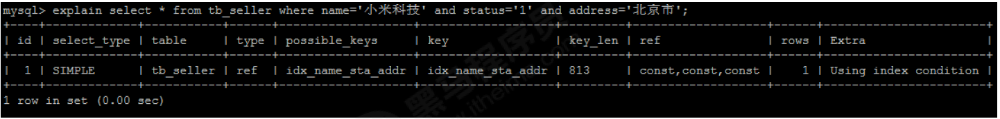

2. 最左前缀法则。
   如果索引了多列，要遵守最左前缀法则。指的是查询从索引的最左前列开始，并且不跳过索引中的列。    
   匹配最左前缀法则，走索引：
   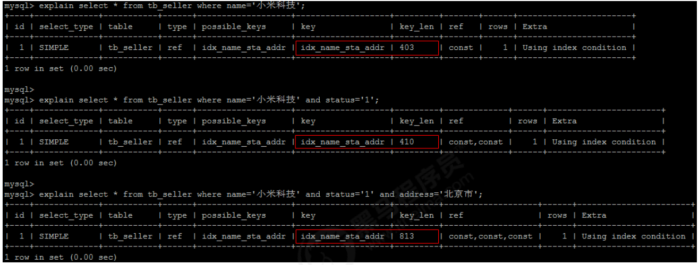

   违反最左前缀法则，索引失效。
   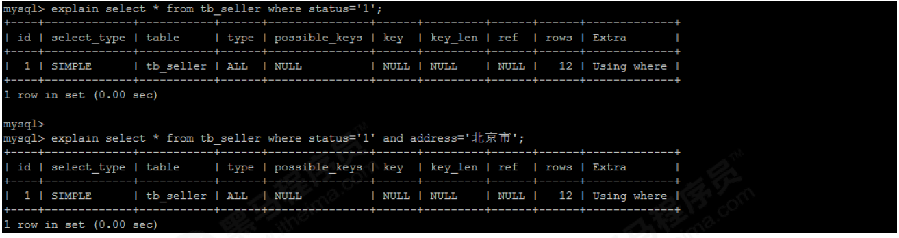

   如果符合最左前缀法则，但是出现条约某一列，则只有最左列索引生效。
   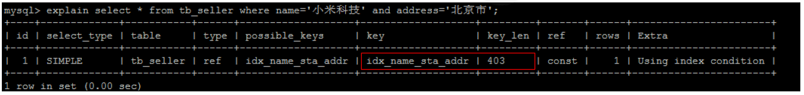
   
3. 范围查询右边的列，不能使用索引。
   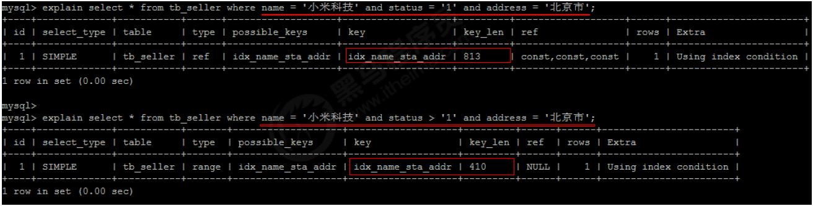
   根据前面两个字段 name status 查询是走索引的。但是最后一个条件 address 没有用到索引。

4. 不要在索引列上进行运算操作，索引将失效。
   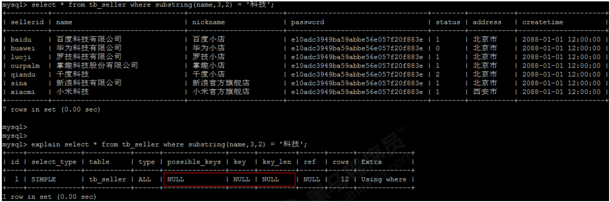

5. 字符串不加单引号，索引失效。
   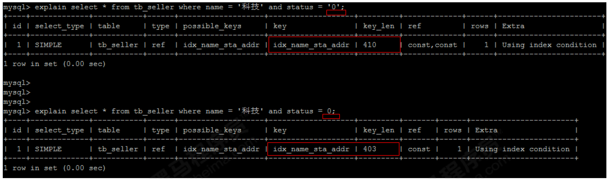
   MySQL 的查询优化器会自动进行类型转换，造成索引失效。

6. 尽量使用覆盖索引，避免使用 select * 。
   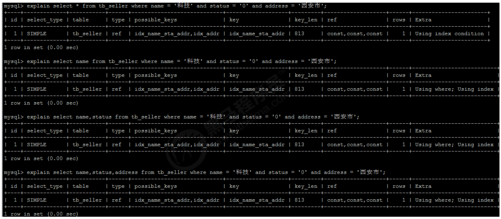
   尽量使用覆盖索引（只访问索引的查询（索引列完全包含查询列）），减少select *。

   如果查询列超出索引列，也会降低性能。
   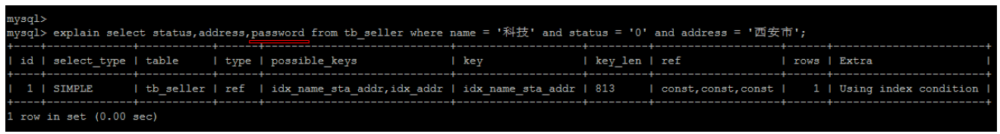

   TIP :
      using index ：使用覆盖索引的时候就会出现
      using where：在查找使用索引的情况下，需要回表去查询所需的数据
      using index condition：查找使用了索引，但是需要回表查询数据
      
      using index ; using where：查找使用了索引，但是需要的数据都在索引列中能找到，所以不需要回表查询数据

7. 用 or 分割开的条件， 如果 or 前的条件中的列有索引，而后面的列中没有索引，那么涉及的索引都不会被用到。
   示例，name字段是索引列 ， 而createtime不是索引列，中间是or进行连接是不走索引的 ：
   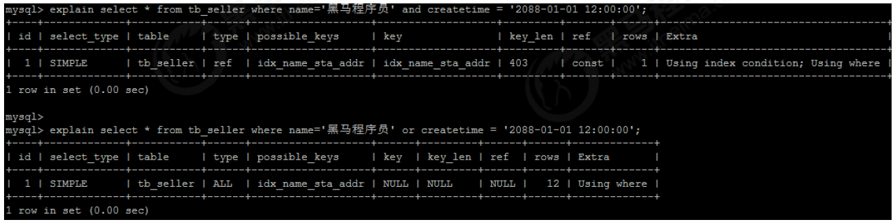

8. 以 % 开头的 like 模糊查询，索引失效。
   如果仅仅是尾部模糊匹配，索引不会失效。如果是头部模糊匹配，索引失效。
   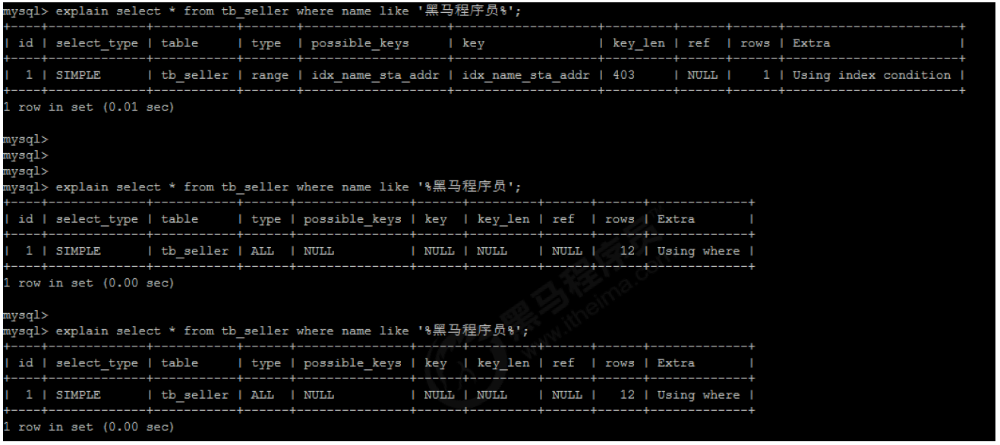

   解决方案：通过覆盖索引解决
   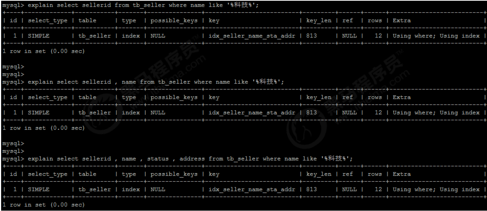

9.  如果 MySQL 评估使用索引比全表更慢，则不使用索引。
    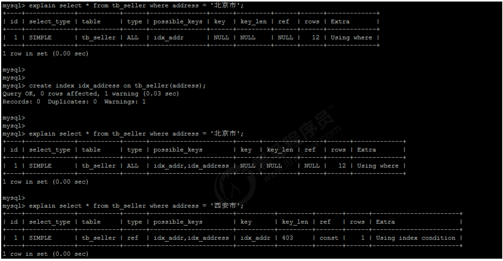

10. is NULL , is NOT NULL 有时索引失效。
    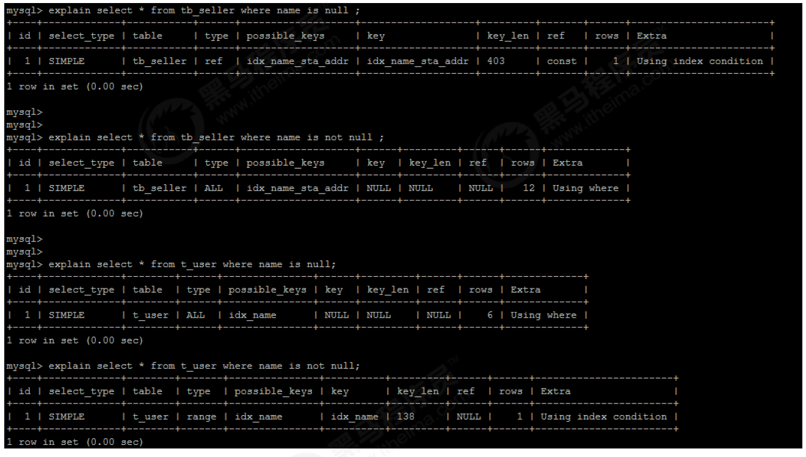

11. in 走索引， not in 索引失效。
    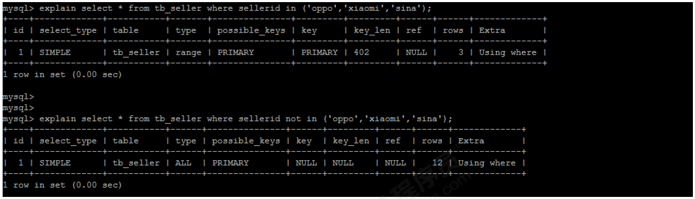

12. 尽量使用复合索引，而少使用单列索引。
    创建复合索引：
    ```sql
    create index idx_name_sta_address on tb_seller(name, status, address);
    就相当于创建了三个索引 ：
    name
    name + status
    name + status + address
    ```
    创建单列索引
    ```sql
    create index idx_seller_name on tb_seller(name);
    create index idx_seller_status on tb_seller(status);
    create index idx_seller_address on tb_seller(address);
    ```
    数据库会选择一个最优的索引（辨识度最高索引）来使用，并不会使用全部索引 。

查看索引使用情况
```sql
show status like 'Handler_read%';

show global status like 'Handler_read%';


mysql> show status like 'Handler_read%';
+-----------------------+-------+
| Variable_name         | Value |
+-----------------------+-------+
| Handler_read_first    | 0     |
| Handler_read_key      | 0     |
| Handler_read_last     | 0     |
| Handler_read_next     | 0     |
| Handler_read_prev     | 0     |
| Handler_read_rnd      | 0     |
| Handler_read_rnd_next | 20    |
+-----------------------+-------+
7 rows in set (0.00 sec)

mysql>
mysql> show global status like 'Handler_read%';
+-----------------------+-------+
| Variable_name         | Value |
+-----------------------+-------+
| Handler_read_first    | 36    |
| Handler_read_key      | 75    |
| Handler_read_last     | 0     |
| Handler_read_next     | 34    |
| Handler_read_prev     | 0     |
| Handler_read_rnd      | 0     |
| Handler_read_rnd_next | 514   |
+-----------------------+-------+
7 rows in set (0.01 sec)

```

Handler_read_first：索引中第一条被读的次数。如果较高，表示服务器正执行大量全索引扫描（这个值越低越好）。
Handler_read_key：如果索引正在工作，这个值代表一个行被索引值读的次数，如果值越低，表示索引得到的性能改善不高，因为索引不经常使用（这个值越高越好）。
Handler_read_next ：按照键顺序读下一行的请求数。如果你用范围约束或如果执行索引扫描来查询索引列，该值增加。
Handler_read_prev：按照键顺序读前一行的请求数。该读方法主要用于优化ORDER BY ... DESC。
Handler_read_rnd ：根据固定位置读一行的请求数。如果你正执行大量查询并需要对结果进行排序该值较高。你可能使用了大量需要MySQL扫描整个表的查询或你的连接没有正确使用键。这个值较高，意味着运行效率低，应该建立索引来补救。
Handler_read_rnd_next：在数据文件中读下一行的请求数。如果你正进行大量的表扫描，该值较高。通常说明你的表索引不正确或写入的查询没有利用索引。
    